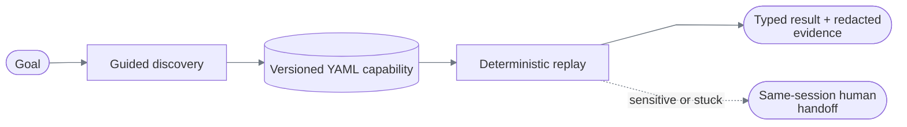

# ReplayForge

ReplayForge discovers a task through a rendered UI, compiles the verified run into a typed YAML capability, and replays that capability without a model in the decision loop.



The implemented vertical slice searches a synthetic member-servicing application and returns a savings balance. Its primary `3.1.0` path operates a richer canvas-only workbench through local OCR, OCR-relative geometry, and an OCR-contextual content-addressed image template. The earlier `3.0.0` visual-terminal path remains as an immutable regression fixture. DOM/accessibility targeting remains an optional web strategy for the earlier failure and handoff scenarios.

## What is real

| Path | Model? | Surface | Result |
|---|---:|---|---|
| Discovery | Yes | Screenshot + local OCR tokens; compact DOM facts when available | Publishes an immutable artifact |
| Replay | **No** | Pixels first; optional semantic DOM candidates second | Success, business outcome, failure, or intervention |
| Handoff | No | The same retained Chromium context | Operator input followed by deterministic replay continuation |

The canonical flow never queries a DOM control: the target exposes one canvas, and all typing, clicking, extraction, and verification are grounded from rendered pixels. Playwright supplies the browser, screenshot, mouse, and keyboard—not element targeting. See [Architecture](docs/architecture.md#surface-reality).

## Run the core replay

Requires Python 3.12, `uv`, Node.js 22+, and pnpm 10.15.1.

```bash
UV_CACHE_DIR=/tmp/replayforge-uv-cache uv sync --extra dev
npm_config_cache=/tmp/replayforge-npm-cache npx --yes pnpm@10.15.1 install --frozen-lockfile
PLAYWRIGHT_BROWSERS_PATH=/tmp/replayforge-playwright-browsers UV_CACHE_DIR=/tmp/replayforge-uv-cache uv run playwright install chromium
cp .env.example .env
```

Start the target:

```bash
npm_config_cache=/tmp/replayforge-npm-cache npx --yes pnpm@10.15.1 --filter @replayforge/demo-bank dev --hostname 127.0.0.1 --port 3001
```

Start the runtime in another terminal:

```bash
PLAYWRIGHT_BROWSERS_PATH=/tmp/replayforge-playwright-browsers UV_CACHE_DIR=/tmp/replayforge-uv-cache uv run uvicorn replayforge.main:app --host 127.0.0.1 --port 8000
```

Invoke the visual-first artifact:

```bash
curl --fail-with-body --silent --show-error \
  -H 'content-type: application/json' \
  -d '{"tenant":"harbor","version":"3.1.0","inputs":{"member_id":"12345"}}' \
  http://127.0.0.1:8000/api/v1/capabilities/member.lookup_savings_balance/invoke
```

Expected: `status: success`, five validated outputs, and checkpoint `savings_balance_verified`.

## Exercise each runtime result

| Behavior | How to run | Expected |
|---|---|---|
| Canvas-only visual workbench | `3.1.0`, member `12345` | `success` without DOM targets |
| Cross-tenant visual workbench | `3.1.0`, tenant `summit` | Same artifact resolves the reordered Savings row |
| Viewport portability | `3.1.0`, `1024×640` or `1440×900` | Same artifact succeeds at a tested scale |
| Delayed result | `3.1.0`, member `13579` | Bounded wait, then `success` |
| Known notice | `3.1.0`, member `67890` | One bounded recovery, then `success` |
| Visual ambiguity | `3.1.0`, member `33333` | `failure/target_ambiguous` before a click |
| Changed visual target | `3.1.0`, member `44444` | `failure/target_absent` |
| Happy path | `1.0.0`, member `12345` | `success` |
| Business outcome | `1.0.0`, member `99999` | `business_outcome/member_not_found` |
| Second tenant | `1.0.0`, tenant `summit` | Same artifact succeeds |
| Known recovery | `UV_CACHE_DIR=/tmp/replayforge-uv-cache uv run python scripts/capture_recovery_run.py` | Interstitial dismissed once, then `success` |
| Hard failure | `UV_CACHE_DIR=/tmp/replayforge-uv-cache uv run python scripts/capture_hard_failure_run.py` | `failure/permission_denied` + masked frame |
| Human handoff | `UV_CACHE_DIR=/tmp/replayforge-uv-cache uv run python scripts/capture_handoff_run.py` | Claim, same-session input, resume, `success` |

Omitting `version` selects the latest artifact, currently visual workbench `3.1.0`. Request `2.0.0` explicitly for the approval/handoff demonstration and `3.0.0` for the original visual-terminal regression path.

## Operator console

Start it after the target and runtime:

```bash
npm_config_cache=/tmp/replayforge-npm-cache npx --yes pnpm@10.15.1 --filter @replayforge/control-plane dev --hostname 127.0.0.1 --port 3000
```

Open `http://127.0.0.1:3000`, enter the intervention ID returned by version `2.0.0`, claim it, operate the polled live viewport, and resume. Every transition uses an exclusive, expiring, monotonically versioned lease.

## Run genuine discovery

Discovery requires an OpenAI key and authenticated local Langfuse. Replay does not.

Create the ignored key file and edit its placeholder locally:

```bash
install -D -m 600 config/openai.env.example .secrets/openai.env
```

Create or reuse ignored Langfuse credentials, then start the pinned loopback-only stack:

```bash
UV_CACHE_DIR=/tmp/replayforge-uv-cache uv run python scripts/bootstrap_langfuse_credentials.py
scripts/start_local_langfuse.sh
```

Restart the runtime so it loads the credentials, keep the demo bank running, then capture discovery:

```bash
UV_CACHE_DIR=/tmp/replayforge-uv-cache uv run python scripts/capture_discovery_run.py \
  --artifact-output /tmp/replayforge-genuine-discovery.yaml
```

The reviewed [model policy](config/model-policy.yaml) fixes provider, model, reasoning effort, token/call limits, timeout, frame size, and cost ceiling. Requests cannot override it. Provider calls use strict structured output, no tools, and `store=false`.

## Verify everything

```bash
bash scripts/verify.sh
```

This runs locked dependency setup, Ruff, strict mypy, unit tests with a 90% branch gate, evidence verification, TypeScript checks, both frontend builds, and real Chromium integration tests.

Run the focused visual portability matrix after starting or building the demo bank:

```bash
UV_CACHE_DIR=/tmp/replayforge-uv-cache \
PLAYWRIGHT_BROWSERS_PATH=/tmp/replayforge-playwright-browsers \
uv run pytest backend/tests/integration/test_visual_portability.py -q
```

Verify only the committed evidence:

```bash
UV_CACHE_DIR=/tmp/replayforge-uv-cache uv run python scripts/verify_evidence_bundles.py evidence
```

## Repository map

```text
backend/src/replayforge/
├── api/             FastAPI contracts and adapter
├── capabilities/    artifact model, serialization, immutable registry
├── discovery/       bounded model loop and specialized compiler
├── replay/          deterministic, model-free interpreter
├── surfaces/        surface contracts and Playwright adapter
├── policy/          layered allowlists and risk decisions
├── interventions/   state machine and exclusive control leases
├── evidence/        redaction, hashing, manifests, local store
├── runs/            application services, results, audit journal
├── providers/       OpenAI adapter
└── runtime/         settings, composition, worker, telemetry

apps/demo-bank/      synthetic target on :3001
apps/control-plane/  intervention console on :3000
capabilities/        reviewed immutable YAML versions
evidence/            committed reviewer bundles; runtime output is ignored
docs/                implementation-accurate design documentation
```

## Documentation

- [Architecture and trade-offs](docs/architecture.md)
- [Domain data models](docs/data-models.md)
- [Capability schema and replay semantics](docs/capability-and-replay.md)
- [Discovery loop and model boundary](docs/discovery.md)
- [Safety, evidence, and human handoff](docs/safety-and-handoff.md)
- [Implemented API and operations](docs/operations.md)
- [Tests and evidence](docs/verification.md)
- [Visual portability implementation plan](docs/plans/01-demo-realism-and-portability.md)
- [Assignment requirement matrix](docs/requirements.md)
- [Required seven-part design report](REPORT.md)

## Deliberate cuts

Operational metadata is in memory; only evidence is durable. The control plane is an intervention console, not a complete run or capability UI. There is no PostgreSQL adapter, WebSocket, distributed queue, authentication layer, native desktop adapter, or discovery continuation after human takeover. The visual adapter is implemented for browser-rendered surfaces; Citrix and native desktop transport remain outside this slice.
