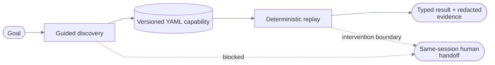

# ReplayForge

ReplayForge discovers a task through a rendered UI, compiles the verified run into a typed YAML capability, and replays that capability without a model in the decision loop.



There is one demo application: a [dated servicing workstation](docs/demo-bank.md) with member
and account inquiry, transaction research, transfers, card maintenance, holds, payoff quotes,
service cases, and an activity journal. Open `http://127.0.0.1:3001/harbor/servicing`.

Genuinely discovered capabilities exercise three different business operations on that same UI: transaction
investigation, loan-payoff quotation, and temporary card lock. Each artifact is independently
validated on Harbor and Summit. The runtime contains no task-specific compiler, navigation
recipe, record ID, or recorded click coordinates. Retired-UI routes, capabilities, and evidence
are not part of the current distribution. All 13 declared negative/recovery cases have genuine
discovery and two-tenant replay proof in the [verification matrix](docs/verification.md#scenario-matrix).

## What is real

| Path | Model? | Surface | Result |
|---|---:|---|---|
| Discovery | Yes | Screenshot + local OCR tokens; compact DOM facts when available | Verified draft; suite replay validation gates publication |
| Replay | **No** | Rendered pixels first; optional semantic DOM candidates second | Success, business outcome, failure, or intervention |
| Handoff | No during manual control | The same retained Chromium context | Verified resume of replay or the blocked discovery loop |

The canonical flow never queries a DOM control: the target exposes one canvas, and all typing, clicking, extraction, and verification are grounded from rendered pixels. Playwright supplies the browser, CSS-pixel screenshot, mouse, and keyboard—not element targeting. See [Architecture](docs/architecture.md#surface-reality).

## Run the core replay

Requires Python 3.12, `uv`, Node.js 22+, and pnpm 10.15.1.

```bash
UV_CACHE_DIR=/tmp/replayforge-uv-cache uv sync --extra dev
npm_config_cache=/tmp/replayforge-npm-cache npx --yes pnpm@10.15.1 install --frozen-lockfile
PLAYWRIGHT_BROWSERS_PATH=/tmp/replayforge-playwright-browsers UV_CACHE_DIR=/tmp/replayforge-uv-cache uv run playwright install chromium
cp .env.example .env
```

OCR inference runs locally. A fresh RapidOCR installation may download model weights at first
use; provision those files before running in a network-isolated environment.

Start the target:

```bash
npm_config_cache=/tmp/replayforge-npm-cache npx --yes pnpm@10.15.1 --filter @replayforge/demo-bank dev --hostname 127.0.0.1 --port 3001
```

Start the runtime in another terminal:

```bash
PLAYWRIGHT_BROWSERS_PATH=/tmp/replayforge-playwright-browsers UV_CACHE_DIR=/tmp/replayforge-uv-cache uv run uvicorn replayforge.main:app --host 127.0.0.1 --port 8000
```

Replay a genuinely discovered task on the servicing workstation:

```bash
curl --fail-with-body --silent --show-error \
  -H 'content-type: application/json' \
  -d '{"tenant":"harbor","version":"1.0.2","inputs":{"member_id":"12346","payoff_date":"2026-09-21"}}' \
  http://127.0.0.1:8000/api/v1/capabilities/member.servicing_loan_payoff_quote/replays
```

Expected: an issued quote for `$9,035.70`, good through `2026-09-21`, and reference `HBR-000001`.
These inputs differ from discovery. The artifact verifies the date equality during every replay;
the browser regression independently checks all three exact outputs. No model is needed.

## Three discovered workflows

| Capability | Required inputs | Verified result |
|---|---|---|
| `member.transaction_investigation` | `member_id`, `account_id`, `transaction_reference` | Six fields; exact account and transaction identity comparisons |
| `member.servicing_loan_payoff_quote` | `member_id`, `payoff_date` | Issued quote, date, reference; returned date equals input |
| `member.temporary_card_lock` | `member_id`, `card_id`, `reason` | Selected card, exact locked status, completion reference |

All use the single registered entry `legacy_servicing`; “legacy” describes the dated
workstation, not a second application. The [goal-only specifications](config/servicing-discovery.yaml)
contain inputs and requested outcomes—not click sequences or selectors.
See [verification](docs/verification.md) for precise evidence and error-handling boundaries.

## Operator console

Start it after the target and runtime:

```bash
npm_config_cache=/tmp/replayforge-npm-cache npx --yes pnpm@10.15.1 --filter @replayforge/control-plane dev --hostname 127.0.0.1 --port 3000
```

Open `http://127.0.0.1:3000` to **Run and watch**. Choose Replay or Discovery, supply inputs
or use explicit demo defaults, and watch actual browser frames and the step timeline.
Replay's **Back / Next / Live** controls inspect temporary screen history without altering execution.
When replay pauses, return Live, claim the retained browser, complete the interrupted step, and
choose **Resume automation**. The standalone operator inbox is at `/interventions`.
Discovery runs automatically until blocked; an operator can correct and resume that same session.
Successful drafts are validated and published automatically, with no human approval stage.
See [Live execution viewing](docs/live-viewing.md) for privacy, expiry, and exact behavior.
The browser regression injects a sensitive boundary
into a temporary copy of the payoff artifact to test this path; it does not publish a fake
discovery or keep a special handoff capability in the production registry.

The console polls bounded in-memory frame/event buffers, not a video stream. Every control
transition uses an exclusive, expiring, monotonically versioned lease. Historical screens are
read-only and never authorize input. Operator IDs are local labels, not authentication.

## Run genuine discovery

Discovery requires an OpenAI key and authenticated local Langfuse. Replay does not.

Create the ignored key file and edit its placeholder locally:

```bash
install -D -m 600 config/openai.env.example .secrets/openai.env
```

Create or reuse ignored Langfuse credentials, then start the pinned loopback-only stack:

```bash
UV_CACHE_DIR=/tmp/replayforge-uv-cache uv run python scripts/bootstrap_langfuse_credentials.py
scripts/start_local_langfuse.sh
```

Restart the runtime so it loads the credentials, keep the demo bank running, then discover,
cross-tenant validate, finalize, and write all configured workflow artifacts:

```bash
UV_CACHE_DIR=/tmp/replayforge-uv-cache uv run python scripts/capture_demo_workflows.py --spec config/servicing-discovery.yaml --timeout-seconds 600
```

Then invoke the latest published card-lock capability without a model call:

```bash
curl --fail-with-body --silent --show-error \
  -H 'content-type: application/json' \
  -d '{"tenant":"harbor","inputs":{"member_id":"12345","card_id":"12345-D1","reason":"Synthetic precautionary lock"}}' \
  http://127.0.0.1:8000/api/v1/capabilities/member.temporary_card_lock/invoke
```

The script exports into a fresh private directory under ignored `.local/discovery-captures` and
reports the actual published versions. Supply that `version` in the invocation body
to pin a run, or omit it to resolve the latest publication. The committed discoveries can also be
replayed with these commands without configuring model credentials or starting Langfuse.

The reviewed [model policy](config/model-policy.yaml) fixes provider, model, reasoning effort,
token/call limits, timeout, frame size, and an output-token cost ceiling—not a total billing cap.
Requests cannot override it. Provider calls use strict structured output, no tools, and `store=false`.

## Inspect without live services

After dependency setup, these checks need no API key, Langfuse, target server, or operator console:

```bash
uv run python scripts/verify_evidence_bundles.py evidence --require-submission
uv run pytest backend/tests/unit -q
```

This verifies saved proof and isolated contracts; it does not simulate a genuine discovery.
Actual replay still needs Chromium and the running target. Read the compact
[design report](REPORT.md), then the [PDF requirement and submission checklist](docs/requirements.md).

## Verify everything

```bash
bash scripts/verify.sh
```

This runs documentation checks, locked dependency setup, Ruff, strict mypy, a 90% branch-aware domain-coverage gate, evidence verification, TypeScript checks, both frontend builds, and real Chromium integration tests.

Run the focused visual portability matrix after starting or building the demo bank:

```bash
UV_CACHE_DIR=/tmp/replayforge-uv-cache \
PLAYWRIGHT_BROWSERS_PATH=/tmp/replayforge-playwright-browsers \
uv run pytest backend/tests/integration/test_visual_portability.py -q
```

Verify only the committed evidence:

```bash
UV_CACHE_DIR=/tmp/replayforge-uv-cache uv run python scripts/verify_evidence_bundles.py evidence --require-submission
```

## Repository map

```text
backend/src/replayforge/
├── api/             FastAPI contracts and adapter
├── capabilities/    artifact model, serialization, immutable registry
├── applications/    validated application onboarding and surface launch policy
├── discovery/       contract planning, bounded model loop, and generic compiler
├── replay/          deterministic, model-free interpreter
├── surfaces/        surface contracts and Playwright adapter
├── policy/          layered allowlists and risk decisions
├── interventions/   state machine and exclusive control leases
├── evidence/        redaction, hashing, manifests, local store
├── runs/            application services, results, audit journal
├── providers/       OpenAI adapter
├── observability/   bounded model-call metrics
├── shared/          IDs, clocks, unique-key YAML parser
└── runtime/         settings, composition, session worker

apps/demo-bank/      synthetic target on :3001
apps/control-plane/  execution viewer and intervention console on :3000
capabilities/        published immutable YAML versions
evidence/            committed reviewer bundles; runtime output is ignored
docs/                implementation-accurate design documentation
```

## Documentation

The [documentation index](docs/README.md) routes each question to its reference page and defines
shared terminology. Start with [Architecture](docs/architecture.md),
[Data models](docs/data-models.md), and [Capability and replay](docs/capability-and-replay.md).
[REPORT.md](REPORT.md) is the required seven-part design summary.

## Deliberate cuts

Published capability artifacts, content-addressed visual assets, and sanitized evidence are durable
local files. Journals, suite progress, leases, browser sessions, and bounded execution views remain
in memory. Replay screenshots expire; no screen-history files are saved. There is no PostgreSQL
adapter, WebSocket/video stream, distributed queue, production authentication, or native desktop
adapter. Discovery requests human takeover only when blocked. Citrix and native desktop transport remain
outside this browser-rendered implementation.
