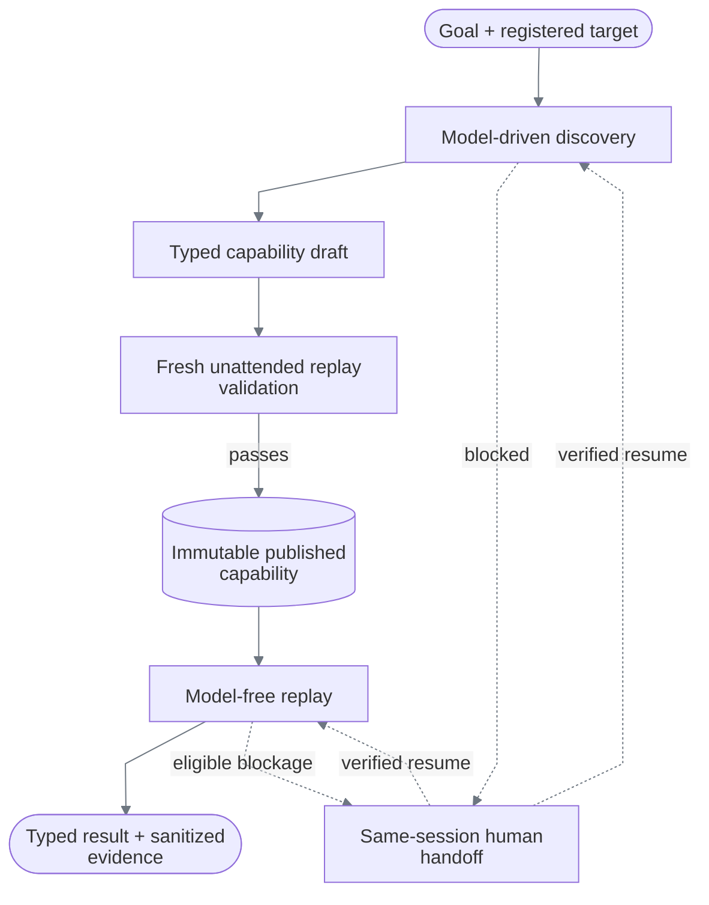
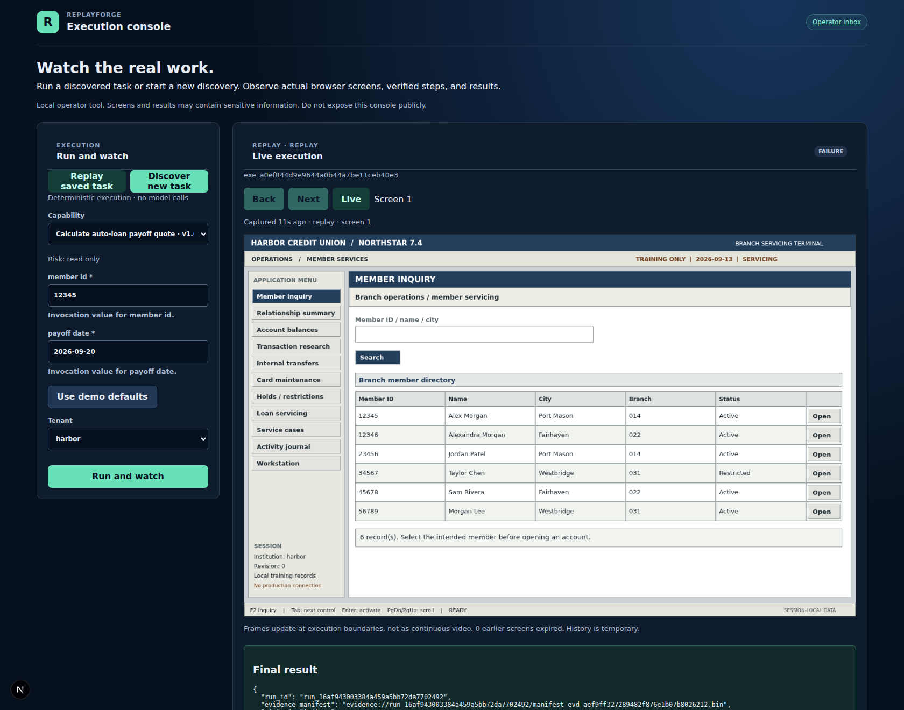

# ReplayForge

ReplayForge turns a goal-driven UI discovery into a reusable, typed YAML capability.
Fresh browser replays gate publication; subsequent execution uses no model decisions.



There is one demo application: a [dated servicing workstation](docs/demo-bank.md) with member
and account inquiry, transaction research, transfers, card maintenance, holds, payoff quotes,
service cases, and an activity journal. Its controls are rendered on a single canvas;
the canonical automation cannot rely on DOM form controls.

Genuinely discovered capabilities exercise three different business operations on that same UI: transaction
investigation, loan-payoff quotation, and temporary card lock. Each artifact is independently
validated on Harbor and Summit. The engine and compiler are task-independent: navigation and
control identity come from discovery, not task-specific code or stored click coordinates.
The demo goals, synthetic inputs, and target policy are explicit configuration. All 13 declared
negative/recovery cases have genuine discovery and two-tenant replay proof in the
[verification matrix](docs/verification.md#scenario-matrix).

Start with the [design report](REPORT.md), [architecture decisions](docs/architecture.md#critical-decision-index),
and [recorded evidence](evidence/README.md).

## What is real

| Path | Model? | Surface | Result |
|---|---:|---|---|
| Discovery | Yes | Screenshot + local OCR tokens; compact DOM facts when available | Verified draft; suite replay validation gates publication |
| Replay | **No** | Rendered pixels first; optional semantic DOM candidates second | Success, business outcome, failure, or intervention |
| Handoff | No during manual control | The same retained Chromium context | Dispatch-aware replay resume or continuation of blocked discovery |

Playwright supplies browser transport, screenshots, mouse, and keyboard. Local OCR and
frame-local visual grounding locate controls again on each observation; runtime coordinates
are calculated from the current screen, not replayed from discovery. Optional DOM targeting
remains available for other web applications. See [surface reality](docs/architecture.md#surface-reality).

## Run the core replay

Run these Bash commands from the repository root. Requires Python 3.12, `uv`, Node.js 22+,
and Chromium's system libraries. Commands below use pinned pnpm 10.15.1 through `npx`.
Replay needs neither an OpenAI key nor Langfuse.

```bash
UV_CACHE_DIR=/tmp/replayforge-uv-cache uv sync --extra dev --frozen
npm_config_cache=/tmp/replayforge-npm-cache npx --yes pnpm@10.15.1 install --frozen-lockfile
PLAYWRIGHT_BROWSERS_PATH=/tmp/replayforge-playwright-browsers UV_CACHE_DIR=/tmp/replayforge-uv-cache uv run playwright install chromium
[ -e .env ] || cp .env.example .env
```

The environment-file command preserves existing configuration. On a fresh Linux host, Chromium
may also require `uv run playwright install-deps chromium` with administrator privileges.
OCR inference runs locally, but first use may download model weights; provision them before
running offline. Dependency installation also requires network access.

Start the target:

```bash
npm_config_cache=/tmp/replayforge-npm-cache npx --yes pnpm@10.15.1 --filter @replayforge/demo-bank dev --hostname 127.0.0.1
```

Start the runtime in another terminal:

```bash
PLAYWRIGHT_BROWSERS_PATH=/tmp/replayforge-playwright-browsers UV_CACHE_DIR=/tmp/replayforge-uv-cache uv run uvicorn replayforge.main:app --host 127.0.0.1 --port 8000
```

Once both services are ready, replay the committed payoff capability:

```bash
curl --fail-with-body --silent --show-error \
  -H 'content-type: application/json' \
  -d '{"tenant":"harbor","version":"1.0.2","inputs":{"member_id":"12346","payoff_date":"2026-09-21"}}' \
  http://127.0.0.1:8000/api/v1/capabilities/member.servicing_loan_payoff_quote/replays
```

Expected for the fresh synthetic session: `status: "success"`, an issued quote for `$9,035.70`,
good through `2026-09-21`, and reference `HBR-000001`.
These inputs differ from discovery. The artifact verifies the date equality during every replay;
the browser regression independently checks all three exact outputs. No model is needed.

Inspect the response's `status`: HTTP 200 can also carry `business_outcome`, `failure`, or
`intervention_required`. API documentation is at [localhost:8000/api/docs](http://127.0.0.1:8000/api/docs).
The target itself is at [Harbor servicing](http://127.0.0.1:3001/harbor/servicing);
opening it manually does not show the automation's separate browser session.

## Three discovered workflows

| Capability / committed version | Required inputs | Verified result |
|---|---|---|
| `member.transaction_investigation` · `1.0.3` | `member_id`, `account_id`, `transaction_reference` | Six fields; exact account and transaction identity comparisons |
| `member.servicing_loan_payoff_quote` · `1.0.2` | `member_id`, `payoff_date` | Issued quote, date, reference; returned date equals input |
| `member.temporary_card_lock` · `1.0.2` | `member_id`, `card_id`, `reason` | Selected card, exact locked status, completion reference |

All use the single registered entry `legacy_servicing`; “legacy” describes the dated
workstation, not a second application. The [discovery specifications](config/servicing-discovery.yaml)
contain goals, inputs, business assertions, and exception cases—not click sequences or selectors.
New tasks on a supported, registered application need discovery, not a new compiler. New
applications need [entry-point and safety-policy registration](docs/application-onboarding.md);
a new surface type needs an adapter. Arbitrary unregistered URLs are not accepted.
See [verification](docs/verification.md) for precise evidence and error-handling boundaries.

## Operator console

Start it after the target and runtime:

```bash
npm_config_cache=/tmp/replayforge-npm-cache npx --yes pnpm@10.15.1 --filter @replayforge/control-plane dev --hostname 127.0.0.1
```

Open [localhost:3000](http://127.0.0.1:3000) to **Run and watch**. Choose Replay or Discovery, supply inputs
or use explicit demo defaults, and watch actual browser frames and the step timeline.
Replay's **Back / Next / Live** controls inspect temporary screen history without altering execution.
Discovery needs the provider setup below. Its viewer retains only the latest screen, not replay-style history.

When a run pauses, return **Live**, claim the retained browser, and follow its handoff instructions:

| Boundary | Operator action | Resume behavior |
|---|---|---|
| Replay blocked before dispatch | Restore the expected UI; do not perform the pending action | Re-ground and retry the same step |
| Replay may have dispatched, or paused for sensitive action | Inspect and complete/correct the requested effect | Verify the declared effect before advancing; no blind repeat |
| Discovery blocked | Make a manual correction that changes the allowed UI state | Continue the bounded discovery loop in the same session |

An uncertain action without an effect contract cannot safely resume. Policy violations,
unavailable sessions, and failed unattended validation do not become unrestricted handoffs.
Successful viewer discovery proceeds through fresh replay validation and publication without
a human approval stage. The operator inbox is at [Interventions](http://127.0.0.1:3000/interventions).
See [live viewing](docs/live-viewing.md) and [handoff safety](docs/safety-and-handoff.md) for exact rules.

The [obstruction recovery bundle](evidence/replay-injected-obstruction-handoff) records manual
clearance and same-step continuation using an unchanged published artifact. Separate browser
tests inject a sensitive policy boundary into a temporary artifact copy; that fixture is not
presented as a model discovery.

The console polls bounded in-memory frame/event buffers, not a video stream. Every control
transition uses an exclusive, expiring, monotonically versioned lease. Historical screens are
read-only and never authorize input. Operator IDs are local labels, not authentication.



*Diagnostic view: a model-free replay stopped at its grounding deadline, with the current screen
retained for inspection. All displayed data is synthetic. See
[runtime readiness](docs/operations.md#grounding-deadlines) for the observed timing condition.*

## Run genuine discovery

Discovery requires an OpenAI key and authenticated local Langfuse, plus Docker Engine,
Docker Compose, Git, and curl for the local stack. It sends screenshots and task values to the
configured provider and incurs model charges. Use synthetic data; do not substitute real customer
information. Replay and its viewer do not require this stack.

Create the ignored key file and edit its placeholder locally:

```bash
[ -e .secrets/openai.env ] || install -D -m 600 config/openai.env.example .secrets/openai.env
```

Create or reuse ignored Langfuse credentials, then start the pinned loopback-only stack:

```bash
scripts/start_local_langfuse.sh
```

The script provisions credentials if missing and starts the pinned Langfuse services at
[localhost:3100](http://127.0.0.1:3100). Restart the runtime to load the credentials.
Keep the target running, then capture one complete workflow suite:

```bash
UV_CACHE_DIR=/tmp/replayforge-uv-cache uv run python scripts/capture_demo_workflows.py \
  --spec config/servicing-discovery.yaml --workflow temporary_card_lock --timeout-seconds 600
```

This selects card lock: one primary discovery and six configured exception/recovery discoveries,
followed by tenant validation and publication checks. Omitting `--workflow` selects all three
suites, not a single run. The timeout is a per-run budget, not a ten-minute campaign deadline.
These are real model runs: a blockage, budget exhaustion, or contract mismatch can prevent publication.

After successful publication, invoke the latest card-lock version without a model call:

```bash
curl --fail-with-body --silent --show-error \
  -H 'content-type: application/json' \
  -d '{"tenant":"harbor","inputs":{"member_id":"12345","card_id":"12345-D1","reason":"Synthetic precautionary lock"}}' \
  http://127.0.0.1:8000/api/v1/capabilities/member.temporary_card_lock/invoke
```

The script writes captured artifacts and scenario proof references into a fresh private directory
under ignored `.local/discovery-captures` and reports the actual published versions.
It does not create the committed reviewer-format evidence bundles; use the separate
[evidence export procedure](docs/verification.md) for those. Supply the reported `version` in the invocation body
to pin a run, or omit it to resolve the latest publication. The committed discoveries can also be
replayed without configuring model credentials or starting Langfuse.

The console's **Discovery** mode runs a primary discovery plus tenant replay validation; it does
not automatically collect the specification's exception scenarios. The lower-level
`POST /api/v1/discoveries` returns an unpublished draft. Suite finalization is the publication gate.

The reviewed [model policy](config/model-policy.yaml) fixes provider, model, reasoning effort,
token/call limits, timeout, frame size, and an output-token cost ceiling—not a total billing cap.
Requests cannot override it. Provider calls use strict structured output, no tools, and `store=false`;
screenshots cross the provider boundary. See [data exposure boundaries](docs/safety-and-handoff.md#data-exposure-boundaries)
for recipients, retention, and deployment controls.

## Inspect without live services

After dependency setup, these checks need no API key, Langfuse, target server, or operator console:

```bash
uv run python scripts/verify_evidence_bundles.py evidence --require-submission
uv run pytest backend/tests/unit -q
```

This verifies saved proof and isolated contracts; it does not simulate a genuine discovery.
Actual replay still needs Chromium and the running target. Read the compact
[design report](REPORT.md), then the [verification guide](docs/verification.md).

## Verify everything

```bash
bash scripts/verify.sh
```

This runs documentation and script checks, locked dependency setup, Ruff, strict mypy, a 90%
branch-aware domain-coverage gate, evidence verification, TypeScript checks, demo-domain tests,
both frontend builds, and real Chromium integration tests. It does not make genuine provider calls.
Browser tests run sequentially and can take tens of minutes; use the lightweight checks above for
an initial review. The [verification record](docs/verification.md) separates saved proof from regression tests.

Run the focused visual portability matrix after starting or building the demo bank:

```bash
UV_CACHE_DIR=/tmp/replayforge-uv-cache \
PLAYWRIGHT_BROWSERS_PATH=/tmp/replayforge-playwright-browsers \
uv run pytest backend/tests/integration/test_visual_portability.py -q
```

Verify only the committed evidence:

```bash
UV_CACHE_DIR=/tmp/replayforge-uv-cache uv run python scripts/verify_evidence_bundles.py evidence --require-submission
```

## Repository map

```text
backend/src/replayforge/
├── api/             FastAPI contracts and adapter
├── capabilities/    artifact model, serialization, immutable registry
├── applications/    validated application onboarding and surface launch policy
├── discovery/       contract planning, bounded model loop, and generic compiler
├── replay/          deterministic, model-free interpreter
├── surfaces/        surface contracts and Playwright adapter
├── policy/          layered allowlists and risk decisions
├── interventions/   state machine and exclusive control leases
├── evidence/        redaction, hashing, manifests, local store
├── runs/            application services, results, audit journal
├── providers/       OpenAI adapter
├── observability/   bounded model-call metrics
├── shared/          IDs, clocks, unique-key YAML parser
└── runtime/         settings, composition, session worker

apps/demo-bank/      synthetic target on :3001
apps/control-plane/  execution viewer and intervention console on :3000
capabilities/        published immutable YAML versions
evidence/            committed reviewer bundles; runtime output is ignored
docs/                implementation-accurate design documentation
```

## Documentation

The [documentation index](docs/README.md) routes each question to its reference page and defines
shared terminology. Start with [Architecture](docs/architecture.md),
[Data models](docs/data-models.md), and [Capability and replay](docs/capability-and-replay.md).
[REPORT.md](REPORT.md) explains the core design in seven sections.

## Deployment boundaries

| Data / service | Lifetime and boundary |
|---|---|
| Published capabilities, visual assets, sanitized evidence | Durable local files; immutable versions and content hashes |
| Journal events | Sanitized events are written to evidence; live journal indexes remain in memory |
| Suite progress, browser sessions, leases, viewer buffers | In memory; restart loses active execution and control state |
| Viewer screens | Temporary, potentially sensitive frames; no persisted screen-history files |
| Failure/handoff diagnostics | Unmasked PNGs for replay and discovery, plus a bounded value-free diagnostic ZIP; not a native Playwright trace. Raw images are for synthetic-data use and require review before sharing. |
| Langfuse | Separate discovery telemetry stack with PostgreSQL, ClickHouse, Redis, and MinIO; materially heavier than the replay runtime |

ReplayForge has no database/object-store adapter, distributed queue, production authentication,
WebSocket/video stream, or native desktop/Citrix transport. Langfuse's infrastructure does not
provide durable ReplayForge sessions. Keep the runtime and console on trusted loopback interfaces.

The local synthetic deployment demonstrates the complete discovery, replay, and handoff contract.
Production onboarding adds institution-level authentication, authorization, provider data controls,
and retention enforcement. See [verified coverage](docs/verification.md#coverage-boundaries) for
the demonstrated scenarios and planned extensions.
