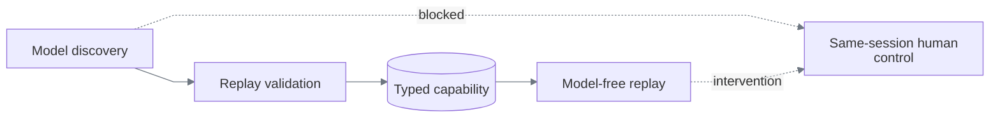

# ReplayForge Design Report

## 1. Architecture

ReplayForge learns a UI task once, saves a typed capability, and replays it without model
decisions. One synthetic bank-staff workstation provides transaction investigation, dated payoff
quoting, and temporary card locking. Its dense canvas surface exposes no task controls through
the DOM and no task-completion API.

A Python/FastAPI monolith unites OCR, typed validation, and execution; ports isolate Playwright,
OpenAI, and storage. Separate Next.js target/operator UIs preserve boundaries. Owner-thread browsers
preserve Playwright affinity during handoff. Microservices would add unnecessary coordination.
Structural tests enforce dependency direction and prohibit model imports in replay.

OpenAI Responses supplies screenshot-based contract planning and one structured action proposal
at a time. The pinned `gpt-5.6-luna`/`low` profile completed the committed runs; no comparative benchmark is
claimed. Independent verification replaces unrestricted agent execution.
The [decision index](docs/architecture.md#critical-decision-index) records alternatives.

## 2. Artifact schema

The program is strict, versioned YAML, not generated executable code or a model transcript.

| Contract | Enforced meaning |
|---|---|
| Identity and compatibility | Immutable ID/version, registered application, supported tenants, surface contract |
| Inputs and outputs | Closed typed objects, constraints, classifications, symbolic input references |
| Execution | Ordered actions, unique targets, conditions, finite retries/recoveries, explicit outcomes/failures |
| Completion and authority | Required-output checkpoint, policy ceiling, discovery provenance, canonical hash |

Pydantic rejects extra fields and invalid references; YAML rejects duplicate keys. Schema `1.4`
rejects persistent target coordinates. Every required output must be extracted and checked.
Transaction checks account/reference identity, payoff checks the requested date, and card lock
checks identity before and after mutation plus exact locked status.

The generic compiler accepts executed, verified traces rather than model-written programs.
Symbolic bindings parameterize inputs. Immutable files and detached snapshots prevent silent
mutation; SHA-256 identifies content, not authorship. See [data models](docs/data-models.md).

## 3. Determinism & error handling

Replay validates inputs and compatibility, opens an isolated browser, checks readiness, then
resolves, authorizes, executes, and verifies each declared step. Local OCR and current-frame
label/control relationships are primary; semantic DOM locators are optional. Saved coordinates
and offsets were rejected because reflow invalidates them. Multiple plausible matches fail
closed. Determinism means fixed execution rules—not identical outputs despite changed business state.

Results distinguish verified `success`, positively observed `business_outcome`, terminal `failure`,
and live `intervention_required`. Failures carry a stable code, available step/context, and evidence.

Waits are bounded. Retry requires a named eligible error, remaining attempts, and proof of no
prior effect. Recovery executes declared corrections and rejoins a fixed step; uncertain mutations
are not repeated. Thirteen genuinely discovered exception/recovery branches and 32 model-free
matrix replays cover all declared cases across both tenants. Unknown faults stop; authentication
expiry has no learned re-login path. Ordinary target failures do not automatically request a human.
See [fault coverage](docs/requirements.md#runtime-fault-coverage).

## 4. Heterogeneity & multi-tenant

`SurfaceSession` owns perception/input; replay owns program semantics. Desktop could reuse PNG
grounding but needs OS input, window/focus identity, ownership, and policy. Unsupported desktop
contracts are rejected today.

One artifact serves differently styled/ordered Harbor and Summit; tests change inputs and viewport.
Registration supplies entry points, readiness, and authority—not task recipes. New tasks need
discovery, not task code; new apps also need registration and supported controls.

Compatibility and landmarks catch declared mismatch. Screenshot hashes are provenance, not drift
gates: harmless data changes alter pixels. Validate upgrades before reuse; changed semantics need
a new version. Future overlays would bind base hash, tenant, and vendor version without widening
policy. Independent tenant origins and fleet rollout remain
[unimplemented](docs/heterogeneity-and-compatibility.md).

## 5. Escalation & handoff

Discovery detects repeated state/actions, low confidence, explicit escalation, and unresolved
safety boundaries. Replay pauses for sensitive policy decisions or adapter-recommended intervention;
other unrecovered errors return failure. Routing carries task, step, surface, and reason.

The operator claims the retained browser using an exclusive expiring lease. Paired compare-and-swap
updates keep intervention state and ownership atomic. Input binds lease version, current frame,
viewport, and command sequence; stale input is rejected. Human actions are audited without typed text.

Replay resume checks fresh state and the interrupted effect or declared outcome. Discovery resume
requires accepted human input and changed allowed state, preserves consumed budgets, and invalidates
outputs. Human actions are not fabricated automation steps: fresh unattended replay still gates
publication and can reject a manually dependent draft. No post-discovery approval exists.

HTTP polling provides frames and read-only history without video infrastructure. Browser handoff
tests use explicit blocking/policy fixtures, not model discoveries.

## 6. Safety

Policy intersects origin/route/action allowlists, unions forbidden classifications, and takes the
lowest risk ceiling. Independently inferred risk can raise declarations. Irreversible automation
is denied; sensitive work pauses. Registration prevents arbitrary caller-selected navigation.

Evidence uses restricted fields, keyed pseudonyms, and classification-based redaction before
storage. Known-value artifact guards reject captured private literals. Failure screenshots are
fully masked; new image-signature capture defaults off. This sacrifices visual post-mortem detail:
the richer attachment proves capture, not what the failed screen displayed.

Authorized discovery sends transient synthetic screenshots to OpenAI with `store=false`; that is
not Zero Data Retention. Langfuse stores local call metrics, not prompts or frames.
[Data boundaries](docs/safety-and-handoff.md#data-exposure-boundaries) distinguish provider, caller,
viewer, and durable evidence. Privacy guards are not universal PII detection. Local operator labels
are not authentication, and browser routing policy is not network isolation.

## 7. Cuts

Files preserve capabilities/evidence; live coordination remains in memory. PostgreSQL, S3,
distributed workers, production authentication, desktop, durable video, and model replay fallback
are cut to focus on the local execution contract. Restart loses active work, not saved programs.

The two stretch goals are typed invocation and cross-tenant reuse. Next priorities are broader
fault handoff and privacy-safe diagnostics. Real-data deployment also needs authentication,
tenant authorization, provider data controls, and retention enforcement.

[README](README.md) gives exact commands; [verification](docs/verification.md#verified-snapshot)
records measured proof. [Requirements](docs/requirements.md) maps the PDF to delivery and remaining concerns.
