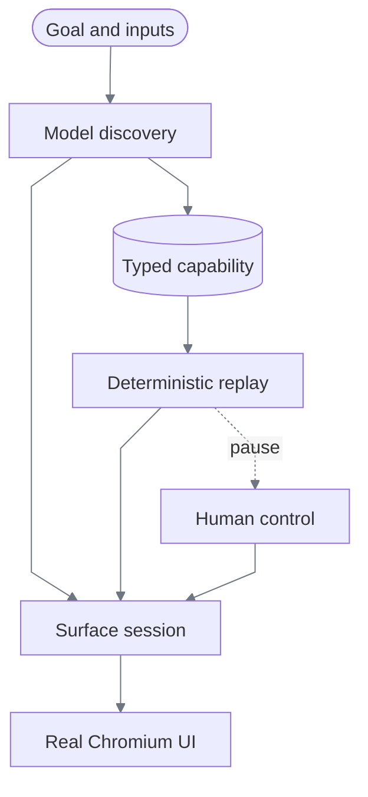

# ReplayForge Design Report

## 1. Architecture

ReplayForge turns a natural-language goal into a verified UI recording, publishes it as a typed
capability, and executes later invocations without model decisions. The real target is one synthetic
banking workbench with transaction investigation, dated loan payoff quoting, and temporary card
locking. Its controls and values are painted on a canvas.

The expanded [staff workstation](docs/demo-bank.md) adds connected balances, transfers, holds,
card maintenance, and service cases. Its application tests are separate from the historical
discovery/replay evidence; automation coverage on that richer UI is not yet claimed.

A modular monolith keeps policy, discovery, replay, evidence, and intervention behind typed ports.
FastAPI composes these modules; separate Next.js applications serve the target and operator console.
Each browser run has one owner thread, retained across handoff. Structural tests prohibit runtime
imports from domain modules and model imports from replay.

Microservices and queues would add coordination without improving this slice. Atomic local files
preserve capabilities, visual assets, and evidence; in-memory repositories own live coordination.
OpenCV/ONNX computation is bounded and shared OCR calls are serialized to prevent oversubscription
and mutable-provider races. [Architecture](docs/architecture.md) explains module ownership.

## 2. Artifact schema

The artifact is strict, versioned YAML—not executable generated code or a model transcript.

| Component | Contract |
|---|---|
| Identity and compatibility | Capability ID/version, application family, tenants, surface contract, entry point, landmarks |
| Inputs and outputs | Closed typed objects, constraints, classifications, nested input references |
| Program | Ordered actions, unique targets, pre/postconditions, timeouts, finite retries/recoveries |
| Result semantics | Explicit business outcomes, application failures, final checkpoint |
| Authority and provenance | Policy ceiling, discovery run, model/compiler versions, evidence key, canonical hash |

Pydantic rejects unknown fields and invalid references; the YAML loader rejects duplicate keys.
Schema 1.4 rejects persistent coordinates and binds provenance evidence to its discovery run.
Every required output must be extracted and referenced by the checkpoint; runtime validates actual
output values before success. Registry snapshots isolate nested mutable mappings, while immutable
file publication prevents replacing an existing version.

Checks are only as strong as the artifact declares: the card-lock fixture validates string outputs
and rendered labels, not an exact status value or an executed inverse. The
[worked example](docs/capability-and-replay.md#worked-example-temporary-card-lock) makes that boundary explicit.

Discovery validates supplied inputs against its planned contract before acting and applies the same
bound-input classification rules as replay, including forbidden parent-object classifications.

YAML was chosen for reviewability, typed models for enforceable semantics, and canonical SHA-256
for content identity. The generic compiler accepts executed, verified trace steps rather than an
arbitrary model-written program. Historical task-specific compilation exists only in test fixtures.
See [Data models](docs/data-models.md) and [Replay contract](docs/capability-and-replay.md).

## 3. Determinism & error handling

Replay validates inputs and registered compatibility, opens an isolated session, checks live
landmarks, and executes each step under an ownership lease and intersected policy. Targets resolve
uniquely from the current frame. Click dispatch is not proof of effect: postconditions and the
business checkpoint establish completion.

`assert` checks its condition, `wait_for` polls within the step budget, and `checkpoint` evaluates the
named condition. Missing or ambiguous targets stop execution. Recovery follows declared steps and
a fixed resume point. Retries require a named eligible error, remaining attempts, and proof that
the previous effect is absent; uncertain mutations are never blindly repeated.

| Result | Meaning |
|---|---|
| `success` | Checkpoint and typed outputs verified |
| `business_outcome` | A legitimate negative result, such as no matching member |
| `failure` | Application, policy, targeting, or verification failure with step/context |
| `intervention_required` | Automation paused with the live session retained |

Known notices, delayed loads, permission denial, and ambiguity have executable coverage.
Open-ended model recovery was rejected because replay must remain reproducible.

## 4. Heterogeneity & multi-tenant

`SurfaceSession` separates perception/input from program semantics. Playwright supplies browser
transport; primary targeting uses local OCR, current-frame label/control relationships, and
content-addressed visual signatures. DOM locators remain optional. Recorded coordinates and
relative regions were rejected because window resizing and responsive reflow invalidate them.

One artifact runs across Harbor and Summit, which vary typography, branding, row order, and layout.
The visual matrix exercises six viewport sizes and DPR 1–2. Discovery-suite validation adds tenant
support only after deterministic execution succeeds.

Before replay, application registration must match the artifact's surface contract; schema 1.4 also
checks base variant and rendered mode. Registered required/forbidden landmarks catch declared entry-state
incompatibility. The discovery observation hash remains provenance, not a literal drift gate:
legitimate values and branding change the pixels. Descriptive discovery landmarks may also contain
tenant branding; only explicit registration readiness conditions apply across tenants.

A vendor change that preserves semantics may reuse the artifact after validation. Changed workflow
or output meaning requires a new immutable version. Future narrow overrides would bind the base
artifact hash, tenant, and vendor version; they must not widen authority. Independent tenant origins,
automated release detection, and an overlay repository are not implemented.

Desktop can reuse PNG grounding but needs OS capture/input, focus/window identity, and desktop
policy semantics. Registration rejects unsupported desktop contracts today.
[Compatibility](docs/heterogeneity-and-compatibility.md) records the extension and legacy rules.

## 5. Escalation & handoff

Repeated state/actions, low confidence, explicit escalation, and sensitive policy decisions route
interventions carrying run, task, step, surface, and pause context.

The operator claims the same retained Chromium context using an exclusive expiring lease.
Intervention and lease transitions commit atomically under paired compare-and-swap checks.
Human input carries the current lease version, frame sequence, viewport, and next client sequence.
Stale input is rejected; accepted input invalidates the frame. Evidence records actions and text
length, never manual text.

Resume validates fresh location and the interrupted step's effect or a declared business outcome.
An unchanged state cannot resume. Successful validation restores automation ownership and continues
the remaining steps. HTTP frame polling provides the required real handoff with modest transport
complexity. Discovery can pause for control, but its automatic continuation remains a documented cut.

## 6. Safety

Origin, normalized route, action, field classification, and independently inferred risk constrain
automation. Policy layers intersect allowlists, union forbidden classes, and take the lowest risk
ceiling. Irreversible automation is denied; sensitive replay pauses for human operation. Reversible
discovery requires deterministic suite validation before publication. No human approval state is
inserted after discovery.

Evidence is redacted before storage. Nested output classifications are preserved; credentials,
personal values, and financial data are removed or masked. New screenshot evidence masks the full
viewport; fixture selectors cannot establish that other pixels are public. New image-signature
capture is disabled by default, with a loopback-only synthetic opt-in. Historical evidence is
unchanged. Live operator frames and authorized
discovery frames are transient. Provider requests use `store=false`; local Langfuse records model-call
metrics.

Hash-linked, closed-set manifests detect changed or incomplete evidence, not signer authenticity.
This is a local trusted-operator system: caller labels are not authentication, human control is not a
semantic financial authorization system, and transport/network isolation is not a browser sandbox.
Production requires authenticated operators, tenant authorization, retention enforcement, and
deployment controls. [Safety and handoff](docs/safety-and-handoff.md) defines these boundaries.

## 7. Cuts

Depth is concentrated in the artifact, replay/error semantics, and actual control transfer, as the
assignment requests. Four genuine discovery bundles and six replay/handoff bundles preserve the
end-to-end evidence; tests exercise current code against immutable artifacts.

| Deliberate cut | Reason / next condition |
|---|---|
| PostgreSQL and distributed workers | Saved capabilities need durable files; multi-process coordination would justify a transactional repository |
| S3 | Local durable evidence satisfies this single-node submission |
| Full operations product and co-browsing stream | A focused polling console proves real handoff |
| Native desktop adapter | Typed surface seam exists; OS transport requires separate implementation |
| Discovery continuation after human control | Replay continuation is implemented; discovery needs a separately validated continuation model |
| Tenant overlay engine | Shared-artifact validation proves reuse; specialization design is documented |
| LLM replay fallback | Finite deterministic recovery preserves the production model boundary |

`bash scripts/verify.sh` checks documentation, formatting, typing, evidence integrity, sequential frontend builds,
and unit/Chromium tests with a 90% configured domain-coverage gate. Setup, genuine discovery, and
invocation commands are in [README](README.md); the full traceability matrix is in
[Requirements](docs/requirements.md).
