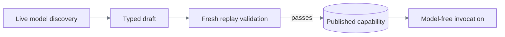

# ReplayForge Design Report

## 1. Architecture

ReplayForge separates learning a task from executing it reliably. The model discovers the UI
procedure; a typed interpreter enforces its actions, authority, and completion conditions.
Fresh replay validation turns a successful discovery into a reusable capability.

Python/FastAPI brings OCR, validation, and execution into one runtime with replaceable adapters.
The monolith keeps session ownership and policy coordination straightforward. Playwright supplies
isolated browsers, screenshots, and input; separate Next.js apps share TypeScript tooling while
isolating target behavior from operator control. Invocation is synchronous; visual runs launch
in the background and use polling.

The synthetic bank-staff workstation deliberately renders controls on canvas to exercise the
no-clean-DOM case. Transaction research, payoff quotation, and reversible card locking provide
multi-step workflows and controlled faults without real customer data or a task-completion API.

OpenAI Responses combines screenshot input with structured proposals. Prompts supply the goal,
current observations, and contract; the runtime validates each proposed action. The pinned
[`gpt-5.6-luna`/`low` profile](config/model-policy.yaml) keeps calls bounded and attributable.
[Recorded discovery](evidence/discovery-transaction-parameterized/manifest.json) demonstrates it on the live target.

## 2. Artifact schema

YAML was chosen over generated code because a small execution language is easier to validate,
review, and constrain. The compiler builds it from verified actions, not the raw model transcript.

| Contract | Purpose |
|---|---|
| Identity, version, compatibility | Bind the program to validated environments |
| Typed inputs/outputs, classifications | Parameterize values and govern data handling |
| Steps, targets, conditions, bounded branches | Define normal execution and exceptions |
| Checkpoint, policy, provenance | Verify completion, authority, and origin |

Strict validation rejects unknown fields, duplicate YAML keys, invalid references, and persisted
target coordinates. Inputs become symbolic bindings, not saved customer values. Required outputs
must be extracted and verified: card lock checks identity before and after mutation and requires
the exact locked status. Completion therefore establishes identity and business state together.

Immutable versions and content hashes preserve reproducibility. The [data models](docs/data-models.md)
keep programs and evidence independent of live runs, interventions, and leases.

## 3. Determinism & error handling

Replay validates inputs and compatibility, then resolves, authorizes, executes, and verifies each
step. OCR text and current-screen label/control relationships provide primary targeting; semantic
DOM candidates are optional. Coordinates are calculated afresh, since saved positions break under
reflow. Ambiguous matches never authorize a click. Determinism means fixed rules, not frozen
business data.

A missing member returns `business_outcome`, not a crash. A recognized notice triggers a declared
correction and rejoins a fixed step. Application rejection or an unrecoverable error returns
`failure`; verified completion returns `success`. A live pause returns `intervention_required`.
Structured failure evidence identifies the step and expected/observed condition without raw
private values; screenshot attachments follow the explicit policy described below.

Waits and retries are bounded. Retrying an action requires evidence that its effect did not occur;
an uncertain mutation is never repeated blindly. The [scenario matrix](docs/verification.md#scenario-matrix)
demonstrates 13 genuinely discovered exception/recovery cases through replay on both tenants.
Each branch must establish its declared outcome or complete its recovery and verify the task.

## 4. Heterogeneity & multi-tenant

`SurfaceSession` owns observation, target resolution, and input; the interpreter owns the recorded
flow. A desktop adapter could reuse screenshot grounding, but must implement OS input, window/focus
identity, and session ownership. This defines the desktop extension boundary.

The same capability runs on Harbor and Summit despite presentation differences. New tasks need
discovery, not task-specific compiler code. New applications also need registered entry points,
readiness landmarks, and policy; accepting arbitrary URLs would bypass that safety boundary.

Compatibility and landmark checks detect mismatches; screenshot hashes also change with ordinary
data, making them unsuitable drift gates. Vendor upgrades should pass fresh replay
before reuse; changed business semantics require a new version. Future tenant overrides would bind
to a base artifact hash and vendor version, permit limited presentation/timing changes, and never
widen authority. Independent tenant origins, override storage, and fleet rollout are
[planned extensions](docs/heterogeneity-and-compatibility.md).

## 5. Escalation & handoff

Discovery pauses on repeated states/actions, low confidence, or an explicit blockage. Replay can
pause after bounded handling of target/action faults or at a sensitive policy boundary. Invalid
inputs, denied actions, wrong identity, and unavailable sessions remain terminal.

The console shows the goal, step, reason, and live screen. An operator claims the retained browser.
Intervention state and an exclusive, expiring lease change atomically; versioned
commands reject stale ownership or frames. One session thread serializes browser access. Manual
actions are audited without retaining typed text.

If an action never started, the operator restores the UI and automation retries that step. If it
may have executed, resume requires fresh effect verification before advancing. Without an effect
contract, resume is refused. Discovery requires manual input and a changed allowed state.
Both modes discard stale outputs and preserve spent budgets.

Human corrections do not become recorded steps. Fresh unattended replay must still validate the
capability; no post-discovery approval is required. Browser tests prove replay control transfer
using injected blockages, separately from genuine discovery evidence. Discovery continuation has
unit coverage; its [console regression](docs/verification.md#control-transfer-evidence) needs follow-up.

## 6. Safety

Application, capability, and runtime policies can only narrow permitted routes, actions, and data
access. Risk inference can raise a model's declaration. Irreversible automation is blocked;
sensitive actions require human control. This is conservative because UI automation cannot promise
transactional rollback.

Structured evidence is redacted using restricted fields, classifications, keyed pseudonyms,
and known-value guards. Failure and handoff PNGs retain visible pixels for synthetic-data debugging
and are explicitly marked unredacted; they require review before sharing. A compact diagnostic ZIP
records execution phase, dispatch uncertainty, condition types, and retry state without UI values.

Live screens and caller outputs are different from retained evidence. Authorized synthetic discovery
sends unmasked screenshots to OpenAI with `store=false`, which is not a zero-retention guarantee.
Langfuse keeps call accounting local and records metrics rather than prompts or frames. Discovery
requires its readiness so accounting remains reliable. The [data boundaries](docs/safety-and-handoff.md#data-exposure-boundaries)
define recipients and retention for this local, synthetic-data deployment.

## 7. Cuts

Capabilities, redacted structured evidence, and explicitly unredacted diagnostic PNGs survive on
disk; active runs, suites, and leases do not survive
restart. Database/queue infrastructure is deferred because this slice needs saved programs, not
durable live coordination. Langfuse's database stack does not persist ReplayForge sessions.

Typed invocation and cross-tenant reuse extend the core execution contract. Desktop, durable video,
and model replay fallback are omitted. Next comes genuine login-expiry and role-denial testing
on an authorized target. Real-data deployment first needs authentication, tenant authorization,
provider data controls, and retention enforcement.
