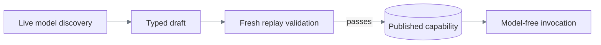

# ReplayForge Design Report

## 1. Architecture

The central decision is to separate learning a task from trusting it to run unattended.
The model discovers how to operate the UI; a typed interpreter decides whether the saved
procedure can execute safely. A model claiming success is not enough to publish a capability.

Python/FastAPI keeps OCR, validation, and execution in one process, with interfaces for model,
browser, and storage adapters. Microservices would add unnecessary coordination. Playwright
supplies browser input; Next.js provides the target and operator console. Direct invocation is
synchronous; the viewer launches background execution and polls it.

The target is one synthetic bank-staff workstation. Its dense canvas has no DOM task controls or
completion API. Three tasks exercise transaction research, payoff quotation, and reversible card
locking without real customer data.

OpenAI Responses was chosen for screenshot input and structured proposals. The runtime checks
each proposal before execution and bounds steps, time, and calls. The pinned
[`gpt-5.6-luna`/`low` profile](config/model-policy.yaml) completed the recorded runs; no comparative
model benchmark was conducted.

## 2. Artifact schema

YAML was chosen over generated code because a small execution language is easier to validate,
review, and constrain. The compiler builds it from verified actions, not the raw model transcript.

| Contract | Purpose |
|---|---|
| Identity, version, compatibility | Bind the program to validated environments |
| Typed inputs/outputs, classifications | Parameterize values and govern data handling |
| Steps, targets, conditions, bounded branches | Define normal execution and exceptions |
| Checkpoint, policy, provenance | Verify completion, authority, and origin |

Strict validation rejects unknown fields, duplicate YAML keys, invalid references, and persisted
target coordinates. Inputs become symbolic bindings, not saved customer values. Required outputs
must be extracted and verified: card lock checks identity before and after mutation and requires
the exact locked status. A confirmation label alone would not prove success.

Versions cannot be overwritten; hashes detect changes, not authorship. The [data models](docs/data-models.md)
keep programs and evidence independent of live runs, interventions, and leases.

## 3. Determinism & error handling

Replay validates inputs and compatibility, then resolves, authorizes, executes, and verifies each
step. OCR text and current-screen label/control relationships provide primary targeting; semantic
DOM candidates are optional. Coordinates are calculated afresh, since saved positions break under
reflow. Ambiguous matches never authorize a click. Determinism means fixed rules, not frozen
business data.

A missing member returns `business_outcome`, not a crash. A recognized notice triggers a declared
correction and rejoins a fixed step. Application rejection or an unrecoverable error returns
`failure`; verified completion returns `success`. A live pause returns `intervention_required`.
Failure evidence identifies the step and expected/observed condition without raw private values.

Waits and retries are bounded. Retrying an action requires evidence that its effect did not occur;
an uncertain mutation is never repeated blindly. The [scenario matrix](docs/verification.md#scenario-matrix)
contains genuine discovery and two-tenant replay for 13 exception/recovery cases, not proof of
arbitrary recovery. Login-expiry and role-denial discovery remain unproven.

## 4. Heterogeneity & multi-tenant

`SurfaceSession` owns observation, target resolution, and input; the interpreter owns the recorded
flow. A desktop adapter could reuse screenshot grounding, but must implement OS input, window/focus
identity, and session ownership. It is not implemented today.

The same capability runs on Harbor and Summit despite presentation differences. New tasks need
discovery, not task-specific compiler code. New applications also need registered entry points,
readiness landmarks, and policy; accepting arbitrary URLs would bypass that safety boundary.

Compatibility and landmark checks detect mismatches; screenshot hashes also change with ordinary
data, making them unsuitable drift gates. Vendor upgrades should pass fresh replay
before reuse; changed business semantics require a new version. Future tenant overrides would bind
to a base artifact hash and vendor version, permit limited presentation/timing changes, and never
widen authority. Independent tenant origins, override storage, and fleet rollout are
[design work, not implemented infrastructure](docs/heterogeneity-and-compatibility.md).

## 5. Escalation & handoff

Discovery pauses on repeated states/actions, low confidence, or an explicit blockage. Replay can
pause after bounded handling of target/action faults or at a sensitive policy boundary. Invalid
inputs, denied actions, wrong identity, and unavailable sessions remain terminal.

The console shows the goal, step, reason, and live screen. An operator claims the same browser,
not a replacement. Intervention state and an exclusive, expiring lease change atomically; versioned
commands reject stale ownership or frames. One session thread serializes browser access. Manual
actions are audited without retaining typed text.

If an action never started, the operator restores the UI and automation retries that step. If it
may have executed, resume requires fresh effect verification before advancing. Without an effect
contract, resume is refused. Discovery requires manual input and a changed allowed state.
Both modes discard stale outputs and preserve spent budgets.

Human corrections do not become recorded steps. Fresh unattended replay must still validate the
capability; no post-discovery approval is required. Browser tests prove control transfer using
injected blockages, separately from genuine discovery evidence.

## 6. Safety

Application, capability, and runtime policies can only narrow permitted routes, actions, and data
access. Risk inference can raise a model's declaration. Irreversible automation is blocked;
sensitive actions require human control. This is conservative because UI automation cannot promise
transactional rollback.

Evidence is redacted before storage using restricted fields, classifications, keyed pseudonyms,
and known-value guards. Screenshots retained on failure are fully masked. That sacrifices visual
debugging, so a bounded, value-free diagnostic ZIP records execution phase, dispatch uncertainty,
condition types, and retry state. It is not a native Playwright trace. New image-asset capture is
disabled by default.

Live screens and caller outputs are different from retained evidence. Authorized synthetic discovery
sends unmasked screenshots to OpenAI with `store=false`, which is not a zero-retention guarantee.
Langfuse keeps call accounting local, at the cost of another discovery dependency; it receives
metrics, not prompts or frames. These controls are not universal PII
detection, production authentication, or network isolation; the [data boundaries](docs/safety-and-handoff.md#data-exposure-boundaries)
make those limits explicit.

## 7. Cuts

Capabilities and sanitized evidence survive on disk; active runs, suites, and leases do not survive
restart. Database/queue infrastructure is deferred because this slice needs saved programs, not
durable live coordination. Langfuse's database stack does not persist ReplayForge sessions.

The two stretch features are typed invocation and cross-tenant reuse. Desktop, durable video,
and model replay fallback are omitted. Next comes genuine login-expiry and role-denial testing
on an authorized target. Real-data deployment first needs authentication, tenant authorization,
provider data controls, and retention enforcement.
