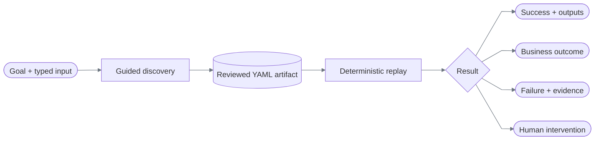

# ReplayForge documentation

ReplayForge turns one model-guided UI run into a typed capability, then replays that capability without model decisions.

Every diagram uses the same grammar: rectangles are work, cylinders are stored
artifacts, diamonds are decisions, rounded nodes are boundaries or outcomes, and
dashed arrows are exceptional transfers. Node colors come from the Markdown
renderer; connectors use one neutral, high-contrast gray in light and dark modes.

## Read by question

| Question | Document |
|---|---|
| What runs, and where are the boundaries? | [Architecture](architecture.md) |
| What are the domain objects and how do they relate? | [Data models](data-models.md) |
| What exactly is recorded and replayed? | [Capability and replay](capability-and-replay.md) |
| What does the model see and decide? | [Discovery](discovery.md) |
| How are unsafe actions, data, and handoff handled? | [Safety and handoff](safety-and-handoff.md) |
| How do I run it, and what HTTP surface exists? | [Operations](operations.md) |
| What do the tests and committed evidence prove? | [Verification](verification.md) |
| How does the implementation map to the assignment? | [Requirements](requirements.md) |

The concise assignment write-up is [REPORT.md](../REPORT.md). Setup and the shortest reviewer path are in the root [README.md](../README.md).

## Status vocabulary

Every page uses these labels consistently:

| Label | Meaning |
|---|---|
| **Implemented** | Executable code is present in this repository. |
| **Evidenced** | A committed, hash-verified run bundle demonstrates it. |
| **Designed** | A typed seam exists or the extension is explained, but the behavior is not built. |
| **Cut** | Intentionally outside this submission. |

## Scope in one table

| Area | Status | Boundary |
|---|---|---|
| Browser discovery | Implemented, evidenced | OpenAI + screenshots + local OCR; DOM facts optional |
| Browser replay | Implemented, evidenced | OCR/templates first, semantic locators second; no model dependency |
| Same-session handoff | Implemented, evidenced | Polling PNG viewport and bounded HTTP input |
| Two tenant variants | Implemented, evidenced | One artifact supports `harbor` and `summit` |
| Persistence | Partly implemented | Evidence on disk; operational metadata in memory |
| Canvas/non-DOM browser control | Implemented, tested | Canvas-only demo; OCR, relative regions, image anchors |
| Native desktop control | Designed | Surface ports exist; no OS adapter executes them |
| Full operations UI | Cut | The UI is an intervention console only |
| Distributed runtime | Cut | One process; one thread-affine worker per browser run |
