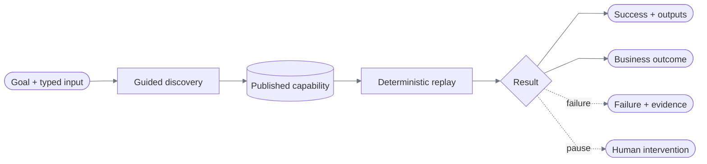

# ReplayForge documentation

ReplayForge turns one model-guided UI run into a typed capability, then replays that capability without model decisions.

Discovery suites validate and publish automatically; there is no human approval stage.
Human intervention belongs to a paused live run.

## Choose a review path

| Audience | Read in order | What to inspect |
|---|---|---|
| Assignment evaluator | [Design report](../REPORT.md) → [requirements](requirements.md) → [evidence](verification.md#scenario-matrix) | Delivered behavior, proof, and explicit cuts |
| Engineer reviewing the design | [Architecture](architecture.md) → [decision index](architecture.md#critical-decision-index) → [real capability walkthrough](capability-and-replay.md#worked-example-temporary-card-lock) | Boundaries, trade-offs, and the actual executable contract |
| Engineer running the system | [Quickstart](../README.md#run-the-core-replay) → [HTTP contract](operations.md) → [handoff](safety-and-handoff.md#same-session-handoff) | Reproduce replay, interpret results, and operate a paused session |

No API key is needed to inspect committed evidence or run deterministic replay. Reproducing
discovery is a separate, credentialed operation. Throughout these docs, “review” means evaluating
the repository—not approving a discovery publication.

## Read by question

| Question | Document |
|---|---|
| What runs, and where are the boundaries? | [Architecture](architecture.md) |
| What are the domain objects and how do they relate? | [Data models](data-models.md) |
| How does one capability span tenants and application versions? | [Compatibility](heterogeneity-and-compatibility.md) |
| What exactly is recorded and replayed? | [Capability and replay](capability-and-replay.md) |
| What does the model see and decide? | [Discovery](discovery.md) |
| How are unsafe actions, data, and handoff handled? | [Safety and handoff](safety-and-handoff.md) |
| Which limits apply, and who may change them? | [Constraints and policy](constraints-and-policy.md) |
| How do I run it, and what HTTP surface exists? | [Operations](operations.md) |
| What can the synthetic bank do, and how does it challenge automation? | [Demo bank](demo-bank.md) |
| What do the tests and committed evidence prove? | [Verification](verification.md) |
| How does the implementation map to the assignment? | [Requirements](requirements.md) |

Start with the root [quickstart](../README.md), then read Architecture → Data models →
Capability and replay. [REPORT.md](../REPORT.md) is the required seven-part design summary.

## Shared terminology

| Term | Meaning |
|---|---|
| Application registration | Configuration for an application's origin, tenants, entry points, readiness, and policy ceiling |
| Discovery suite | A task draft, observed scenarios, deterministic validation, and automatic publication |
| Capability artifact | The immutable, versioned execution contract; not its evidence bundle |
| Run | One discovery or replay invocation |
| Operator console | The intervention UI in `apps/control-plane`; not a general operations dashboard |
| Evidence bundle | Sanitized records proving a particular execution; not input to replay |

“Reviewed configuration” means checked-in application or budget policy, not approval of
each discovery result. New task artifacts use schema `1.4`; older immutable fixtures retain
their documented legacy semantics.

## Status vocabulary

Every page uses these labels consistently:

| Label | Meaning |
|---|---|
| **Implemented** | Executable code is present in this repository. |
| **Tested** | Automated checks exercise it; this alone does not claim a genuine model run. |
| **Evidenced** | A committed, hash-verified run bundle demonstrates it. |
| **Designed** | A typed seam exists or the extension is explained, but the behavior is not built. |
| **Cut** | Intentionally outside this submission. |

## Scope in one table

| Area | Status | Boundary |
|---|---|---|
| Browser discovery | Implemented, Evidenced | OpenAI + screenshots + local OCR; DOM facts optional |
| Browser replay | Implemented, Evidenced | Rendered semantic candidates first, optional DOM locators second; no model dependency |
| Same-session handoff | Implemented, Evidenced | Polling PNG viewport and bounded HTTP input |
| Two tenant variants | Implemented, Evidenced | One artifact supports `harbor` and `summit` |
| Persistence | Implemented for required durable objects | Atomic capability/assets and evidence on disk; live operational state in memory |
| Canvas/non-DOM browser control | Implemented, Tested | Canvas-only visual-terminal and visual-workbench; OCR, frame-local relations, canonical signatures |
| Native desktop control | Designed | Surface ports exist; no OS adapter executes them |
| Full operations UI | Cut | The UI is an intervention console only |
| Distributed runtime | Cut | One process; one thread-affine worker per browser run |

## Documentation conventions

Each reference page owns one subject; other pages summarize and link to it. Decision tables
name the alternatives, the choice, and the reason. Numeric limits belong in
[Constraints and policy](constraints-and-policy.md); environment settings and ports belong in
[Operations](operations.md). Verification counts are dated by a commit checkpoint, not promises
about future test runs.

Flowcharts use rectangles for components, work, or data structures; cylinders for durable stores;
diamonds for decisions; and rounded nodes for inputs or outcomes. Dashed flowchart edges mark
failure or handoff. Sequence diagrams use dashed replies and state diagrams use native notation.
Labels stay short, HTML labels are disabled, and all diagrams share one initialization directive.
Node colors follow the Markdown renderer's theme; neutral gray connectors work in light and dark
themes. A renderer must support Mermaid and switch its theme to follow the page.

Run `uv run python scripts/check_docs.py` for local links, heading anchors, report structure,
index coverage, and diagram-style checks. This is a structural gate, not a substitute for rendering
diagrams in the Markdown viewer used for publication.
