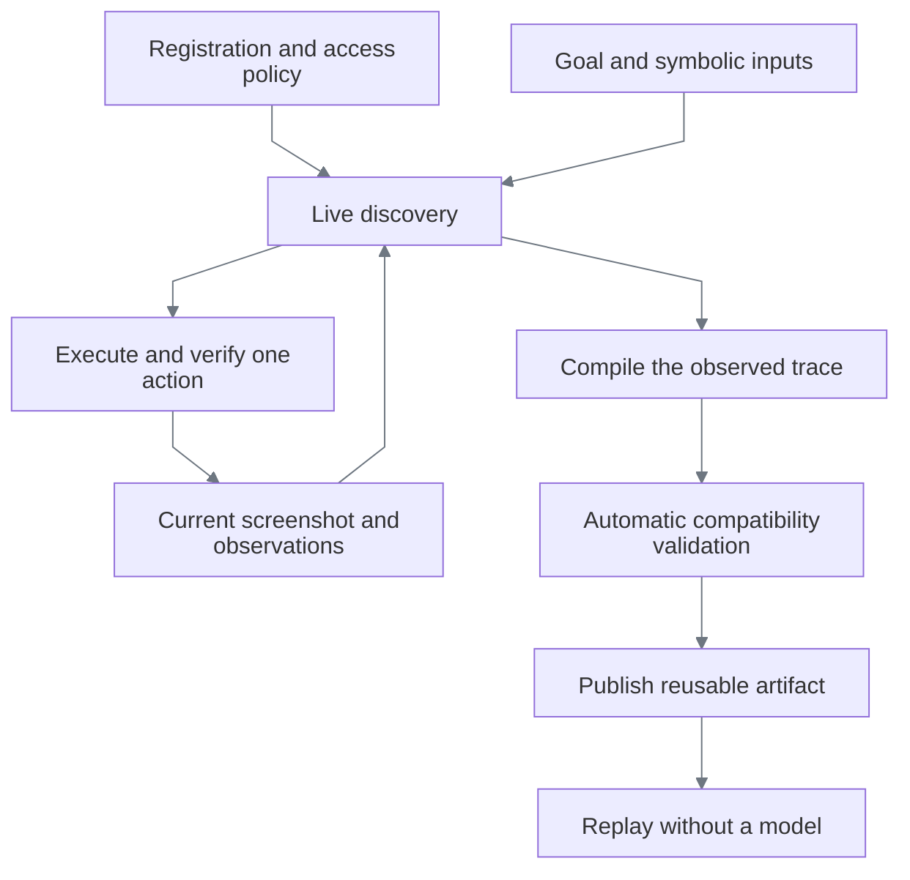

# Discovering a task in another application

[Documentation index](README.md)

ReplayForge discovers a procedure, not just the parameters of a built-in bank workflow. The same
goal can produce different action sequences and artifacts on different UIs. A supported web
application needs registration and a fresh discovery; it does not need a task compiler, selector
map, or application-specific Python branch.

## What changes, and what stays shared

| Supplied per application or task | Shared runtime |
|---|---|
| Origin, tenant entry URLs, readiness landmarks | Browser session and observation adapter |
| Allowed routes, actions and risk ceiling | Policy enforcement, leases and intervention |
| Goal and invocation inputs | Model-driven planning and action loop |
| Genuine observed procedure | Trace compiler, artifact validation and publication |
| Discovered application-specific artifact | Model-free replay and evidence recording |



There is no post-discovery human approval gate. A human takes over a paused live session when
execution needs intervention; publication requires the runtime's verification checks.

## Registration is a security boundary

Add an application to [the registry](../config/applications.yaml). Its entry point says where a
session may start, not which pages or buttons complete a task. A rendered-only entry uses live
screenshots and OCR; DOM targeting remains available for applications that permit it.

Set the real origin, entry path, tenant set, readiness landmarks, route allowlist and risk ceiling.
Do not put task steps, record identities, coordinates or expected business answers in registration.
Credentials and secrets remain forbidden input classifications. Authorization for this demo's
synthetic screenshots does **not** authorize sending real customer data from another application.

## Describe the outcome, not the procedure

A goal can say: “Assign the request identified by `request_id` to `requested_owner`; return its
identity, owner and final state, verifying both identities against the supplied inputs.” It should
not prescribe menu names, click order, row numbers or screen coordinates.

Call `POST /api/v1/discoveries` for discovery, or `POST /api/v1/discovery-suites` when collecting
validation runs for publication. Supply `application_family`, `tenant`, `entry_point`, `goal` and
`inputs`. Current provider planning supports string, integer and boolean inputs; UI extractions
are strings. The model proposes the output contract and the next action from the live surface.
The runtime resolves input values locally and executes policy-approved actions.

The goal-only batch client also accepts a supplied specification:

```bash
uv run python scripts/capture_demo_workflows.py --spec path/to/discovery-spec.yaml
```

The checked-in [workstation specification](../config/servicing-discovery.yaml) illustrates the file
shape. Its goals are demo requests, not engine logic. A specification alone is not discovery proof.

## Reuse is earned by verification

| Risk | Mechanism and reason |
|---|---|
| A customer identity becomes a literal selector | `input_text` stores an input path and resolves exact text only at execution; no executable interpolation |
| A locator accidentally embeds the output | Stable field-label extraction plus known-value publication guards; current values are not field identity |
| A dense table looks like stacked fields | The model can record observed `right_of` / `below`; multiple matches in that direction still fail |
| A review screen is mistaken for completion | Executed postconditions, exact output-state and input/output identity comparisons |
| A successful run depends on its initial defaults | Replay with different inputs and inspect exact outputs, then vary tenant and viewport |
| Replay quietly asks a model for help | Verify with provider credentials absent; replay must stop or request intervention when its contract fails |

Observed labels and relative layout relationships belong in the generated artifact. They are
discovered application knowledge, not hardcoded runtime knowledge. Changed layouts can invalidate
that artifact and require rediscovery; the engine must not guess or silently rewrite it.

## Honest limits

Registration cannot make an unsupported control work. The concrete adapter supports Chromium web
surfaces, a bounded action vocabulary, local OCR and image signatures. Native desktop, Citrix/RDP
transport, inaccessible authentication and controls outside that vocabulary need additional adapter
work or operator intervention. Visual dropdown selection is not a native `select` operation;
discovery must use supported interactions exposed by the actual control.

Model calls, time, frame size and retries stay bounded. Literal leak guards cover known data, not
universal semantic PII recognition. New deployments need their own data-sharing authorization and
policy. The current tests demonstrate reusable mechanisms; they do not prove every application
will discover successfully. See [discovery](discovery.md) and [privacy boundaries](safety-and-handoff.md).
