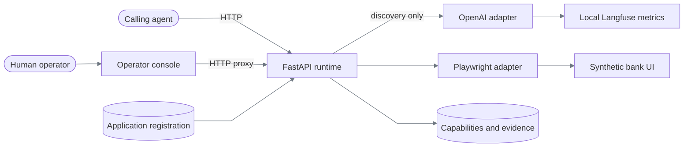
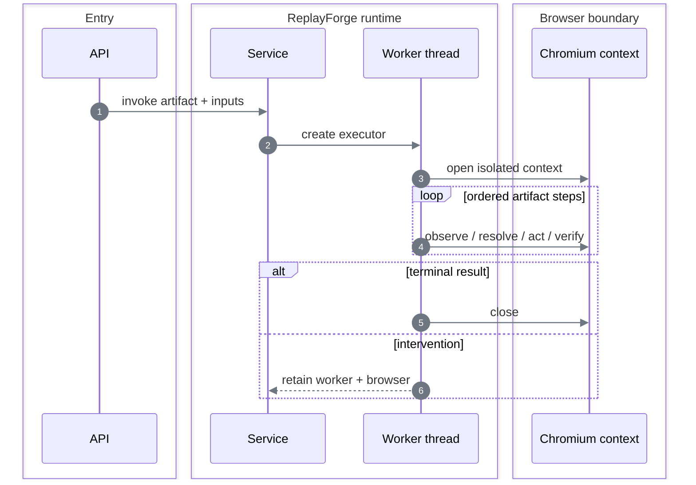

# Architecture

[Documentation index](README.md)

## System shape

ReplayForge is a modular monolith with two separate Next.js applications: one is the synthetic target, the other is the operator console.



### Deployable units

| Unit | Responsibility | Does not do |
|---|---|---|
| FastAPI runtime | Discovery, replay, policy, sessions, evidence, intervention | Render the target or operator UI |
| Operator console | Claim and operate a paused live session | Browse runs or edit capabilities |
| Demo bank | Synthetic two-tenant target and controlled faults | Expose a task-completion API |
| Langfuse stack | Local model-call metrics for discovery | Participate in replay |

Local addresses and configuration are in [Operations](operations.md#local-topology).

PostgreSQL is not part of the implemented runtime. Published capabilities and content-addressed visual assets are immutable local files; sanitized evidence is also written to disk. Lease, intervention, journal, and discovery-suite state remains in process memory. The application catalog is checked-in YAML so onboarding is reviewable.

`config/applications.yaml` is the onboarding boundary. It owns only application facts: a
credential-free origin, tenant variants, symbolic entry points, route aliases, readiness
landmarks, and policy ceilings. A new task in a registered application therefore supplies a
goal and a fresh discovery suite; it does not add task code or route constants. A new web app
adds one reviewed registration. A new surface contract still requires a surface adapter.

## Dependency direction

```text
main → runtime composition root
             │ constructs
             ▼
 API → application services → discovery / replay engines
                                  │ depend on
                                  ▼
                         typed ports + domain models
                                  ▲
                                  │ implement
                 OpenAI / Playwright / local files
```

Two structural tests enforce the important direction: replay cannot import discovery or model
providers, and domain/adapter packages cannot import the outer `runtime` composition package.
Provider budgets therefore live with the provider adapter; visual budgets live with surfaces;
runtime only loads configuration and wires concrete objects. Replacing OpenAI cannot alter replay,
and replacing Playwright does not require changing the replay state machine.

| Boundary | Port or contract | Current adapter |
|---|---|---|
| Model decision | `ModelProvider` | OpenAI Responses API |
| UI perception/action | `SurfaceDriver`, `SurfaceSession` | Synchronous Playwright |
| Artifact storage | `CapabilityRegistry` | Atomic immutable YAML files |
| Evidence bytes | `EvidenceStore` | Atomic local files |
| Run audit | `RunRecorder` | In-memory journal backed by evidence files |
| Handoff state | `InterventionTransitionRepository` | Atomic intervention-and-lease memory adapter |

## Module ownership

| Module | Owns | Main entry |
|---|---|---|
| `api` | HTTP validation, correlation IDs, safe error mapping | [`api/app.py`](../backend/src/replayforge/api/app.py) |
| `capabilities` | Artifact aggregate, YAML, schema, hashing, immutable versions | [`capabilities/models.py`](../backend/src/replayforge/capabilities/models.py) |
| `applications` | Validated application onboarding, launch resolution, route aliases, and policy ceilings | [`applications/models.py`](../backend/src/replayforge/applications/models.py) |
| `discovery` | Contract planning, bounded observe-decide-act loop, and generic trace compilation | [`discovery/engine.py`](../backend/src/replayforge/discovery/engine.py) |
| `replay` | Model-free step interpreter, recovery, outcomes, checkpoint | [`replay/engine.py`](../backend/src/replayforge/replay/engine.py) |
| `surfaces` | Session port, Playwright adapter, deterministic vision, and visual policy | [`surfaces/ports.py`](../backend/src/replayforge/surfaces/ports.py) |
| `policy` | Allowlist intersection, risk inference, decision records | [`policy/evaluator.py`](../backend/src/replayforge/policy/evaluator.py) |
| `interventions` | Intervention lifecycle and exclusive lease transitions | [`interventions/service.py`](../backend/src/replayforge/interventions/service.py) |
| `evidence` | Redaction, local storage, manifests, bundle verification/export | [`evidence/redaction.py`](../backend/src/replayforge/evidence/redaction.py) |
| `runs` | Invocation orchestration, discovery suites, terminal results, ordered journal | [`runs/service.py`](../backend/src/replayforge/runs/service.py) |
| `providers` | OpenAI translation plus its reviewed model/cost policy | [`providers/openai.py`](../backend/src/replayforge/providers/openai.py) |
| `observability` | Bounded model-call metrics | [`observability/model_calls.py`](../backend/src/replayforge/observability/model_calls.py) |
| `runtime` | Settings, dependency wiring, worker/session retention | [`runtime/composition.py`](../backend/src/replayforge/runtime/composition.py) |
| `shared` | Stable IDs, clocks, and unambiguous YAML parsing | [`shared`](../backend/src/replayforge/shared) |

See [Data models](data-models.md) for the objects passed across these boundaries.

The capability schema is the intentional shared execution language: discovery produces it, replay
interprets it, and a surface adapter executes its typed actions and conditions. Application
identity is not part of the Playwright adapter. Every driver receives an `ApplicationRegistry`;
there is no hardcoded demo-bank fallback.

The production discovery compiler is task-independent. The historical savings compiler lives only
in [`backend/tests/legacy_compiler.py`](../backend/tests/legacy_compiler.py) to reproduce old fixtures;
runtime composition cannot import it.

| Failure owner | Boundary behavior |
|---|---|
| HTTP adapter | Reject malformed contracts and map known failures to stable, value-free errors |
| Application service | Resolve versions and create one isolated run scope |
| Discovery/replay engine | Return typed business outcome, failure, or intervention state |
| Surface/provider adapter | Translate implementation exceptions into bounded domain error codes |
| Repository/evidence adapter | Reject conflicts, unsafe paths, oversized content, and integrity mismatch |
| Composition root | Construct concrete adapters and retain only live local-process resources |

## Per-run isolation



Playwright's synchronous objects are thread-affine. `SerialSessionWorker` therefore gives each run one bounded queue and one owner thread. API requests for viewport capture or human input are marshalled back to that thread.

Native computation and shared OCR inference are bounded to avoid multiplying machine-wide thread
pools per run. Frontend builds are sequential. [Constraints and policy](constraints-and-policy.md#storage-and-payload-bounds)
records the limits and rationale; this design does not claim fleet throughput.

## Surface reality

The production path is rendered-surface first. Playwright is still the browser transport, but the canonical capability uses it only for CSS-pixel screenshots and input dispatch; it never asks Playwright for a target element.

| Option | Decision | Reason |
|---|---|---|
| Persisted coordinates or relative ROIs | Rejected | Reflow and responsive breakpoints invalidate recorded geometry |
| Raw CSS/XPath recording | Rejected as primary | Couples artifacts to markup shape and generated identifiers |
| Semantic DOM/accessibility locators | Optional fallback | Useful when a trustworthy semantic surface exists; unavailable on the canvas contract |
| Semantic OCR + frame-local layout graph + visual signature | **Chosen primary** | Uses rendered identity, derives current geometry, and survives reflow, tenant styling, and DPR |
| OS accessibility/desktop driver | Designed, not built | Fits the surface port, but the assignment requires only one concrete surface |

`VisionGrounder` runs RapidOCR locally and resolves four geometry-free strategies: rendered text, a rendered label-to-control relation, a rendered label-to-value relation, and a rendered group label plus content-addressed visual signature. OCR phrases are rebuilt from the current frame; edge components are segmented from that same frame; relations use measured text height rather than saved offsets. Each result must be unique and satisfy the centrally loaded OCR, segmentation, similarity, pixel, and time budgets. Failure returns `target_absent` or `target_ambiguous`; replay never guesses.

The `visual-workbench` route is one canvas-only servicing application, not three showcase apps. It
supports transaction investigation, a dated loan payoff quote, and a reversible temporary card
lock. Harbor and Summit vary palette, typography, placement, row order, and layout. The same
task-independent engine plans each contract, records only actions that actually execute and verify,
then compiles a distinct artifact. Geometry-free OCR relationships disambiguate repeated `Open`
actions by the current account-row text; label/control and label/value relationships survive stacked
and horizontal layouts. New artifact targets store no coordinates or target-specific geometry; schema
`1.4` rejects them recursively while legacy fixtures remain loadable.

## Decisions

### Critical decision index

Use this index to locate the full alternatives and rationale. The cost column is the limitation
accepted with each choice, not an unimplemented feature presented as delivered.

| Decision | Rationale and alternatives | Accepted cost |
|---|---|---|
| Modular monolith and owner-thread sessions | [Architecture decisions](#architecture-decisions) | Single-process coordination; no fleet scheduling |
| Generic compiler and immutable typed artifacts | [Artifact decisions](capability-and-replay.md#schema-and-version-decisions) | New workflow semantics need fresh discovery and publication |
| Current-frame visual grounding before DOM | [Targeting decisions](capability-and-replay.md#targeting-decision) | OCR and segmentation have bounded applicability; ambiguous targets stop |
| Separate model planning from replay | [Discovery decisions](discovery.md#provider-decision) | No model fallback to repair unseen production drift |
| Explicit checkpoints and effect-absent retries | [Replay semantics](capability-and-replay.md#error-semantics) | Correctness is limited to declared checks; uncertain effects cannot be retried |
| Strict models and detached repository snapshots | [Model decisions](data-models.md#decisions) | Nested mappings require copying; frozen objects alone are insufficient |
| Registration plus measured tenant validation | [Compatibility choices](heterogeneity-and-compatibility.md#version-changes-and-specialization) | New apps need registration; unseen vendor releases are not automatically certified |
| Layered authority and centrally bounded work | [Constraint decisions](constraints-and-policy.md#decisions) | Callers cannot expand budgets or permissions for convenience |
| Exclusive lease and same-session HTTP handoff | [Handoff decisions](safety-and-handoff.md#decisions) | Polling, narrow input commands, and no crash-resumable sessions |
| Redaction before storage and local metrics | [Data exposure](safety-and-handoff.md#data-exposure-boundaries) | Masked evidence intentionally loses visual detail |
| Files for durable objects; memory for live state | [Durability](data-models.md#durability) | Published artifacts survive restart; active work does not |
| Unit fakes, real browsers, historical live evidence | [Testing decisions](verification.md#testing-decisions) | Historical model runs prove their recorded execution, not every later commit |

### Architecture decisions

| Decision | Alternatives | Choice | Reason |
|---|---|---|---|
| Runtime stack | Python/FastAPI, TypeScript server, bare HTTP | Python + FastAPI + Pydantic | Keeps OCR, provider integration, and strict artifact validation in one runtime; HTTP remains an outer adapter |
| UI stack | Static pages, one combined UI, separate Next.js apps | Two TypeScript/Next.js apps | Isolates target behavior from operator control while sharing frontend tooling; two builds are the accepted cost |
| Browser transport | Playwright, Selenium, direct CDP, OS input | Playwright behind surface ports | Supplies isolated contexts, screenshots, frame handling, and input; rendered targeting remains a separate layer |
| Process topology | Microservices, queued workers, monolith | Modular monolith | Preserves explicit boundaries without adding deployment failure modes |
| Browser concurrency | Shared browser thread, async Playwright, worker per run | Worker per run | Keeps the synchronous Playwright session on one thread, including handoff |
| Target | Public sandbox, real bank, local synthetic app | Local synthetic app | Legal, deterministic, credential-free, and able to inject failures |
| Persistence | PostgreSQL/S3, memory/files, browser-local state | Atomic files for immutable artifacts/evidence; memory for live state | Exactly the saved-capability guarantee without unrelated operational infrastructure |
| Tenant model | Artifact copy per tenant, free-form overrides, shared contract | Shared supported-variant list | Demonstrates reuse without unsafe override complexity |
| Responsive grounding | Saved offsets, ordinal row selection, frame-local graph | Frame-local graph + canonical visual signature | Recomputes geometry after layout changes and fails closed on ties |
| DPR handling | Rescale stored pixels, screenshot in device pixels, CSS-pixel capture | CSS-pixel capture + explicit context DPR | Mouse coordinates and screenshot regions remain in one coordinate space |
| Live control | WebSocket stream, headed browser, polling | Versioned HTTP polling/input | Minimal real same-session control with stale-command protection |

## Surface extension

```text
Capability semantics stay stable
  inputs → ordered actions → outputs → checkpoint
                         │
                         ├── web.v1: rendered OCR + signatures   [primary]
                         ├── web.v1: semantic Playwright locators [optional]
                         └── desktop.v1: accessibility/window IDs [designed]
```

A new transport must define observation normalization, input dispatch, screenshots, and condition evaluation. The visual grounding layer is transport-independent over PNG frames and viewport dimensions; a native desktop adapter can reuse it, but no native transport is claimed here.

Application compatibility and the vendor-version extension are described in
[Heterogeneity and compatibility](heterogeneity-and-compatibility.md).
