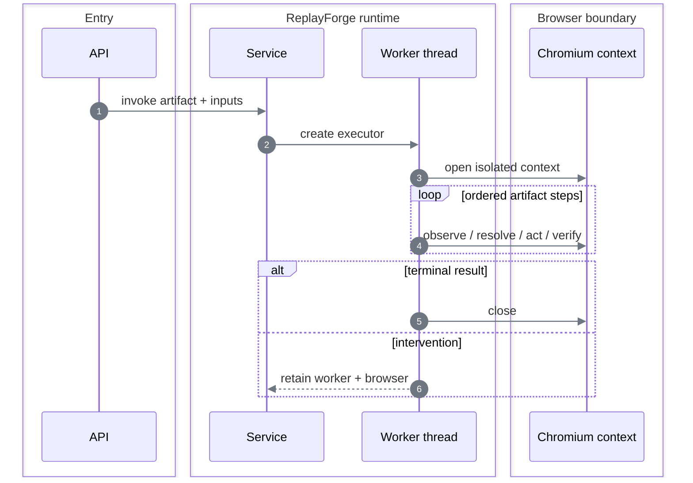

# Architecture

## System shape

ReplayForge is a modular monolith with two separate Next.js applications: one is the synthetic target, the other is the operator console.


### Deployable units

| Unit | Port | Responsibility | Does not do |
|---|---:|---|---|
| FastAPI runtime | `8000` | Discovery, replay, policy, sessions, evidence, intervention | Render the target or operator UI |
| Control plane | `3000` | Claim and operate a paused live session | Browse runs or edit capabilities |
| Demo bank | `3001` | Synthetic two-tenant target and controlled faults | Expose a task-completion API |
| Langfuse stack | `3100` | Local model-call metrics for discovery | Participate in replay |

PostgreSQL is not part of the implemented runtime. Capability, lease, intervention, and journal metadata live in process memory. Sanitized evidence is written to disk.

## Dependency direction

```text
FastAPI / OpenAI / Playwright / filesystem
                    │ implement
                    ▼
           typed ports and services
                    │ use
                    ▼
       domain models and deterministic rules
```

The key rule is structural: `replay` does not import `providers`. A test enforces that rule. Replacing OpenAI cannot alter replay; replacing Playwright does not require changing the replay state machine.

| Boundary | Port or contract | Current adapter |
|---|---|---|
| Model decision | `ModelProvider` | OpenAI Responses API |
| UI perception/action | `SurfaceDriver`, `SurfaceSession` | Synchronous Playwright |
| Artifact storage | `CapabilityRegistry` | Thread-safe memory loaded from YAML |
| Evidence bytes | `EvidenceStore` | Atomic local files |
| Run audit | `RunRecorder` | In-memory journal backed by evidence files |
| Control ownership | `ControlLeaseRepository` | Thread-safe compare-and-swap memory |

## Module ownership

| Module | Owns | Main entry |
|---|---|---|
| `api` | HTTP validation, correlation IDs, safe error mapping | [`api/app.py`](../backend/src/replayforge/api/app.py) |
| `capabilities` | Artifact aggregate, YAML, schema, hashing, immutable versions | [`capabilities/models.py`](../backend/src/replayforge/capabilities/models.py) |
| `discovery` | Observe-decide-act loop and savings-balance compilation | [`discovery/engine.py`](../backend/src/replayforge/discovery/engine.py) |
| `replay` | Model-free step interpreter, recovery, outcomes, checkpoint | [`replay/engine.py`](../backend/src/replayforge/replay/engine.py) |
| `surfaces` | Technology-neutral session port and Playwright implementation | [`surfaces/ports.py`](../backend/src/replayforge/surfaces/ports.py) |
| `policy` | Allowlist intersection, risk inference, decision records | [`policy/evaluator.py`](../backend/src/replayforge/policy/evaluator.py) |
| `interventions` | Intervention lifecycle and exclusive lease transitions | [`interventions/service.py`](../backend/src/replayforge/interventions/service.py) |
| `evidence` | Redaction, local storage, manifests, bundle verification/export | [`evidence/redaction.py`](../backend/src/replayforge/evidence/redaction.py) |
| `runs` | Invocation orchestration, terminal results, ordered journal | [`runs/service.py`](../backend/src/replayforge/runs/service.py) |
| `providers` | OpenAI request/response translation only | [`providers/openai.py`](../backend/src/replayforge/providers/openai.py) |
| `observability` | Bounded model-call metrics | [`observability/model_calls.py`](../backend/src/replayforge/observability/model_calls.py) |
| `runtime` | Settings, dependency wiring, worker/session retention | [`runtime/composition.py`](../backend/src/replayforge/runtime/composition.py) |
| `shared` | Stable IDs and clocks only | [`shared/ids.py`](../backend/src/replayforge/shared/ids.py) |

See [Data models](data-models.md) for the objects passed across these boundaries.

## Per-run isolation



Playwright's synchronous objects are thread-affine. `SerialSessionWorker` therefore gives each run one bounded queue and one owner thread. API requests for viewport capture or human input are marshalled back to that thread.

## Surface reality

The assignment permits DOM-level automation but asks for a design that does not assume a clean DOM. The implementation makes a deliberate, narrower choice:

| Option considered | Decision | Reason |
|---|---|---|
| Screenshot coordinates for all replay | Rejected | Easy to discover, brittle across viewport, font, and layout changes |
| Raw CSS/XPath recording | Rejected as primary | Couples artifacts to markup shape and generated identifiers |
| Semantic DOM/accessibility locators | **Chosen for implemented web replay** | Deterministic, inspectable, and stable for the selected target |
| OCR/image-anchor replay | Designed, not built | Needed for canvas/remote surfaces; adds confidence and calibration problems |
| OS accessibility/desktop driver | Designed, not built | Fits the surface port, but the assignment requires only one concrete surface |

Discovery sees a screenshot plus compact normalized facts. Replay currently resolves frame title, role/name, label, text, placeholder, CSS, and relative-text locators. The schema also models accessibility-path, image-anchor, and coordinate candidates, but the Playwright adapter intentionally rejects or skips unsupported visual strategies. This repository does **not** claim canvas, Citrix, remote-desktop, or native-desktop replay.

The demo target is legacy-style rather than DOM-hostile: iframe nesting, tables, no test IDs, and server navigation are present, but useful labels and roles still exist. That is a deliberate implementation cut, not proof of non-DOM automation.

## Decisions

| Stage | Alternatives | Chosen | Why |
|---|---|---|---|
| Process topology | Microservices, queued workers, monolith | Modular monolith | Preserves explicit boundaries without adding deployment failure modes |
| Browser concurrency | Shared browser thread, async Playwright, worker per run | Worker per run | Keeps the synchronous Playwright session on one thread, including handoff |
| Target | Public sandbox, real bank, local synthetic app | Local synthetic app | Legal, deterministic, credential-free, and able to inject failures |
| Persistence | PostgreSQL/S3, memory/files, browser-local state | Memory + atomic files | Small runnable submission; repository ports leave a migration seam |
| Tenant model | Artifact copy per tenant, free-form overrides, shared contract | Shared supported-variant list | Demonstrates reuse without unsafe override complexity |
| Live control | WebSocket stream, headed browser, polling | Versioned HTTP polling/input | Minimal real same-session control with stale-command protection |

## Honest extension path

```text
Capability semantics stay stable
  inputs → ordered actions → outputs → checkpoint
                         │
                         ├── web.v1: Playwright locators          [implemented]
                         ├── visual.v1: OCR/image anchors         [designed]
                         └── desktop.v1: accessibility/window IDs [designed]
```

A new surface adapter must define observation normalization, supported locator strategies, action receipts, screenshots, and condition evaluation. The current artifact model can identify a different `surface_contract`; it does not yet provide calibration, confidence thresholds, or a working non-web resolver.
