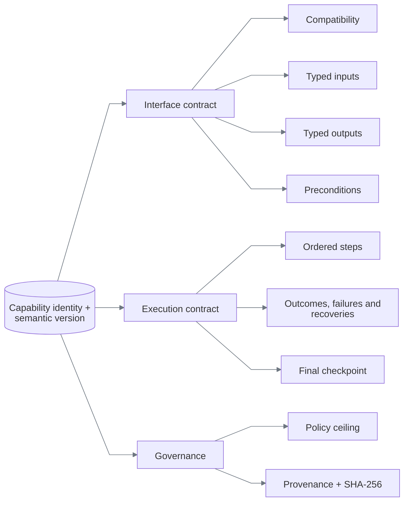
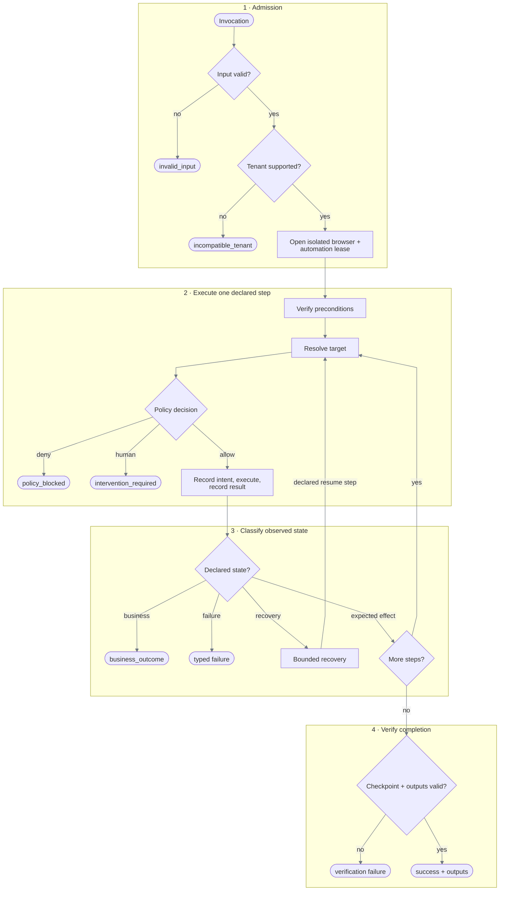

# Capability and deterministic replay

## The artifact is the production program

Discovery is temporary. The YAML artifact is the durable contract interpreted in production.

```text
raw model exchange       recorded successful trace       published capability
     discarded        ───────── compiler ─────────►   typed, hashed, reviewable
```

An artifact contains no Python, JavaScript, selector callback, model transcript, or persisted click
coordinate. The task-independent discovery examples are
[`member.transaction_investigation`](../capabilities/member.transaction_investigation/1.0.0.yaml),
[`member.loan_payoff_quote`](../capabilities/member.loan_payoff_quote/1.0.0.yaml), and
[`member.temporary_card_lock`](../capabilities/member.temporary_card_lock/1.0.0.yaml). The last,
including its verified inverse state, demonstrates reversible compilation. The earlier
[`member.lookup_savings_balance/3.2.0`](../capabilities/member.lookup_savings_balance/3.2.0.yaml)
remains the visual portability and failure fixture. All use the same Pydantic definition in
[`capabilities/models.py`](../backend/src/replayforge/capabilities/models.py).

Publication is the durability boundary. A validated discovery allocates the next semantic version,
computes its canonical hash, and atomically exposes a complete YAML file at
`capabilities/<capability-id>/<version>.yaml`. Existing versions are immutable and identical retries
are idempotent. A fresh runtime validates the file's size, path identity, schema, and declared hash
before making it available to model-free replay. Visual assets use the same write-then-publish rule
under `capabilities/_assets/`; evidence remains a separate audit record, not the executable registry.

## Shape



For `member.lookup_savings_balance`, the external contract is:

```text
input  member_id: 5–10 digits
output member_id, account_type, currency, available_balance, as_of
result success | business_outcome | failure | intervention_required
```

Every required output must be bound by a main-flow extraction and checked by the final checkpoint. Artifact validation rejects a missing binding or check before a browser opens.

The generic compiler has also produced these unrelated shapes without task-specific code:

| Capability | Inputs | Outputs | Steps | Risk |
|---|---|---|---:|---|
| `member.transaction_investigation` | member, merchant, date, amount | reference, merchant, posted date, amount, currency, status | 15 | read-only |
| `member.loan_payoff_quote` | member, payoff date | principal, interest, payoff amount, currency, good-through date | 11 | read-only |
| `member.temporary_card_lock` | member, card suffix | card suffix, lock status, effective time, confirmation reference | 12 | reversible |

## Targeting

A target is a description, a scope, ordered candidates, and required state.

```yaml
target:
  description: Rendered Search action
  registered_risk: read_only
  visual_candidates:
    - strategy: rendered_text
      value: Search
      match: exact
```

The geometry-free `3.2.0` artifact uses the same shape for all durable targets:

```yaml
target:
  description: Value associated with the rendered Currency label
  visual_candidates:
    - strategy: rendered_field_value
      label: Currency
      label_match: exact
```

Resolution is deterministic:

```text
for each rendered candidate, in artifact order
  → capture a fresh CSS-pixel screenshot
  → rebuild OCR phrases and frame-local edge components
  → enforce policy budgets and exactly one semantic match
  → return a transient region handle tied to the frame hash
otherwise → target_absent or target_ambiguous
```

The resolver never asks a model, selects the first ambiguous result, or clicks a nearby element.

Replay retries only a declared recoverable error when the surface adapter proves the prior attempt
had no effect. Capability artifacts cannot disable that requirement. Attempts, backoff, step time,
and recovery use are all schema-bounded; see [Constraints and policy](constraints-and-policy.md).

### Targeting decision

| Option | Outcome | Reason |
|---|---|---|
| Persisted coordinates | Rejected | Not stable across viewport and layout changes |
| OCR text | **Chosen for named actions and conditions** | Human-readable identity on rendered pixels |
| Saved OCR-relative region | Rejected | Stores layout geometry and breaks under reflow |
| Label-to-control relation | **Chosen for text inputs** | Uses the current label and detected control component |
| Label-to-value relation | **Chosen for extraction** | Supports horizontal and stacked field layouts without offsets |
| Group label + edge signature | **Chosen for repeated icon actions** | Content-addressed identity plus semantic row context |
| Role/label + iframe scope | Optional fallback | Precise when a trustworthy semantic surface exists |
| Generated CSS selector | Supported but not primary | Often encodes incidental markup |

Coordinates exist only as ephemeral browser input dispatch values. Discovery may observe a transient icon region to create a signature, but the compiler publishes only rendered candidates; schema `1.4` rejects persisted coordinates, and rendered-only registrations reject legacy DOM targets recursively. Schemas `1.0`–`1.3` remain loadable for immutable fixtures.

### Contextual image anchors

Repeated-row interfaces need more than a global icon match. Version `3.2.0` first resolves the rendered `Savings` label with OCR, identifies same-group components in the current frame, then compares each component with the hashed signature. Three identical account icons therefore remain safe: a global match is ambiguous, while the semantic group plus signature has one permitted match. The resulting click region is transient and tied to the current frame hash.

| Repeated-icon option | Decision | Reason |
|---|---|---|
| Click the first template match | Rejected | Identical Checking, Savings, and loan actions make ordinal selection unsafe |
| Persist the Savings-row coordinates | Rejected | Layout and viewport changes invalidate the recording |
| Give each icon a different shape | Rejected | Hides the ambiguity instead of solving it |
| OCR anchor + saved relative template region | Rejected | Relative geometry still leaks recording-time layout |
| OCR group label + current-frame component graph | **Chosen** | Binds the icon to the named business row without persisted geometry |

Template matching extracts a bounded set of spatial peaks per scale and merges detections referring to the same physical icon. A close second match returns `target_ambiguous`; no first-match shortcut is used.

The reviewed vision policy keeps a `0.72` normalized-signature floor, a `0.08` uniqueness margin, a `64×64` canonical canvas, and bounded pixel/time budgets. DPR variation is handled by CSS-pixel screenshots and canonical normalization—not by storing a scale range in the artifact.

## Replay pipeline



The engine validates inputs before opening Chromium, checks ownership before each action, and records action intent separately from result. A click dispatch is not success; postconditions and the final checkpoint must be observable.

## Error semantics

| Class | Meaning | Example | Result |
|---|---|---|---|
| Business outcome | Workflow completed with a legitimate negative answer | No member exists | `business_outcome/member_not_found` |
| Recoverable condition | A declared finite repair is safe | Known training notice | Recovery events, then continue |
| Application failure | Target rendered a known terminal error | Permission denied | `failure/permission_denied` |
| Mechanical failure | Automation could not resolve or act | Two savings links | `failure/target_ambiguous` |
| Verification failure | Action ran but evidence does not prove the effect | Wrong member on detail page | `failure/checkpoint_mismatch` |
| Safety pause | Action needs a person | Sensitive search submit in `2.0.0` | `intervention_required` |

Retry occurs only when the artifact names the error, attempts remain, and the prior effect is known absent when required. Recoveries are named, capped at three uses by schema, cannot invoke nested recoveries, and cannot contain sensitive actions.

## Committed versions

| Version | Purpose | Additional behavior |
|---|---|---|
| `1.0.0` | Normal model-free replay | Eight read-only steps; member-not-found outcome |
| `1.0.1` | Recovery demonstration | Selects a known interstitial; dismisses it once |
| `1.0.2` | Hard-failure demonstration | Selects permission denial; classifies expected/observed state |
| `2.0.0` | Handoff demonstration | Marks search submission sensitive; policy pauses before click |
| `3.0.0` | Visual-first demonstration | Full canvas-only flow using OCR, relative geometry, and one image anchor |
| `3.1.0` | Prior visual portability fixture | Richer repeated-row canvas with contextual relative template |
| `3.2.0` | Geometry-free responsive replay | Semantic candidates, frame-local graph, canonical signature, six viewport/DPR cases, delayed response, recovery, and declared visual failures |

No version means “latest,” currently `3.2.0`. Use `2.0.0` explicitly for human handoff and `3.0.0` for the original visual-terminal fixture.

## Schema and version decisions

| Decision | Alternatives | Why chosen |
|---|---|---|
| YAML authoring + Pydantic validation | JSON only, executable scripts | YAML reviews well; strict models prevent free-form execution |
| Symbolic input references | Record discovery values | One artifact can accept new member IDs without retaining the original value |
| Immutable semantic versions | Mutable latest script | Replays remain reproducible and auditable |
| SHA-256 over canonical serialization | Filename/version trust | Detects content changes independently of storage |
| Explicit outcomes and checkpoints | Infer success from last click | Forces callers and reviewers to see what was actually proven |
| Generic trace compiler + model draft | Direct model-authored artifact | The model proposes task semantics, but only observed, policy-approved actions become a durable artifact |

Schema `1.4` carries the compiled capability route allowlist and the registered rendered-surface
flag. The compiler records only routes observed during discovery, narrowed to application
patterns; replay intersects them again with the application policy.

The interpreter owns condition actions: `assert` evaluates immediately, `wait_for` polls within
the step timeout, and `checkpoint` evaluates the named final condition. A false condition stops
the step or enters its declared recovery; it cannot become a successful no-op. Conditions inside
actions receive the same cross-reference validation as preconditions and postconditions.

Input references support dotted object paths, including typing, selection, identity checks, and
business-outcome details. Decimal strings must represent finite values. Missing inputs and invalid
values report declared paths and stable codes; unknown caller-supplied keys are never echoed.
An ambiguous or broken target lookup is not proof that an element is absent.
