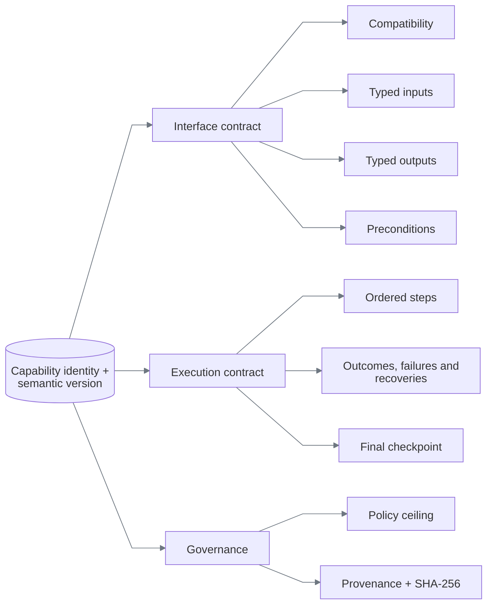

# Capability and deterministic replay

## The artifact is the production program

Discovery is temporary. The YAML artifact is the durable contract interpreted in production.

```text
raw model exchange       recorded successful trace       published capability
     discarded        ───────── compiler ─────────►   typed, hashed, reviewable
```

An artifact contains no Python, JavaScript, selector callback, model transcript, or persisted click coordinate. The primary example is [`3.1.0.yaml`](../capabilities/member.lookup_savings_balance/3.1.0.yaml); its Pydantic definition is [`capabilities/models.py`](../backend/src/replayforge/capabilities/models.py). `3.0.0.yaml` remains the immutable original visual-terminal fixture.

## Shape



For `member.lookup_savings_balance`, the external contract is:

```text
input  member_id: 5–10 digits
output member_id, account_type, currency, available_balance, as_of
result success | business_outcome | failure | intervention_required
```

Every required output must be bound by a main-flow extraction and checked by the final checkpoint. Artifact validation rejects a missing binding or check before a browser opens.

## Targeting

A target is a description, a scope, ordered candidates, and required state.

```yaml
target:
  description: Search button text
  registered_risk: read_only
  visual_candidates:
    - strategy: ocr_text
      value: Search
      match: exact
      minimum_confidence: 0.85
```

Resolution is deterministic:

```text
for each visual candidate, in artifact order
  → capture a fresh screenshot
  → enforce search bounds, confidence and exactly one match
  → return a transient region handle
otherwise try optional semantic candidates in order
otherwise → target_absent or target_ambiguous
```

The resolver never asks a model, selects the first ambiguous result, or clicks a nearby element.

### Targeting decision

| Option | Outcome | Reason |
|---|---|---|
| Persisted coordinates | Rejected | Not stable across viewport and layout changes |
| OCR text | **Chosen for named controls** | Human-readable and exact on rendered pixels |
| OCR-relative region | **Chosen for fields and values** | Recomputes geometry from a fresh text anchor |
| Edge template | **Chosen for icon-only controls** | Palette-reduced, multi-scale, hash-verified, and uniqueness-gated |
| Role/label + iframe scope | Optional fallback | Precise when a trustworthy semantic surface exists |
| Generated CSS selector | Supported but not primary | Often encodes incidental markup |

Coordinates exist only at discovery time for an icon bounding box. Before the action is recorded, the adapter crops an edge representation, stores it under `asset://sha256/<digest>`, and replaces the coordinate candidate with an `image_anchor`. The compiler rejects a coordinate-only recording.

### Contextual image anchors

Repeated-row interfaces need more than a global icon match. Version `3.1.0` first resolves the rendered `Savings` label with OCR, derives a search rectangle from that fresh anchor, and only then searches for the hashed chevron inside the rectangle. Three identical account icons therefore remain safe: a global template search is ambiguous, while the contextual search has one permitted match. The context and relative region are part of the typed artifact; the resulting click region is still transient and tied to the current frame hash.

| Repeated-icon option | Decision | Reason |
|---|---|---|
| Click the first template match | Rejected | Identical Checking, Savings, and loan actions make ordinal selection unsafe |
| Persist the Savings-row coordinates | Rejected | Layout and viewport changes invalidate the recording |
| Give each icon a different shape | Rejected | Hides the ambiguity instead of solving it |
| OCR anchor + relative template region | **Chosen** | Preserves pixel-first operation while binding the icon to the named business row |

Template matching extracts a bounded set of spatial peaks per scale and merges detections referring to the same physical icon. A close second match returns `target_ambiguous`; no first-match shortcut is used.

The committed calibration keeps a `0.75` score floor and evaluates scales `0.70–1.25` in `0.025` steps. The lower bound is measured from the compact `1024×640` rendering (the chevron is approximately `0.775×` the logical template), not a blanket confidence reduction.

## Replay pipeline


The engine validates inputs before opening Chromium, checks ownership before each action, and records action intent separately from result. A click dispatch is not success; postconditions and the final checkpoint must be observable.

## Error semantics

| Class | Meaning | Example | Result |
|---|---|---|---|
| Business outcome | Workflow completed with a legitimate negative answer | No member exists | `business_outcome/member_not_found` |
| Recoverable condition | A declared finite repair is safe | Known training notice | Recovery events, then continue |
| Application failure | Target rendered a known terminal error | Permission denied | `failure/permission_denied` |
| Mechanical failure | Automation could not resolve or act | Two savings links | `failure/target_ambiguous` |
| Verification failure | Action ran but evidence does not prove the effect | Wrong member on detail page | `failure/checkpoint_mismatch` |
| Safety pause | Action needs a person | Sensitive search submit in `2.0.0` | `intervention_required` |

Retry occurs only when the artifact names the error, attempts remain, and the prior effect is known absent when required. Recoveries are named, capped at three uses by schema, cannot invoke nested recoveries, and cannot contain sensitive actions.

## Committed versions

| Version | Purpose | Additional behavior |
|---|---|---|
| `1.0.0` | Normal model-free replay | Eight read-only steps; member-not-found outcome |
| `1.0.1` | Recovery demonstration | Selects a known interstitial; dismisses it once |
| `1.0.2` | Hard-failure demonstration | Selects permission denial; classifies expected/observed state |
| `2.0.0` | Handoff demonstration | Marks search submission sensitive; policy pauses before click |
| `3.0.0` | Visual-first demonstration | Full canvas-only flow using OCR, relative geometry, and one image anchor |
| `3.1.0` | Visual portability demonstration | Richer repeated-row canvas, contextual image anchor, viewport matrix, delayed response, recovery, and declared visual failures |

No version means “latest,” currently `3.1.0`. Use `2.0.0` explicitly for human handoff and `3.0.0` for the original visual-terminal fixture.

## Schema and version decisions

| Decision | Alternatives | Why chosen |
|---|---|---|
| YAML authoring + Pydantic validation | JSON only, executable scripts | YAML reviews well; strict models prevent free-form execution |
| Symbolic input references | Record discovery values | One artifact can accept new member IDs without retaining the original value |
| Immutable semantic versions | Mutable latest script | Replays remain reproducible and auditable |
| SHA-256 over canonical serialization | Filename/version trust | Detects content changes independently of storage |
| Explicit outcomes and checkpoints | Infer success from last click | Forces callers and reviewers to see what was actually proven |
| Specialized compiler | Generic model-authored artifact | Fail-closed implementation for one deep workflow; less breadth, stronger validation |
