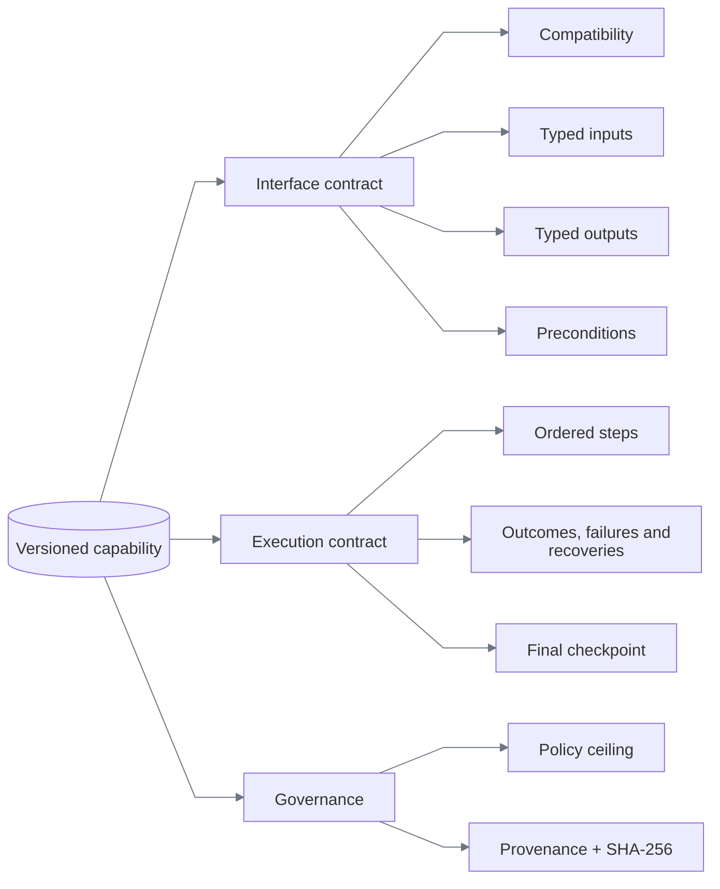

# Capability and deterministic replay

[Documentation index](README.md)

## The artifact is the production program

Discovery is temporary. The YAML artifact is the durable contract interpreted in production.

```text
verified trace → generic compiler → validated capability → immutable publication
```

An artifact contains no Python, JavaScript, selector callback, or model transcript. New schema `1.4`
targets also reject persisted coordinates and relative geometry. The task-independent discovery examples are
[`member.transaction_investigation`](../capabilities/member.transaction_investigation/1.0.0.yaml),
[`member.loan_payoff_quote`](../capabilities/member.loan_payoff_quote/1.0.0.yaml), and
[`member.temporary_card_lock`](../capabilities/member.temporary_card_lock/1.0.0.yaml). The last
demonstrates a task classified as reversible; its exact proof boundary is described below. The earlier
[`member.lookup_savings_balance/3.2.0`](../capabilities/member.lookup_savings_balance/3.2.0.yaml)
remains the visual portability and failure fixture. All use the same Pydantic definition in
[`capabilities/models.py`](../backend/src/replayforge/capabilities/models.py).

Publication is the durability boundary. A validated discovery allocates the next semantic version,
computes its canonical hash, and atomically exposes a complete YAML file at
`capabilities/<capability-id>/<version>.yaml`. Existing versions are immutable and identical retries
are idempotent. A fresh runtime validates the file's size, path identity, schema, and declared hash
before making it available to model-free replay. Visual assets use the same write-then-publish rule
under `capabilities/_assets/`; evidence remains a separate audit record, not the executable registry.

## Shape



For `member.lookup_savings_balance/3.2.0`, the external contract is:

```text
input  member_id: 5–10 digits
output member_id, account_type, currency, available_balance, as_of
result success | business_outcome | failure | intervention_required
```

Every required output must be bound by a main-flow extraction and checked by the final checkpoint. Artifact validation rejects a missing binding or check before a browser opens.

The generic compiler has also produced three related banking tasks with distinct contracts,
without task-specific code:

| Capability | Inputs | Outputs | Steps | Risk |
|---|---|---|---:|---|
| `member.transaction_investigation` | member, merchant, date, amount | reference, merchant, posted date, amount, currency, status | 15 | read-only |
| `member.loan_payoff_quote` | member, payoff date | principal, interest, payoff amount, currency, good-through date | 11 | read-only |
| `member.temporary_card_lock` | member, card suffix | card suffix, lock status, effective time, confirmation reference | 12 | reversible |

Input references support dotted object paths for typing, selection, identity checks, and
business-outcome details. Decimal strings must represent finite values. Missing or invalid inputs
report declared paths and stable codes; unknown caller-supplied keys are never echoed.

Schema `1.4` carries the compiled route allowlist and registered rendered-surface flag.
Only observed routes, narrowed to application patterns, enter the artifact; replay intersects
them again with application policy.

## Worked example: temporary card lock

This is a reading guide to the committed
[`member.temporary_card_lock/1.0.0`](../capabilities/member.temporary_card_lock/1.0.0.yaml), not
pseudocode or a newly generated run. Its [discovery manifest](../evidence/discovery-temporary-card-lock/manifest.json)
links the recording commit, command, run identity, and file hashes.

| Stage | Actual artifact | Why it matters |
|---|---|---|
| Admit | Schema `1.4`; `web.v1`; `visual_member_workbench`; Harbor and Summit | Task semantics are separate from registered application facts |
| Bind input | `member_id` and `card_last4`, both required strings | Steps reference input paths; discovery values are not recorded literals |
| Find the card | Steps 1–6: member search → Checking → Card controls → card search | The repeated `Open` target is bound to the rendered Checking row, not a row index |
| Mutate | Steps 7–8: `Review temporary lock` → `Confirm temporary lock` | The confirm step declares `reversible` risk and still passes independent policy evaluation |
| Extract | Steps 9–12: `card_last4`, `lock_status`, `effective_at`, `confirmation_reference` | Label-to-value targets resolve from the current frame; each extraction checks its output contract |
| Complete | `temporary_card_lock_verified`: route, four rendered labels, and four valid outputs | Success requires the recorded checkpoint, not merely dispatching the confirm click |

The labels “Review temporary lock” and “Confirm temporary lock” belong to the target application's
workflow; they do not introduce a human reviewer into discovery.

**Proof boundary:** this version's outputs are strings without semantic enums or constants. Its
checkpoint does not assert `lock_status == Locked`, match the returned suffix to the input, or
execute an unlock-and-restore cycle. The UI exposes an inverse operation, but that is not proof
of transactional rollback. The artifact also declares no recovery, business-outcome, or failure
branches; those mechanisms are demonstrated by the separate savings-balance fixtures. A stronger
task-specific completion contract would require a new validated artifact version, not a rewritten
historical evidence bundle.

## Targeting

A target is a description, a scope, ordered candidates, and required state.

```yaml
target:
  description: Rendered Search action
  registered_risk: read_only
  visual_candidates:
    - strategy: rendered_text
      value: Search
      match: exact
```

The geometry-free `3.2.0` artifact uses the same shape for all durable targets:

```yaml
target:
  description: Value associated with the rendered Currency label
  visual_candidates:
    - strategy: rendered_field_value
      label: Currency
      label_match: exact
```

Resolution is deterministic:

```text
for each rendered candidate, in artifact order
  → capture a fresh CSS-pixel screenshot
  → rebuild OCR phrases and frame-local edge components
  → enforce policy budgets and exactly one semantic match
  → return a transient region handle tied to the frame hash
otherwise → target_absent or target_ambiguous
```

The resolver never asks a model, selects the first ambiguous result, or clicks a nearby element.

Replay retries only a declared recoverable error when the surface adapter proves the prior attempt
had no effect. Capability artifacts cannot disable that requirement. Attempts, backoff, step time,
and recovery use are all schema-bounded; see [Constraints and policy](constraints-and-policy.md).

### Targeting decision

| Option | Decision | Reason |
|---|---|---|
| Persisted coordinates | Rejected | Not stable across viewport and layout changes |
| OCR text | **Chosen for named actions and conditions** | Human-readable identity on rendered pixels |
| Saved OCR-relative region | Rejected | Stores layout geometry and breaks under reflow |
| Label-to-control relation | **Chosen for text inputs** | Uses the current label and detected control component |
| Label-to-value relation | **Chosen for extraction** | Supports horizontal and stacked field layouts without offsets |
| Group label + edge signature | **Chosen for repeated icon actions** | Content-addressed identity plus semantic row context |
| Role/label + iframe scope | Optional fallback | Precise when a trustworthy semantic surface exists |
| Generated CSS selector | Supported but not primary | Often encodes incidental markup |

For new capabilities, coordinates exist only during frame-local grounding and input dispatch.
Discovery may observe a transient icon region to create a signature, but the compiler publishes
only rendered candidates. Schema `1.4` rejects persisted geometry; rendered-only registrations
also reject legacy DOM targets recursively.

Labeled input association uses the label's local text height when considering an input-shaped
component. A page-wide median alone can reject a normal input when a dense table uses larger
text. Intervening visible text blocks association across another field or section: a missed input
must not become a click into a distant table cell. These are frame-derived rules, not application
coordinates or tenant-specific thresholds.

Field-value association filters right-hand tokens before building text lines, so navigation on
the same baseline cannot hide a value. It examines enclosing containers because segmentation
can detect a label-only table column separately from its value cells. A plausible stacked value
in a smaller container conflicts with an outer horizontal candidate and fails as ambiguous.
This was chosen over taking the next text line or blindly using the smallest rectangle: both
can return another field label as customer data. All regions come from the current frame.

### Current-frame visual signatures

Repeated-row interfaces need more than a global icon match. Version `3.2.0` first resolves the rendered `Savings` label with OCR, identifies same-group components in the current frame, then compares each component with the hashed signature. Three identical account icons therefore remain safe: a global match is ambiguous, while the semantic group plus signature has one permitted match. The resulting click region is transient and tied to the current frame hash.

| Repeated-icon option | Decision | Reason |
|---|---|---|
| Click the first template match | Rejected | Identical Checking, Savings, and loan actions make ordinal selection unsafe |
| Persist the Savings-row coordinates | Rejected | Layout and viewport changes invalidate the recording |
| Give each icon a different shape | Rejected | Hides the ambiguity instead of solving it |
| OCR anchor + saved relative template region | Rejected | Relative geometry still leaks recording-time layout |
| OCR group label + current-frame component graph | **Chosen** | Binds the icon to the named business row without persisted geometry |

The [vision policy](../config/vision-policy.yaml) owns the canonical signature size, similarity
floor, uniqueness margin, and pixel/time budgets. DPR variation is handled by CSS-pixel screenshots
and canonical normalization—not by storing a scale range in the artifact.

### Legacy compatibility

Immutable schema `1.0`–`1.3` fixtures remain loadable. Savings versions `3.0.0` and `3.1.0`
retain recorded relative regions and image-anchor strategies; they are not the current compiler's
output. Legacy template matching extracts bounded spatial peaks per scale and merges detections
of the same physical icon. A close second match returns `target_ambiguous`; it never chooses the
first match. [Registration compatibility](heterogeneity-and-compatibility.md#what-is-enforced)
defines which legacy semantics are accepted.

## Replay pipeline


The engine validates inputs before opening Chromium, checks ownership before each action, and records action intent separately from result. A click dispatch is not success; postconditions and the final checkpoint must be observable.

The step box includes preconditions, target resolution, policy evaluation, intent/result recording,
and effect verification. Declared outcomes, failures, and recoveries are checked around actions
and waits; the diagram summarizes branching, not every observation. Recovery failure terminates
with a typed failure too.

The interpreter owns condition actions: `assert` evaluates immediately, `wait_for` polls within
the step timeout, and `checkpoint` evaluates the named final condition. A false condition stops
the step or enters its declared recovery; it cannot become a successful no-op. Action conditions
receive the same cross-reference validation as preconditions and postconditions. An ambiguous or
broken target lookup is not proof that an element is absent.

## Error semantics

| Class | Meaning | Example | Result |
|---|---|---|---|
| Business outcome | Workflow completed with a legitimate negative answer | No member exists | `business_outcome/member_not_found` |
| Recoverable condition | A declared finite repair is safe | Known training notice | Recovery events, then continue |
| Application failure | Target rendered a known terminal error | Permission denied | `failure/permission_denied` |
| Mechanical failure | Automation could not resolve or act | Two savings links | `failure/target_ambiguous` |
| Verification failure | Action ran but evidence does not prove the effect | Wrong member on detail page | `failure/checkpoint_mismatch` |
| Safety pause | Action needs a person | Sensitive search submit in `2.0.0` | `intervention_required` |

Retry requires a named recoverable error, remaining attempts, and proof that the prior effect is
absent. Recoveries are named and bounded, cannot invoke nested recoveries, and cannot contain
sensitive actions. Exact limits are in [Constraints and policy](constraints-and-policy.md#execution-bounds).

## Savings-balance fixture versions

| Version | Purpose | Additional behavior |
|---|---|---|
| `1.0.0` | Normal model-free replay | Eight read-only steps; member-not-found outcome |
| `1.0.1` | Recovery demonstration | Selects a known interstitial; dismisses it once |
| `1.0.2` | Hard-failure demonstration | Selects permission denial; classifies expected/observed state |
| `2.0.0` | Handoff demonstration | Marks search submission sensitive; policy pauses before click |
| `3.0.0` | Visual-first demonstration | Full canvas-only flow using OCR, relative geometry, and one image anchor |
| `3.1.0` | Prior visual portability fixture | Richer repeated-row canvas with contextual relative template |
| `3.2.0` | Geometry-free responsive replay | Semantic candidates, frame-local graph, canonical signature, six viewport/DPR cases, delayed response, recovery, and declared visual failures |

Omitting `version` resolves the latest publication for the requested capability ID. For the
committed savings-balance fixtures, that is `3.2.0`; other task capabilities currently have `1.0.0`.
Use savings `2.0.0` explicitly for handoff and `3.0.0` for the original visual-terminal fixture.

## Schema and version decisions

| Choice | Alternatives | Reason |
|---|---|---|
| YAML authoring + Pydantic validation | JSON only, executable scripts | YAML reviews well; strict models prevent free-form execution |
| Symbolic input references | Record discovery values | One artifact can accept new member IDs without retaining the original value |
| Immutable semantic versions | Mutable latest script | Replays remain reproducible and auditable |
| SHA-256 over canonical serialization | Filename/version trust | Detects content changes independently of storage |
| Explicit outcomes and checkpoints | Infer success from last click | Forces callers and reviewers to see what was actually proven |
| Generic trace compiler + model draft | Direct model-authored artifact | The model proposes task semantics, but only observed, policy-approved actions become a durable artifact |
