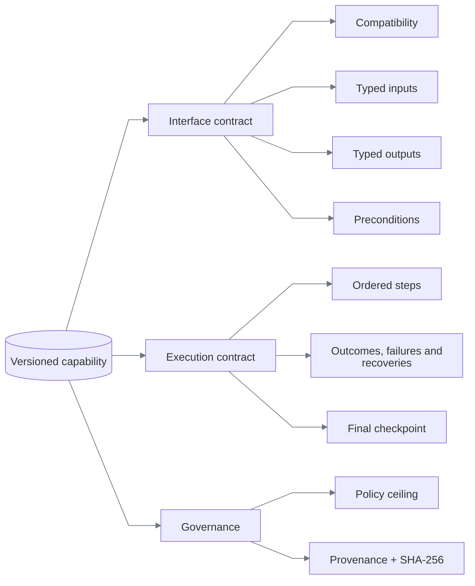
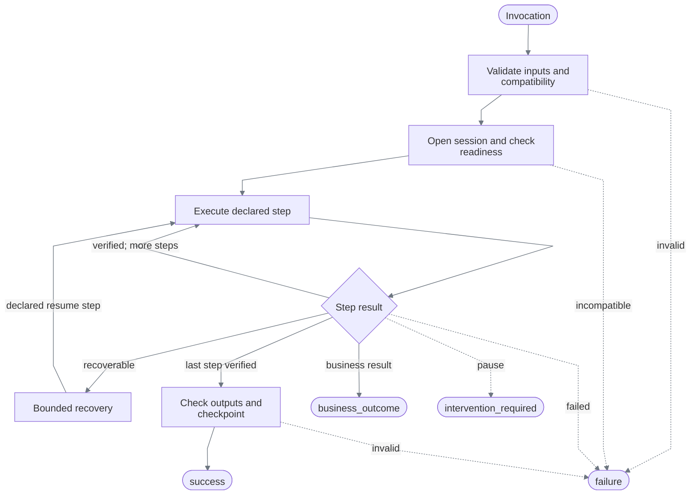

# Capability and deterministic replay

[Documentation index](README.md)

## The artifact is the production program

Discovery is temporary. The YAML artifact is the durable contract interpreted in production.

```text
verified trace → generic compiler → validated capability → immutable publication
```

An artifact contains no Python, JavaScript, selector callback, or model transcript. All three
published capabilities use schema `1.4`, which rejects persisted coordinates and relative geometry.
They share the definition in [capabilities/models.py](../backend/src/replayforge/capabilities/models.py).
The [evidence inventory](verification.md#scenario-matrix) binds each to its genuine discovery.

Publication is the durability boundary. A validated discovery allocates the next semantic version,
computes its canonical hash, and atomically exposes a complete YAML file at
`capabilities/<capability-id>/<version>.yaml`. Existing versions are immutable and identical retries
are idempotent. A fresh runtime validates the file's size, path identity, schema, and declared hash
before making it available to model-free replay. Visual assets use the same write-then-publish rule
under `capabilities/_assets/`; evidence remains a separate audit record, not the executable registry.

## Shape



Every required output must be bound by a main-flow extraction and checked by the final checkpoint.
Artifact validation rejects a missing binding or check before a browser opens.

| Capability | Inputs | Outputs | Risk |
|---|---|---|---|
| `member.transaction_investigation` | member ID, account ID, transaction reference | reference, account ID, amount, posted date, description, posting status | read-only |
| `member.servicing_loan_payoff_quote` | member ID, payoff date | payoff amount, good-through date, confirmation reference | read-only |
| `member.temporary_card_lock` | member ID, full card ID, reason | card ID, lock status, confirmation reference | reversible |

These contracts came from independent model planning and verified UI actions, not task adapters.
Their [goal-only specifications](../config/servicing-discovery.yaml) state the requested business
result without providing navigation instructions.

Input references support dotted object paths for typing, selection, identity checks, and
business-outcome details. Decimal strings must represent finite values. Missing or invalid inputs
report declared paths and stable codes; unknown caller-supplied keys are never echoed.

Schema `1.4` carries the compiled route allowlist and registered rendered-surface flag.
Only observed routes, narrowed to application patterns, enter the artifact; replay intersects
them again with application policy.

## Worked example: temporary card lock

The [current card-lock artifact](../capabilities/member.temporary_card_lock/1.0.2.yaml)
extends the [original discovery](../evidence/discovery-servicing-card-lock/manifest.json)
on the same servicing UI as the other two capabilities.

| Stage | Recorded responsibility | Why it matters |
|---|---|---|
| Admit | Registered rendered entry; Harbor and Summit | Application facts remain separate from the task |
| Select | Bind member and full card ID through input references | No copied IDs, row indices, or saved click coordinates |
| Verify | Extract selected identity and compare with input before mutation | Do not operate merely because a card page is visible |
| Change | Enter reason, review, confirm temporary lock | Risk is evaluated at each action; review alone is not completion |
| Verify result | Extract completed identity, exact locked status, and reference | A prior observation or a confirmation click cannot substitute for the result |
| Complete | Verify all declared conditions and typed outputs | Success is a checked state, not the model's assertion |

“Review” is the target application's confirmation screen, not a human approval stage in discovery.
The UI exposes an inverse, but discovery does not execute an unlock-and-restore cycle or establish
transactional rollback. The current card artifact adds three business outcomes, two application
failures, and a notice recovery. Payoff adds five cases and transaction investigation adds two:
all 13 have genuine scenario discovery and model-free replay proof on both tenants. The
[scenario matrix](verification.md#scenario-matrix) links each detector and recovery to its evidence;
engine-only fault and handoff fixtures remain a separate claim.

## Targeting

A target is a description, a scope, ordered candidates, and required state.

```yaml
target:
  description: Rendered Search action
  registered_risk: read_only
  visual_candidates:
    - strategy: rendered_text
      value: Search
      match: exact
```

Durable labeled-value targets use the same generic shape:

```yaml
target:
  description: Value associated with the rendered Currency label
  visual_candidates:
    - strategy: rendered_field_value
      label: Currency
      label_match: exact
```

Resolution is deterministic:

```text
for each rendered candidate, in artifact order
  → capture a fresh CSS-pixel screenshot
  → rebuild OCR phrases and frame-local edge components
  → enforce policy budgets and exactly one semantic match
  → return a transient region handle tied to the frame hash
otherwise → target_absent or target_ambiguous
```

The resolver never asks a model, selects the first ambiguous result, or clicks a nearby element.

Replay retries only a declared recoverable error when the surface adapter proves the prior attempt
had no effect. Capability artifacts cannot disable that requirement. Attempts, backoff, step time,
and recovery use are all schema-bounded; see [Constraints and policy](constraints-and-policy.md).

### Targeting decision

| Option | Decision | Reason |
|---|---|---|
| Persisted coordinates | Rejected | Not stable across viewport and layout changes |
| OCR text | **Chosen for named actions and conditions** | Human-readable identity on rendered pixels |
| Saved OCR-relative region | Rejected | Stores layout geometry and breaks under reflow |
| Label-to-control relation | **Chosen for text inputs** | Uses the current label and detected control component |
| Label-to-value relation | **Chosen for extraction** | Supports horizontal and stacked field layouts without offsets |
| Group label + edge signature | **Chosen for repeated icon actions** | Content-addressed identity plus semantic row context |
| Role/label + iframe scope | Optional fallback | Precise when a trustworthy semantic surface exists |
| Generated CSS selector | Supported but not primary | Often encodes incidental markup |

For new capabilities, coordinates exist only during frame-local grounding and input dispatch.
Discovery may observe a transient icon region to create a signature, but the compiler publishes
only rendered candidates. Schema `1.4` rejects persisted geometry; rendered-only registrations
also reject legacy DOM targets recursively.

Labeled input association uses the label's local text height when considering an input-shaped
component. A page-wide median alone can reject a normal input when a dense table uses larger
text. Intervening visible text blocks association across another field or section: a missed input
must not become a click into a distant table cell. These are frame-derived rules, not application
coordinates or tenant-specific thresholds.

OCR-relative `right_of` requires overlap in the current text row; `below` requires overlap in
the current text column. Neither selects the nearest of several matching actions: multiple
aligned matches remain ambiguous. Requiring alignment avoids a sidebar anchor accidentally
matching an identically named control in the main workspace. Alignment is measured from fresh
OCR boxes and scales with them; no page positions are stored.

Field-value association filters right-hand tokens before building text lines, so navigation on
the same baseline cannot hide a value. It examines enclosing containers because segmentation
can detect a label-only table column separately from its value cells. A plausible stacked value
in a smaller container conflicts with an outer horizontal candidate and fails as ambiguous.
This was chosen over taking the next text line or blindly using the smallest rectangle: both
can return another field label as customer data. All regions come from the current frame.

### Current-frame visual signatures

Repeated-row interfaces need more than a global icon match. The optional signature resolver
first resolves a rendered group label, identifies same-group components in the current frame,
then compares each with a content-addressed signature. Its click region is transient and tied
to the frame hash. This mechanism has synthetic vision tests; the three current discoveries use
text/label relationships and do not need any committed image assets.

| Repeated-icon option | Decision | Reason |
|---|---|---|
| Click the first template match | Rejected | Identical Checking, Savings, and loan actions make ordinal selection unsafe |
| Persist the Savings-row coordinates | Rejected | Layout and viewport changes invalidate the recording |
| Give each icon a different shape | Rejected | Hides the ambiguity instead of solving it |
| OCR anchor + saved relative template region | Rejected | Relative geometry still leaks recording-time layout |
| OCR group label + current-frame component graph | **Chosen** | Binds the icon to the named business row without persisted geometry |

The [vision policy](../config/vision-policy.yaml) owns the canonical signature size, similarity
floor, uniqueness margin, and pixel/time budgets. DPR variation is handled by CSS-pixel screenshots
and canonical normalization—not by storing a scale range in the artifact.

## Replay pipeline



The engine validates inputs before opening Chromium, checks ownership before each action, and records action intent separately from result. A click dispatch is not success; postconditions and the final checkpoint must be observable.

The step box includes preconditions, target resolution, policy evaluation, intent/result recording,
and effect verification. Declared outcomes, failures, and recoveries are checked around actions
and waits; the diagram summarizes branching, not every observation. Recovery failure terminates
with a typed failure too.

The interpreter owns condition actions: `assert` evaluates immediately, `wait_for` polls within
the step timeout, and `checkpoint` evaluates the named final condition. A false condition stops
the step or enters its declared recovery; it cannot become a successful no-op. Action conditions
receive the same cross-reference validation as preconditions and postconditions. An ambiguous or
broken target lookup is not proof that an element is absent.

## Error semantics

| Class | Meaning | Example | Result |
|---|---|---|---|
| Business outcome | Workflow completed with a legitimate negative answer | No member exists | `business_outcome/member_not_found` |
| Recoverable condition | A declared finite repair is safe | Known training notice | Recovery events, then continue |
| Application failure | Target rendered a known terminal error | Permission denied | `failure/permission_denied` |
| Mechanical failure | Automation could not resolve or act | Two indistinguishable actions | `failure/target_ambiguous` |
| Verification failure | Action ran but evidence does not prove the effect | Wrong member on detail page | `failure/checkpoint_mismatch` |
| Safety pause | Action needs a person | Sensitive action requiring an operator | `intervention_required` |

Retry requires a named recoverable error, remaining attempts, and proof that the prior effect is
absent. Recoveries are named and bounded, cannot invoke nested recoveries, and cannot contain
sensitive actions. Exact limits are in [Constraints and policy](constraints-and-policy.md#execution-bounds).

Omitting `version` resolves the latest publication for that capability ID. Pin an explicit version
for reproducible invocations. Old demo capabilities are intentionally absent from this distribution;
the repository is not maintaining a migration path for deployed users.

## Schema and version decisions

| Choice | Alternatives | Reason |
|---|---|---|
| YAML authoring + Pydantic validation | JSON only, executable scripts | YAML reviews well; strict models prevent free-form execution |
| Symbolic input references | Record discovery values | One artifact can accept new member IDs without retaining the original value |
| Immutable semantic versions | Mutable latest script | Replays remain reproducible and auditable |
| SHA-256 over canonical serialization | Filename/version trust | Detects content changes independently of storage |
| Explicit outcomes and checkpoints | Infer success from last click | Forces callers and reviewers to see what was actually proven |
| Generic trace compiler + model draft | Direct model-authored artifact | The model proposes task semantics, but only observed, policy-approved actions become a durable artifact |
