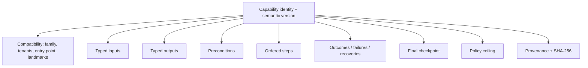
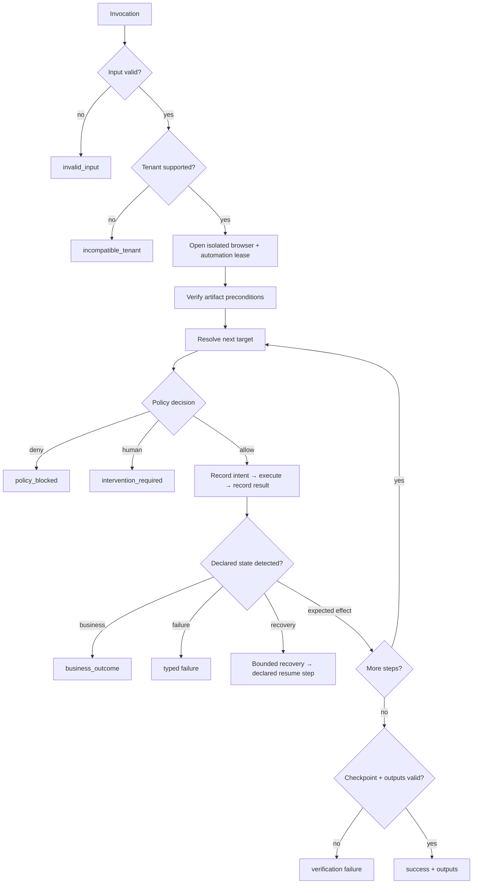

# Capability and deterministic replay

## The artifact is the production program

Discovery is temporary. The YAML artifact is the durable contract interpreted in production.

```text
raw model exchange       recorded successful trace       published capability
     discarded        ───────── compiler ─────────►   typed, hashed, reviewable
```

An artifact contains no Python, JavaScript, selector callback, or model transcript. The full example is [`1.0.0.yaml`](../capabilities/member.lookup_savings_balance/1.0.0.yaml); its Pydantic definition is [`capabilities/models.py`](../backend/src/replayforge/capabilities/models.py).

## Shape



For `member.lookup_savings_balance`, the external contract is:

```text
input  member_id: 5–10 digits
output member_id, account_type, currency, available_balance, as_of
result success | business_outcome | failure | intervention_required
```

Every required output must be bound by a main-flow extraction and checked by the final checkpoint. Artifact validation rejects a missing binding or check before a browser opens.

## Targeting

A target is a description, a scope, ordered candidates, and required state.

```yaml
target:
  description: Search button
  scope:
    frame_path:
      - locator: {strategy: title, value: Member operations}
  candidates:
    - {strategy: role_name, role: button, name: Search}
  state: {visible: true}
```

Resolution is deterministic:

```text
for each candidate, in artifact order
  → resolve frame scope
  → wait within its bounded share of the timeout
  → require exactly one match
  → require declared visibility/enabled state
  → return the handle
otherwise → target_absent or target_ambiguous
```

The resolver never asks a model, selects the first ambiguous result, or clicks a nearby element.

### Targeting decision

| Option | Outcome | Reason |
|---|---|---|
| Absolute coordinates | Schema-only extension; not executed | Not stable enough for the implemented replay path |
| Generated CSS selector | Supported but not used by the main artifact | Often encodes incidental markup |
| Text alone | Available | Can be ambiguous without role or scope |
| Role/label + iframe scope | **Chosen first** | Human-readable and robust on the selected target |
| Relative label/value relationship | **Chosen for extraction** | Stable for definition-list data without generated IDs |

## Replay pipeline



The engine validates inputs before opening Chromium, checks ownership before each action, and records action intent separately from result. A click dispatch is not success; postconditions and the final checkpoint must be observable.

## Error semantics

| Class | Meaning | Example | Result |
|---|---|---|---|
| Business outcome | Workflow completed with a legitimate negative answer | No member exists | `business_outcome/member_not_found` |
| Recoverable condition | A declared finite repair is safe | Known training notice | Recovery events, then continue |
| Application failure | Target rendered a known terminal error | Permission denied | `failure/permission_denied` |
| Mechanical failure | Automation could not resolve or act | Two savings links | `failure/target_ambiguous` |
| Verification failure | Action ran but evidence does not prove the effect | Wrong member on detail page | `failure/checkpoint_mismatch` |
| Safety pause | Action needs a person | Sensitive search submit in `2.0.0` | `intervention_required` |

Retry occurs only when the artifact names the error, attempts remain, and the prior effect is known absent when required. Recoveries are named, capped at three uses by schema, cannot invoke nested recoveries, and cannot contain sensitive actions.

## Committed versions

| Version | Purpose | Additional behavior |
|---|---|---|
| `1.0.0` | Normal model-free replay | Eight read-only steps; member-not-found outcome |
| `1.0.1` | Recovery demonstration | Selects a known interstitial; dismisses it once |
| `1.0.2` | Hard-failure demonstration | Selects permission denial; classifies expected/observed state |
| `2.0.0` | Handoff demonstration | Marks search submission sensitive; policy pauses before click |

No version means “latest,” currently `2.0.0`. Use `1.0.0` for unattended happy-path replay.

## Schema and version decisions

| Decision | Alternatives | Why chosen |
|---|---|---|
| YAML authoring + Pydantic validation | JSON only, executable scripts | YAML reviews well; strict models prevent free-form execution |
| Symbolic input references | Record discovery values | One artifact can accept new member IDs without retaining the original value |
| Immutable semantic versions | Mutable latest script | Replays remain reproducible and auditable |
| SHA-256 over canonical serialization | Filename/version trust | Detects content changes independently of storage |
| Explicit outcomes and checkpoints | Infer success from last click | Forces callers and reviewers to see what was actually proven |
| Specialized compiler | Generic model-authored artifact | Fail-closed implementation for one deep workflow; less breadth, stronger validation |
