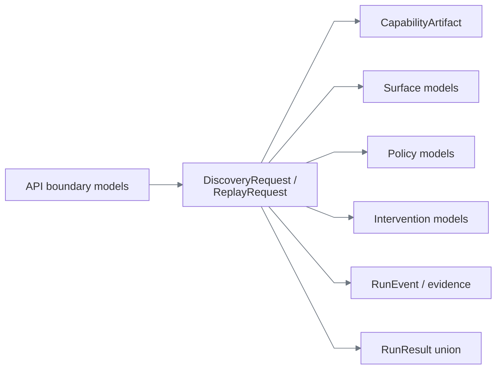
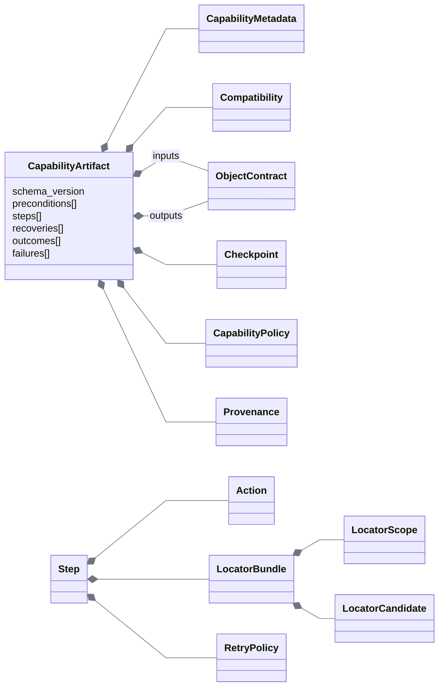
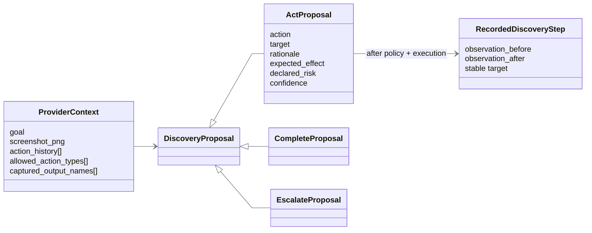
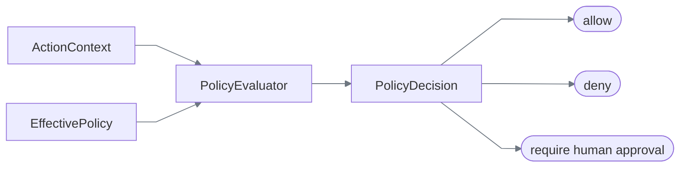
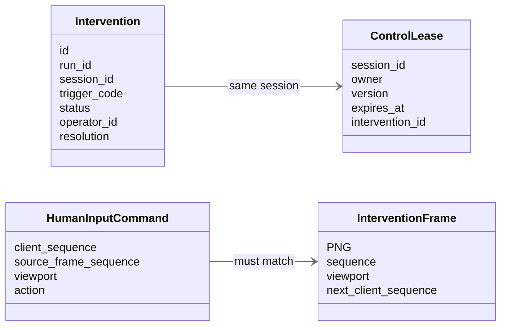
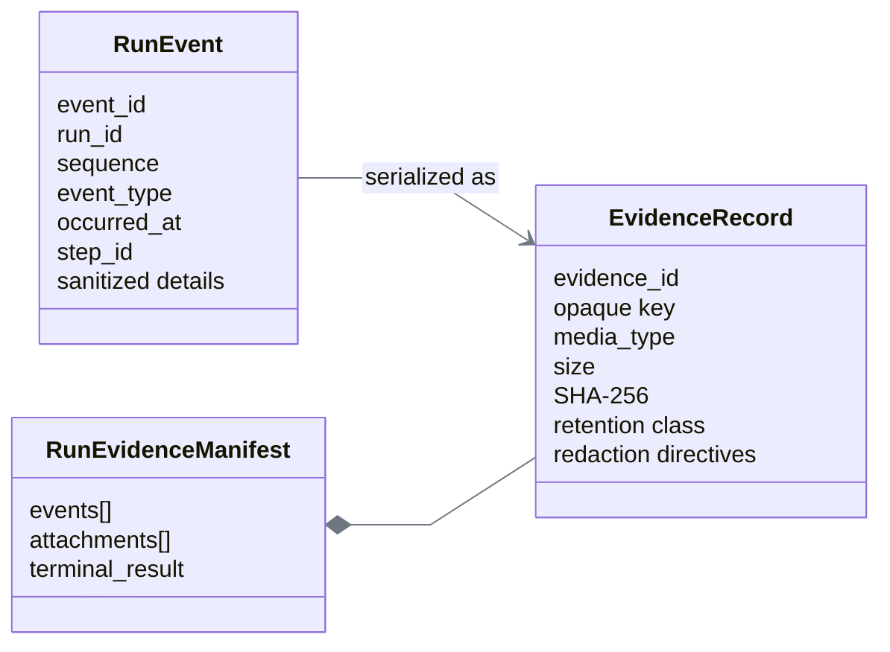

# Data models

The models are split by ownership. Pydantic is used at serialized trust boundaries; frozen dataclasses are used for internal domain values; protocols define replaceable dependencies.



## Identity model

All runtime identities use a typed prefix plus 32 lowercase hexadecimal characters.

| Entity | Prefix | Created for |
|---|---|---|
| Run | `run_` | One discovery or replay invocation |
| Session | `ses_` | One isolated browser context |
| Event | `evt_` | One ordered journal event or normalized observation |
| Decision | `dec_` | One policy evaluation |
| Intervention | `int_` | One routed human handoff |
| Evidence | `evd_` | One stored evidence object |
| Trace | `trc_` | One API correlation identity |

`EntityId` validates both syntax and expected kind at boundaries. IDs are opaque; business meaning never depends on parsing their random component.

### Decision

| Alternative | Choice | Reason |
|---|---|---|
| Database integers | Rejected | Leak ordering and require a central allocator |
| Untyped UUID strings | Rejected | Easy to mix run, session, and evidence IDs |
| Prefixed random IDs | **Chosen** | Locally generated, log-readable, and kind-checkable |

## Capability aggregate

`CapabilityArtifact` is the root of the replay contract.



| Model | Important fields | Invariant |
|---|---|---|
| `CapabilityMetadata` | ID, semantic version, application family, surface, risk | Capability family matches compatibility; risk matches policy ceiling |
| `Compatibility` | Base variant, supported variants, surface contract, entry point, landmarks | At least one supported tenant; entry point must be policy-allowed |
| `ObjectContract` | Required names, property schemas, additional-properties flag | Required names exist; invocation/output objects reject undeclared values |
| `ValueSchema` | Type, constraints, classification, persistence | Decimal and timestamp stay strings at artifact/API boundaries |
| `Step` | ID, action, target, conditions, timeout, retry, references, risk | Target-required actions have a target; referenced objects exist |
| `LocatorBundle` | Description, scope, ordered candidates, state | At least one candidate; resolved match must be unique |
| `Recovery` | Trigger, maximum uses, steps, resume target | No nested recovery; resume step exists; recovery cannot be sensitive |
| `BusinessOutcome` | Stable code, detector, allowed step, result bindings | Only detectable after explicitly listed steps |
| `ApplicationFailure` | Stable code, detector, expected/observed state, recoverability | Cannot collide with a business-outcome code |
| `Checkpoint` | ID and composed condition | Must validate every required output |
| `Provenance` | Discovery run, provider/model, adapter/compiler versions, fingerprint, evidence, hash | Optional declared hash must equal canonical artifact content |

Action and condition models are discriminated unions. This makes invalid combinations impossible to interpret accidentally: an `extract` has an output binding; a `type` has a literal or input source; `all`/`any` contain nested conditions.

## Discovery model



The provider proposal is not the recording. Only a policy-approved, successfully executed action becomes a `RecordedDiscoveryStep`. Before/after observations and the adapter-captured locator are retained separately from provider output.

### Decision

| Alternative | Choice | Reason |
|---|---|---|
| Persist provider response as the workflow | Rejected | Provider-specific and not execution-safe |
| Let free-form text drive the browser | Rejected | Cannot validate action, target, risk, or bounds |
| Parse into a strict proposal, then record verified effects | **Chosen** | Separates model suggestion from trusted capability input |

## Surface model

`NormalizedObservation` is the portable perception record:

```text
identity + session + timestamp
route + viewport + fingerprint
landmarks + frame titles
actionable controls(role, name, count)
extractable fields(label, count)
visual tokens(text, confidence, screen region)
active element + optional dialog/evidence reference
```

`ResolvedTarget` does not expose a Playwright locator. It contains an adapter-owned opaque handle, description, chosen candidate index, observed count, reviewed risk, and optional transient visual region. Durable visual candidates contain text/relative rules or a content-addressed template—never the resolved screen coordinates.

`SurfaceError` carries only safe, classified data: code, safe message, recoverability, whether the prior effect is absent, whether intervention is recommended, and sanitized expected/observed facts.

### Decision

| Alternative | Choice | Reason |
|---|---|---|
| Pass Playwright objects into engines | Rejected | Prevents fake, visual, or desktop adapters |
| Serialize full DOM | Rejected | Large, sensitive, and web-specific |
| Compact normalized facts + OCR tokens + opaque handle | **Chosen** | Keeps domain logic portable while the adapter owns grounding technology |

## Policy model



| Model | Contains |
|---|---|
| `PolicyLayer` | Name, origin/route/action allowlists, risk ceiling, forbidden field classes |
| `EffectivePolicy` | Intersection of allowed sets, union of forbidden classes, lowest risk ceiling |
| `ActionContext` | Principal, mode, app, tenant, location, action, target, declared/observed risk, owner |
| `PolicyDecision` | Stable reason, explanation, matched layers, effective risk, evidence/redaction requirements, timestamp |

The decision is data rather than an exception so the same reason can control execution and produce an audit event.

## Intervention and lease model



`Intervention.status` is `open → claimed → resuming → resolved`, with termination allowed from open or claimed. Release returns claimed to open. Failed resume validation returns resuming to open. The lease separately tracks the actual control owner: automation, automation-paused, one named human, or none.

Keeping intervention workflow and control ownership separate prevents a UI status change from granting browser authority. Every lease replacement increments exactly one version and is installed with compare-and-swap.

## Run result model

```text
RunResult
├── SuccessResult
│   └── capability ref + outputs + VerifiedCheckpoint(true) + evidence
├── BusinessOutcomeResult
│   └── stable code + redacted details + evidence
├── FailureResult
│   └── code + safe message + recoverable + step + expected/observed + evidence
└── InterventionRequiredResult
    └── intervention ID + code + step + live-session flag + paused owner
```

The `status` field is the discriminator. A caller cannot mistake “member not found” for a crash or a paused live session for a terminal failure.

## Evidence model



The journal owns monotonic event sequence and exactly-one finalization. The store owns bytes, hashes, sidecars, atomic replacement, and root confinement. The redactor produces `SanitizedEvidence`; the store does not accept an untyped raw byte payload.

## Durability matrix

| Data | Current owner | Durable? | Lost on API restart? |
|---|---|---:|---:|
| Committed capability YAML | Repository | Yes | No |
| Runtime capability records | In-memory registry | No | Reloaded from YAML |
| Run journal objects | Process memory | No | Yes |
| Event/result/attachment bytes | Local evidence directory | Yes | No |
| Leases and interventions | Process memory | No | Yes |
| Retained browser sessions | Worker thread + Chromium | No | Yes |
| Stable reviewer bundles | Repository under `evidence/` | Yes | No |
| Model telemetry | Local Langfuse deployment | External local service | Depends on its volumes |

PostgreSQL was considered for registry, run, intervention, and lease durability. It was deferred to keep the submission's core runnable without infrastructure. The protocols and compare-and-swap semantics identify the intended persistence boundary, but crash recovery is not implemented and is not implied by those interfaces.
