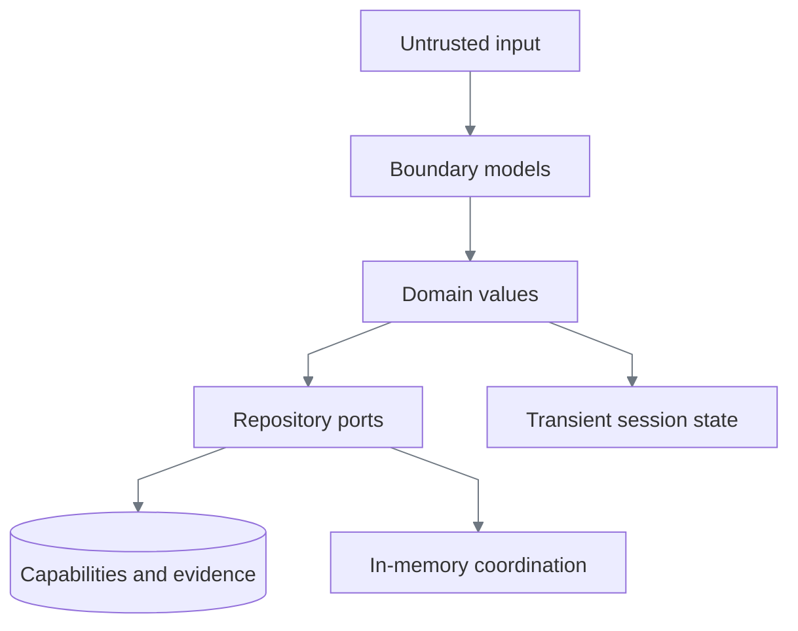
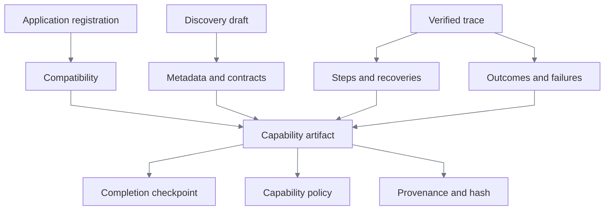
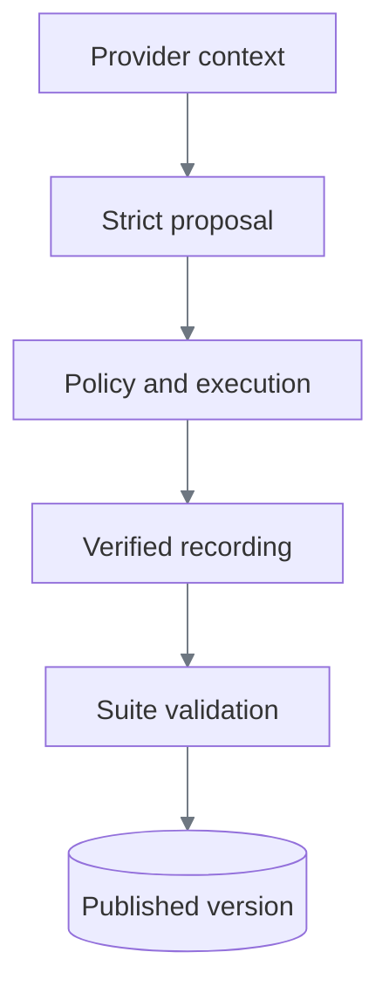
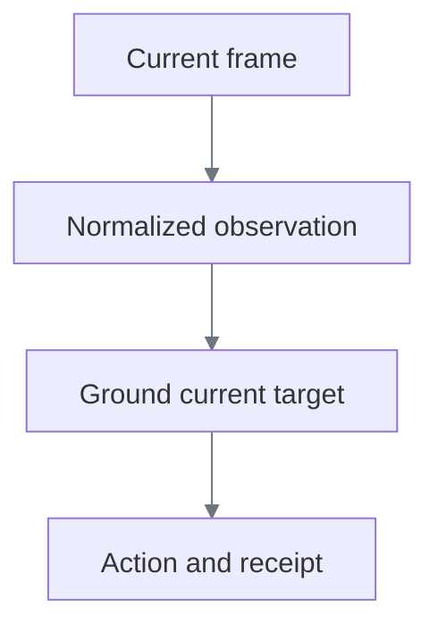
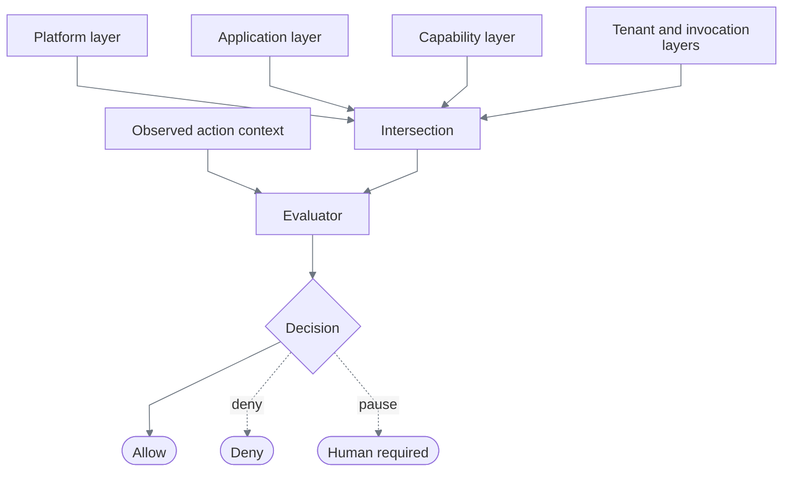
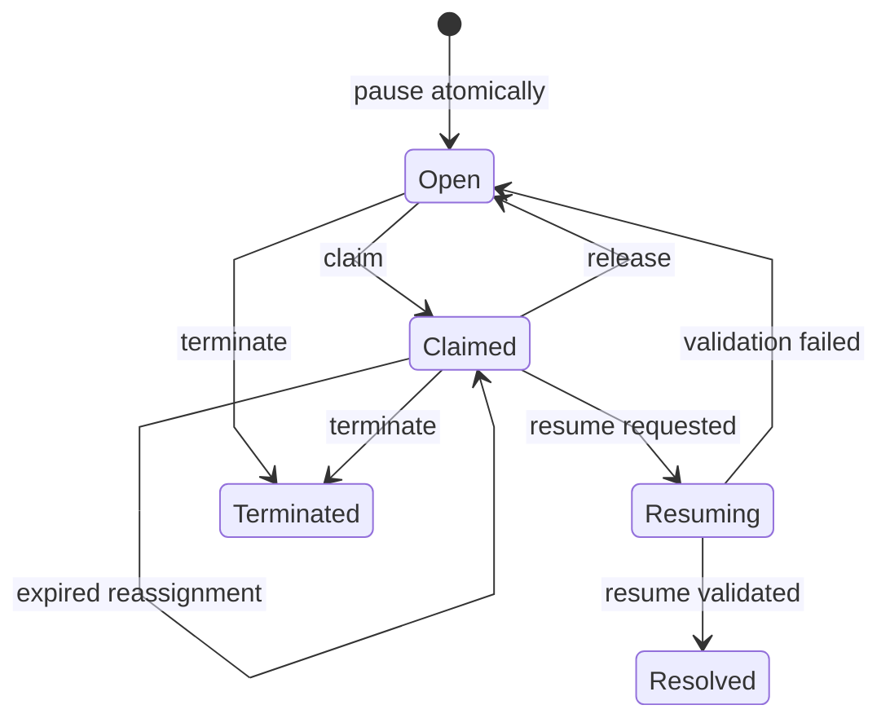
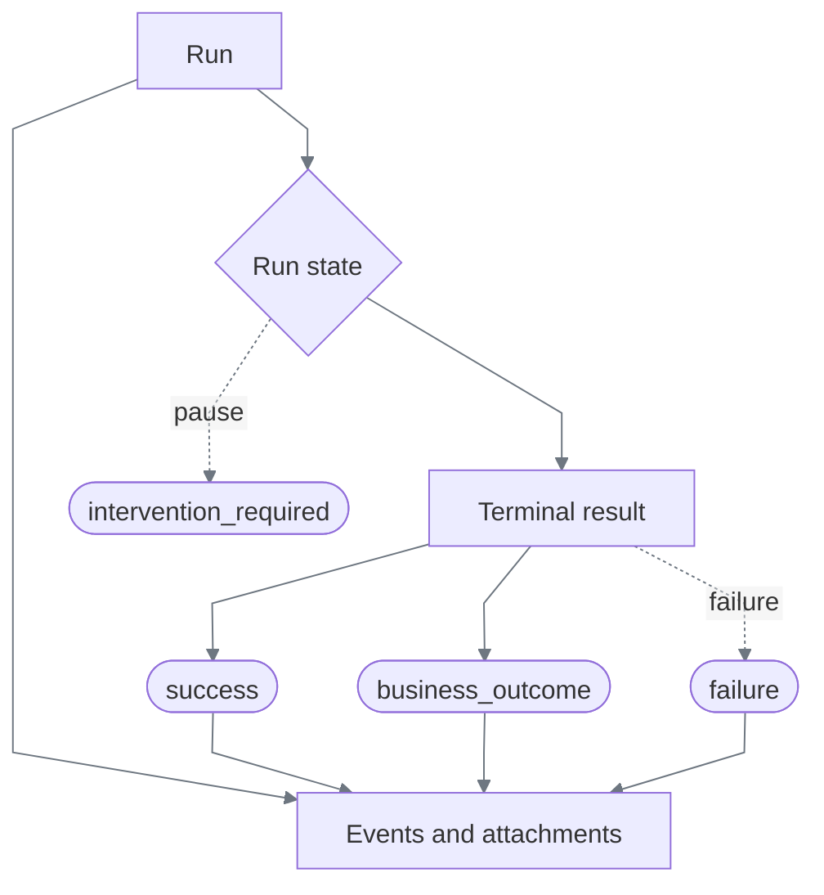

# Data models

[Documentation index](README.md)

ReplayForge separates data by trust and lifetime. Serialized boundaries use strict Pydantic
models with unknown fields rejected; durable contracts reject field reassignment. Internal state
uses frozen dataclasses. Nested dictionaries remain ordinary Python mappings, so capability and
application registries, discovery-suite repositories, and journal reads use detached snapshots.
This prevents a caller from mutating a published contract through a previously returned object.
Repository protocols own mutation.

| Layer | Representative models | Rule |
|---|---|---|
| Boundary | API requests, `CapabilityArtifact`, `RunResult`, evidence manifest | Parse strictly; reject extra or contradictory fields |
| Domain | observations, decisions, receipts, leases, interventions | Construct only valid states; use aware timestamps and typed IDs |
| Repository | capability, suite, evidence, lease/intervention ports | Mutation and concurrency belong here |
| Transient | provider context, browser handle, current visual region | Never becomes a capability artifact |

## Identity

Every runtime ID is a prefix plus 32 lowercase hexadecimal characters.

| Prefix | Entity | Scope |
|---|---|---|
| `run_` | Run | One discovery or replay invocation |
| `exe_` | Execution view | One ephemeral user launch, containing actual discovery/replay/validation run identities |
| `sui_` | Discovery suite | One draft, its scenarios, and publication outcome |
| `ses_` | Surface session | One isolated live browser context |
| `evt_` | Event or observation | One ordered audit event or normalized observation |
| `dec_` | Policy decision | One evaluation |
| `int_` | Intervention | One human handoff |
| `evd_` | Evidence record | One stored object |
| `trc_` | Trace | One API correlation identity |

IDs are opaque. The prefix prevents cross-entity substitution; code never interprets the random
component.

Execution viewing adds a bounded in-memory state machine: running → paused → running,
or a terminal success/failure/business-outcome/termination. Frame and timeline sequences are
monotonic within the execution, with actual run and phase metadata. The viewer's access token
is independent of its public execution ID and never grants an intervention control lease.
See [viewing lifecycle and limits](live-viewing.md#privacy-and-lifecycle).

### Version and content identity

| Field | Identifies | Does not establish |
|---|---|---|
| `schema_version`, e.g. `1.4` | The artifact format and its validation rules | A task release or application vendor version |
| Capability ID + semantic version | One immutable task program | Support for an unvalidated tenant |
| `surface_contract`, e.g. `web.v1` | The adapter's observation/action semantics | A particular website's markup or layout |
| Canonical artifact hash | The normalized artifact content | Author identity or safety by itself |
| `target_fingerprint` | The observation recorded during discovery | A universal startup equality check or vendor-release detector |

These fields are separate because format evolution, workflow evolution, adapter compatibility,
and content integrity change independently. Publication preserves the old version; compatibility
checks decide whether a saved program may run on the current registered surface.

## Capability artifact

`CapabilityArtifact` is the immutable replay contract. Application registration supplies where
and under what ceiling a task may run; discovery supplies task semantics.

| Part | Enforced invariant |
|---|---|
| Metadata | Capability ID and semantic version are stable; application family matches compatibility |
| Input/output contracts | Required properties exist; unknown invocation values are rejected; secrets and credentials cannot enter discovered contracts |
| Compatibility | Tenant set is non-empty; entry point is registered and policy-allowed; landmarks describe the expected surface |
| Step | ID is unique; action and target agree; references resolve; timeout and retry counts are bounded |
| Target | Candidate order is explicit; every candidate has exactly the fields its strategy needs |
| Recovery | Trigger, bounded uses, and resume step are valid; nested and sensitive recovery are rejected |
| Outcome/failure | Codes are unique and disjoint; detection is limited to declared steps |
| Checkpoint | Every required output is validated before success |
| Policy | Entry points, routes, actions, risk ceiling, and forbidden data classes are explicit |
| Provenance | Run, provider/model, component versions, timestamp, fingerprint, evidence key, and optional canonical hash are recorded |

Artifact, registration, model-policy, and vision-policy YAML reject duplicate mapping keys, including duplicates introduced
by merge keys. Silent last-key-wins parsing would let displayed configuration disagree with the
effective contract. These boundaries share one parser and one rejection rule.

Compatibility is checked against registration before launch and registered readiness landmarks
on the live entry surface. Descriptive discovery fingerprints are not executable preconditions.
See [Compatibility](heterogeneity-and-compatibility.md) for current-schema rules, vendor-version
handling, and the deliberately unimplemented overlay design.

Actions and conditions are discriminated unions. For example, `type` requires a value source and a
target; `navigate` accepts an entry-point name and cannot carry a target. The same pairing is
checked on model proposals, recorded discovery steps, and final artifact steps.

Schema `1.4` stores no coordinates. Rendered candidates describe text, labeled controls, fields,
or image groups. The surface adapter derives a region from the current frame and viewport, uses it
once, and discards it. The geometry prohibition also covers visual fallbacks in DOM-enabled
capabilities; changing the surface flag cannot bypass it. The guard traverses typed model objects,
not arbitrary JSON data that happens to contain a field named `strategy`.
Older `1.0`–`1.3` artifact schemas are rejected; no migration shim is retained.

## Discovery

`ProviderContext` and `PlanningContext` are transient and may contain the goal, synthetic inputs,
and an unmasked live PNG. These authorized discovery frames are distinct from masked evidence
frames; they are not written to local evidence. Managed viewing retains only the latest discovery
frame in memory. A provider response is only a proposal. It becomes a recording
after policy allows it, the adapter executes it, and deterministic postconditions pass.

`DiscoverySuccess` binds a typed run ID to that run's evidence manifest. An extension of a
published capability retains that original run and manifest; `primary_source` distinguishes it
from new discovery. Extension requires fresh primary replay before scenario collection.
`DiscoverySuite` has its
own `sui_` identity and four states: `collecting`, `validated`, `published`, or `failed`. A suite can
publish only a successful, validated artifact whose version matches the published version. There
is no reviewer or approval state after discovery.

`DiscoveryPause` binds a blocker to its request, live session, effective policy, observation,
and lease version. `DiscoveryContinuation` owns the suspended loop in memory; it is deliberately
not serializable and never enters an artifact or evidence bundle. A managed wait releases the
browser worker for operator input while the original application-service call remains pending.
Resume preserves the loop's recordings and consumed budgets; cancellation closes it. Suite
state changes only when that primary discovery actually completes. All publication uses the
same fresh deterministic validation gate, including read-only and human-assisted drafts.

`ReplayContinuation` is also ephemeral: it retains the exact interrupted step index, session,
inputs, output cache, recovery-use counters, and spent retry attempt. Its `retry_step` boundary
means the action was not dispatched, rather than merely having a recoverable error code. Otherwise
resume verifies the effect and advances. Human control invalidates cached outputs; only fresh,
policy-allowed extraction can restore operands needed by the resume conditions. This state stays
outside the immutable capability schema because it belongs to one execution, not the saved task.

## Surface

`NormalizedObservation` contains a typed event and session ID, aware timestamp, absolute route,
viewport, fingerprint, non-empty landmarks/frame titles, semantic controls and fields, OCR tokens,
and an optional evidence reference. It contains no Playwright object or full DOM.

`ResolvedTarget` contains an adapter-owned handle, candidate index, exactly-one match count,
registered risk, and optional current-frame visual data. A visual region is valid only with the
frame hash that produced it. `ActionReceipt` is either `completed` or `failed`; timestamps are
ordered and only failure may contain an error code.

## Policy

Each `PolicyLayer` contains credential-free HTTP origins, safe route patterns, action identifiers,
a risk ceiling, and forbidden data classes. Intersection keeps only shared allowlists, unions
forbidden classes, and chooses the lowest risk ceiling. Empty intersections are valid and fail
closed.

The diagram shows replay's five layers. Discovery intersects platform and application policy;
replay's tenant and invocation layers currently inherit existing ceilings rather than expose
independent overrides. See [Policy composition](safety-and-handoff.md#policy-composition).

Discovery and replay pass the bound input's classification into policy, including forbidden
classifications in parent objects. Discovery also rejects nested credential/secret fields and
checks supplied values against the planned contract before the action loop.
Evidence classification also walks nested outputs. Explicit `remove` directives drop the field;
`tokenize` and `last4` never weaken a stronger classification, and customer tokenization is used
instead of retaining trailing identifying digits. These are persistence rules; successful callers
receive the typed task outputs.

`ActionContext` deliberately accepts hostile observed values so the evaluator can return a stable
denial instead of failing during parsing. `PolicyDecision` is strict: typed `dec_` ID, stable
reason, matched layers, effective risk, evidence/redaction requirements, and aware timestamp.

## Intervention and control lease

An intervention describes workflow. A lease grants browser authority. Neither is sufficient alone.

| Intervention state | Required lease owner | Binding |
|---|---|---|
| `open` | `automation_paused` | Same intervention |
| `claimed` | `human:<operator>` | Same intervention and operator |
| `resuming` | `automation_paused` | Same intervention |
| `resolved` | `automation` | No intervention binding |
| `terminated` | `none` | No intervention binding |

Every ownership change increments the lease version exactly once. Opening, claiming, releasing,
heartbeating, resuming, reopening, resolving, and terminating use a paired compare-and-swap
repository. Reads also return the pair under the same lock, so no caller can observe half a local
transition. A future persistent adapter must preserve this same transaction boundary.

Operator input is tied to both the current frame sequence and lease version. Pointer coordinates
are transient input coordinates inside the source viewport—not stored replay locators. Audit data
records pointer position, sequences, and viewport; typed text is represented only by character
count.

## Results and evidence

Terminal completed results are `success`, `business_outcome`, or `failure`; each accepts only
JSON-safe values and a manifest key belonging to its run. `intervention_required` is non-terminal:
it identifies a live paused session and therefore has no finalized manifest requirement.

The journal owns monotonic sequences and exactly-once finalization. Redaction produces
`SanitizedEvidence`; only that type crosses the storage port. Each `EvidenceRecord` contains an
opaque key, media type, bounded size, SHA-256 hash, retention class, directives, and aware time.
The authoritative `RunEvidenceManifest` requires unique evidence identities, unique run-owned keys,
and separate JSON events, binary attachments, and optional terminal result.

`ExecutionDiagnostic` is a separate strict, frozen snapshot, not an untyped observation dump.
It bounds counters and normalizes action/error/condition strings to finite vocabularies. The
step ordinal and dispatch phase describe execution without retaining target labels or predicate
values. Each failure/blockage emits an event; finalization optionally adds one ZIP containing
the latest scanned snapshot. An unavailable archive changes diagnostic status, not task status.

The persisted terminal result is deliberately narrower than the caller's typed result: failure
messages and unclassified outputs are omitted. A discovery terminal record contains the
capability identity and canonical artifact hash rather than duplicating the full capability.
Public run IDs are separation context, not pseudonym secrets; ephemeral keyed HMACs protect
retained customer/operator identifiers from simple enumeration. See the
[retention schema and boundaries](safety-and-handoff.md#persistence-pipeline).

## Decisions

| Decision | Alternatives considered | Chosen and why |
|---|---|---|
| Runtime identity | Integers; bare UUIDs | Prefixed random IDs: local generation plus kind checking without leaked ordering |
| Boundary modeling | Dictionaries; one model system everywhere | Strict Pydantic at serialized boundaries and frozen dataclasses internally: validation without framework coupling |
| Capability shape | Recorded script; provider response; typed aggregate | Typed aggregate: reviewable, hashable, versioned, and deterministic |
| Discovery trust | Execute free text; persist provider output | Parse proposal, policy-check, execute, then record verified effect |
| Perception | Playwright handles; full DOM; screenshots only | Compact semantic observation plus current frame: portable and bounded |
| Targeting | Fixed coordinates; DOM-only selectors; current-frame grounding | Ordered semantic/visual candidates with transient grounding: survives layout changes and poor DOMs |
| Policy | Boolean guard; exceptions; decision record | Layer intersection plus data decision: fail-closed execution and auditable reasons |
| Human handoff | UI status flag; lease only; separate writes | Intervention plus versioned lease in one transaction: workflow and authority cannot diverge |
| Run completion | Nullable fields in one result | Discriminated result union: impossible states are rejected |
| Evidence | Raw logs; arbitrary blobs; typed manifest | Redact before storage, hash every object, and bind every key to its run |
| Persistence now | PostgreSQL immediately; memory only | Immutable capability/assets and evidence on disk; mutable live coordination in memory |

## Durability

| Data | Current storage | Restart behavior |
|---|---|---|
| Published capability versions | Atomic immutable YAML files | Survive; a fresh registry validates and reloads them |
| Content-addressed visual assets | Atomic immutable PNG files | Survive; hash verification rejects missing or changed bytes |
| Application registrations | YAML repository | Survives; registry reloads them |
| Evidence objects and manifests | Confined local directory | Survive |
| Runs and discovery suites | Process memory | Lost |
| Interventions and leases | Process memory | Lost together |
| Retained browser sessions | Worker thread and Chromium | Lost |

The paired intervention repository guarantees atomicity inside the current process, not crash
recovery. PostgreSQL is deferred until mutable operational history or multi-process coordination
creates a concrete need; it is not required to reload and replay a saved capability.
