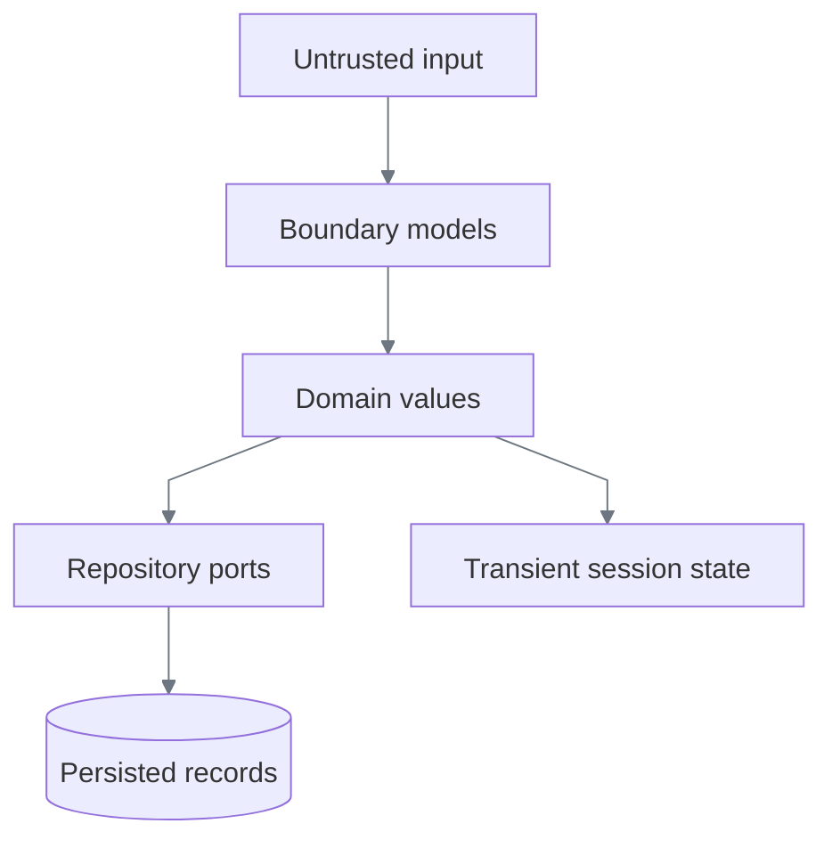
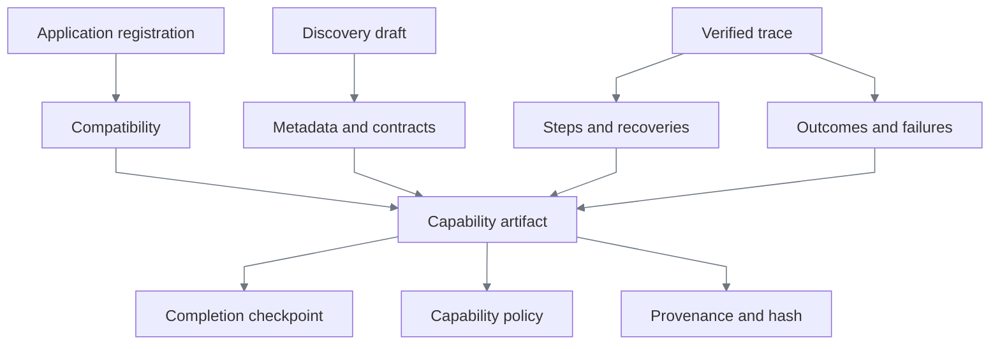
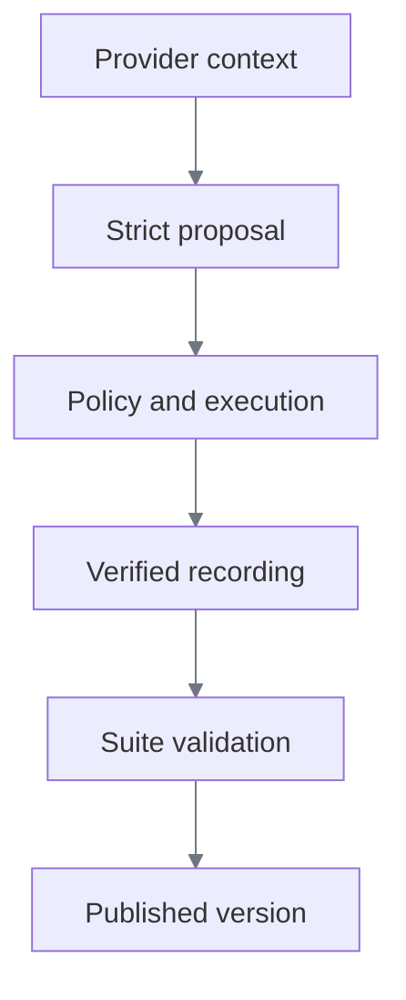
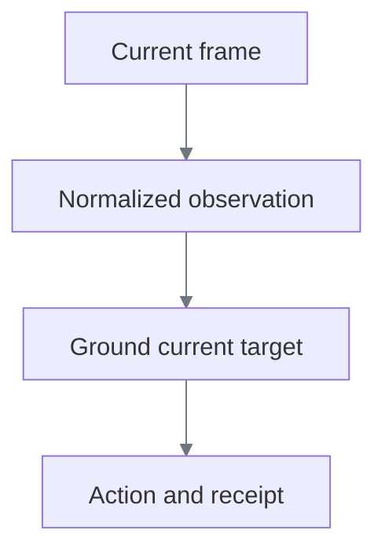
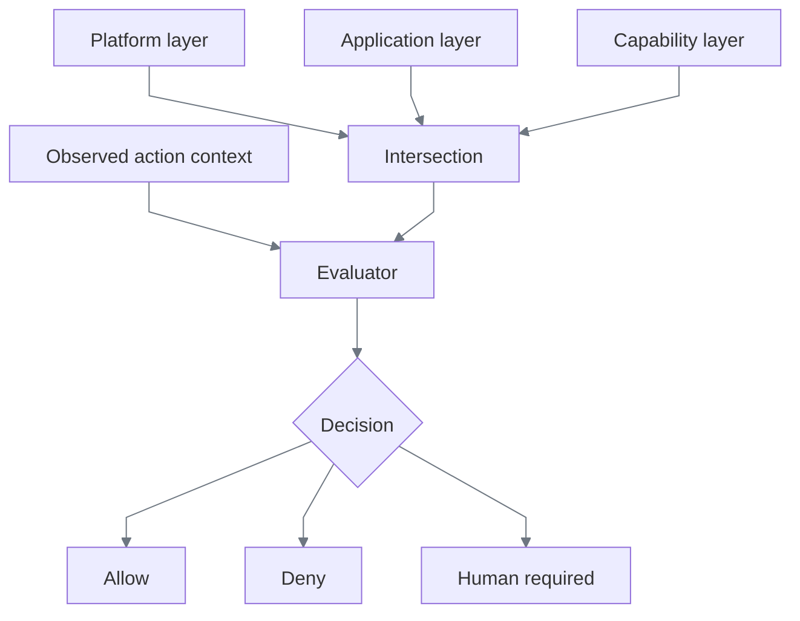
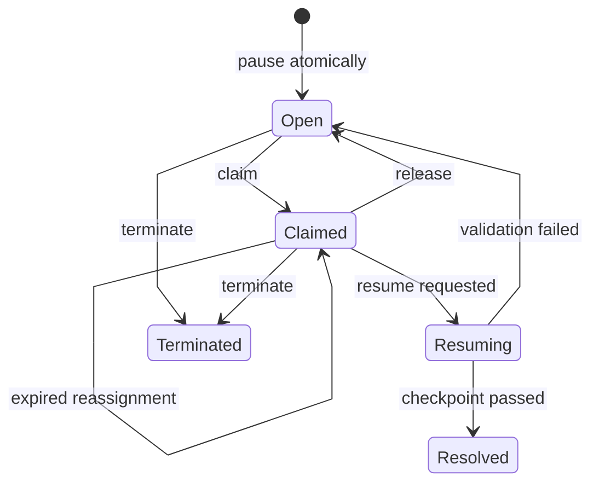
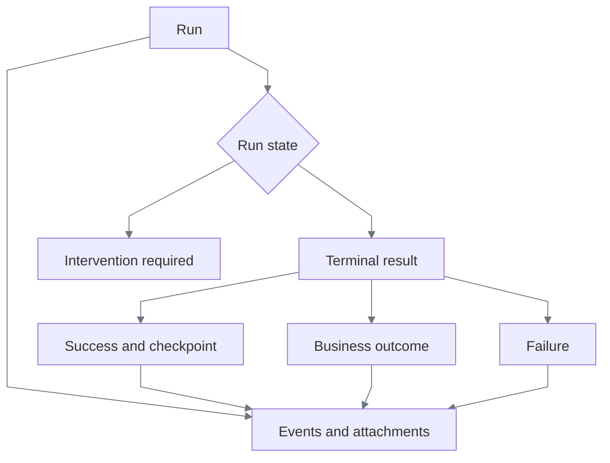

# Data models

ReplayForge separates data by trust and lifetime. Serialized boundaries use strict Pydantic
models with unknown fields rejected; durable contracts are frozen. Internal state uses frozen
dataclasses. Repository protocols own mutation.

| Layer | Representative models | Rule |
|---|---|---|
| Boundary | API requests, `CapabilityArtifact`, `RunResult`, evidence manifest | Parse strictly; reject extra or contradictory fields |
| Domain | observations, decisions, receipts, leases, interventions | Construct only valid states; use aware timestamps and typed IDs |
| Repository | capability, suite, evidence, lease/intervention ports | Mutation and concurrency belong here |
| Transient | provider context, browser handle, current visual region | Never becomes a capability artifact |

## Identity

Every runtime ID is a prefix plus 32 lowercase hexadecimal characters.

| Prefix | Entity | Scope |
|---|---|---|
| `run_` | Run | One discovery or replay invocation |
| `sui_` | Discovery suite | One draft, its scenarios, and publication outcome |
| `ses_` | Surface session | One isolated live browser context |
| `evt_` | Event or observation | One ordered audit event or normalized observation |
| `dec_` | Policy decision | One evaluation |
| `int_` | Intervention | One human handoff |
| `evd_` | Evidence record | One stored object |
| `trc_` | Trace | One API correlation identity |

IDs are opaque. The prefix prevents cross-entity substitution; code never interprets the random
component.

## Capability artifact

`CapabilityArtifact` is the immutable replay contract. Application registration supplies where
and under what ceiling a task may run; discovery supplies task semantics.

| Part | Enforced invariant |
|---|---|
| Metadata | Capability ID and semantic version are stable; application family matches compatibility |
| Input/output contracts | Required properties exist; unknown invocation values are rejected; secrets and credentials cannot enter discovered contracts |
| Compatibility | Tenant set is non-empty; entry point is registered and policy-allowed; landmarks describe the expected surface |
| Step | ID is unique; action and target agree; references resolve; timeout and retry counts are bounded |
| Target | Candidate order is explicit; every candidate has exactly the fields its strategy needs |
| Recovery | Trigger, bounded uses, and resume step are valid; nested and sensitive recovery are rejected |
| Outcome/failure | Codes are unique and disjoint; detection is limited to declared steps |
| Checkpoint | Every required output is validated before success |
| Policy | Entry points, routes, actions, risk ceiling, and forbidden data classes are explicit |
| Provenance | Run, provider/model, component versions, timestamp, fingerprint, evidence key, and optional canonical hash are recorded |

Actions and conditions are discriminated unions. For example, `type` requires a value source and a
target; `navigate` accepts an entry-point name and cannot carry a target. The same pairing is
checked on model proposals, recorded discovery steps, and final artifact steps.

Schema `1.4` stores no coordinates. Rendered candidates describe text, labeled controls, fields,
or image groups. The surface adapter derives a region from the current frame and viewport, uses it
once, and discards it. Older `1.0`–`1.3` fixtures remain readable for compatibility.

## Discovery

`ProviderContext` and `PlanningContext` are transient and may contain the goal, synthetic inputs,
and a sanitized PNG. A provider response is only a proposal. It becomes a recording after policy
allows it, the adapter executes it, and deterministic postconditions pass.

`DiscoverySuccess` binds a typed run ID to that run's evidence manifest. `DiscoverySuite` has its
own `sui_` identity and four states: `collecting`, `validated`, `published`, or `failed`. A suite can
publish only a successful, validated artifact whose version matches the published version. There
is no reviewer or approval state after discovery.

## Surface

`NormalizedObservation` contains a typed event and session ID, aware timestamp, absolute route,
viewport, fingerprint, non-empty landmarks/frame titles, semantic controls and fields, OCR tokens,
and an optional evidence reference. It contains no Playwright object or full DOM.

`ResolvedTarget` contains an adapter-owned handle, candidate index, exactly-one match count,
registered risk, and optional current-frame visual data. A visual region is valid only with the
frame hash that produced it. `ActionReceipt` is either `completed` or `failed`; timestamps are
ordered and only failure may contain an error code.

## Policy

Each `PolicyLayer` contains credential-free HTTP origins, safe route patterns, action identifiers,
a risk ceiling, and forbidden data classes. Intersection keeps only shared allowlists, unions
forbidden classes, and chooses the lowest risk ceiling. Empty intersections are valid and fail
closed.

`ActionContext` deliberately accepts hostile observed values so the evaluator can return a stable
denial instead of failing during parsing. `PolicyDecision` is strict: typed `dec_` ID, stable
reason, matched layers, effective risk, evidence/redaction requirements, and aware timestamp.

## Intervention and control lease

An intervention describes workflow. A lease grants browser authority. Neither is sufficient alone.

| Intervention state | Required lease owner | Binding |
|---|---|---|
| `open` | `automation_paused` | Same intervention |
| `claimed` | `human:<operator>` | Same intervention and operator |
| `resuming` | `automation_paused` | Same intervention |
| `resolved` | `automation` | No intervention binding |
| `terminated` | `none` | No intervention binding |

Every ownership change increments the lease version exactly once. Opening, claiming, releasing,
heartbeating, resuming, reopening, resolving, and terminating use a paired compare-and-swap
repository. Reads also return the pair under the same lock, so no caller can observe half a local
transition. The repository protocol is the required transaction boundary for PostgreSQL.

Operator input is tied to both the current frame sequence and lease version. Pointer coordinates
are transient input coordinates inside the source viewport—not stored replay locators. Audit data
records pointer position, sequences, and viewport; typed text is represented only by character
count.

## Results and evidence

Terminal completed results are `success`, `business_outcome`, or `failure`; each accepts only
JSON-safe values and a manifest key belonging to its run. `intervention_required` is non-terminal:
it identifies a live paused session and therefore has no finalized manifest requirement.

The journal owns monotonic sequences and exactly-once finalization. Redaction produces
`SanitizedEvidence`; only that type crosses the storage port. Each `EvidenceRecord` contains an
opaque key, media type, bounded size, SHA-256 hash, retention class, directives, and aware time.
The authoritative `RunEvidenceManifest` requires unique run-owned keys and separates JSON events,
binary attachments, and the optional terminal result.

## Choice record

| Decision | Alternatives considered | Chosen and why |
|---|---|---|
| Runtime identity | Integers; bare UUIDs | Prefixed random IDs: local generation plus kind checking without leaked ordering |
| Boundary modeling | Dictionaries; one model system everywhere | Strict Pydantic at serialized boundaries and frozen dataclasses internally: validation without framework coupling |
| Capability shape | Recorded script; provider response; typed aggregate | Typed aggregate: reviewable, hashable, versioned, and deterministic |
| Discovery trust | Execute free text; persist provider output | Parse proposal, policy-check, execute, then record verified effect |
| Perception | Playwright handles; full DOM; screenshots only | Compact semantic observation plus current frame: portable and bounded |
| Targeting | Fixed coordinates; DOM-only selectors; current-frame grounding | Ordered semantic/visual candidates with transient grounding: survives layout changes and poor DOMs |
| Policy | Boolean guard; exceptions; decision record | Layer intersection plus data decision: fail-closed execution and auditable reasons |
| Human handoff | UI status flag; lease only; separate writes | Intervention plus versioned lease in one transaction: workflow and authority cannot diverge |
| Run completion | Nullable fields in one result | Discriminated result union: impossible states are rejected |
| Evidence | Raw logs; arbitrary blobs; typed manifest | Redact before storage, hash every object, and bind every key to its run |
| Persistence now | PostgreSQL immediately; memory only | Immutable capability/assets and evidence on disk; mutable live coordination in memory |

## Durability

| Data | Current storage | Restart behavior |
|---|---|---|
| Published capability versions | Atomic immutable YAML files | Survive; a fresh registry validates and reloads them |
| Content-addressed visual assets | Atomic immutable PNG files | Survive; hash verification rejects missing or changed bytes |
| Application registrations | YAML repository | Survives; registry reloads them |
| Evidence objects and manifests | Confined local directory | Survive |
| Runs and discovery suites | Process memory | Lost |
| Interventions and leases | Process memory | Lost together |
| Retained browser sessions | Worker thread and Chromium | Lost |

The paired intervention repository guarantees atomicity inside the current process, not crash
recovery. PostgreSQL is deferred until mutable operational history or multi-process coordination
creates a concrete need; it is not required to reload and replay a saved capability.
