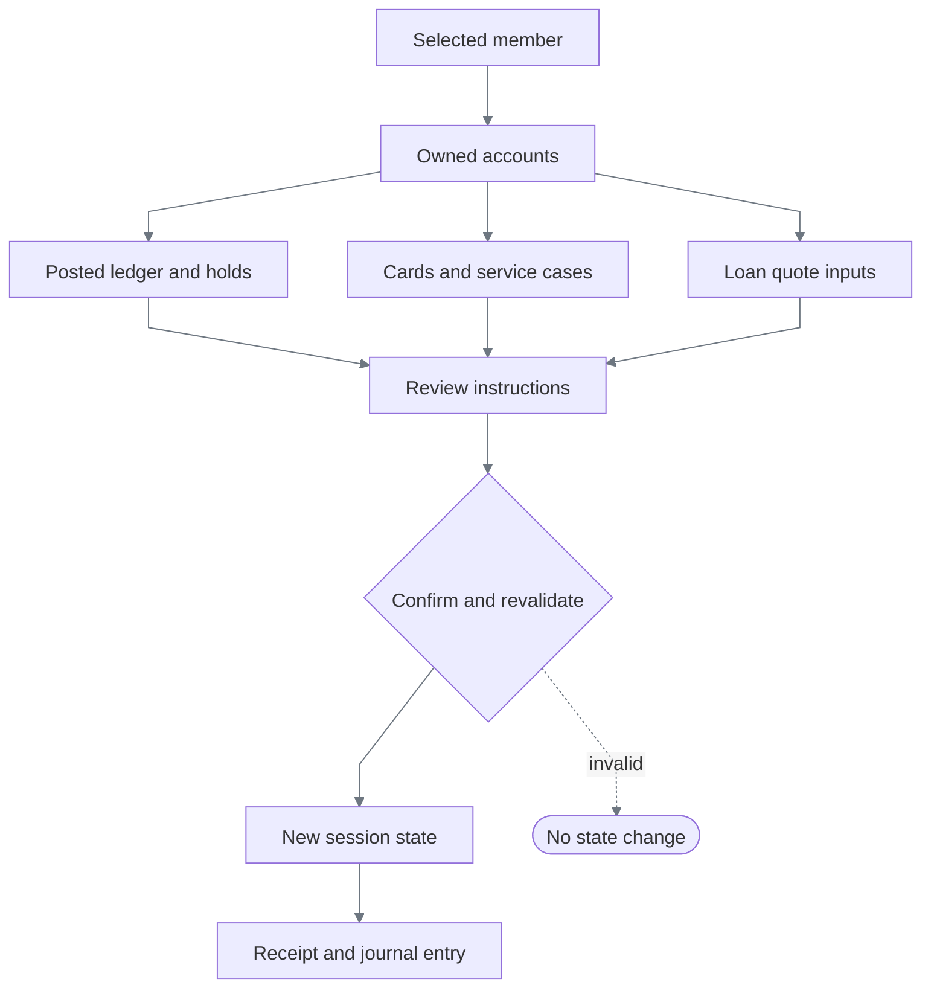

# Demo bank: Northstar servicing workstation

[Documentation index](README.md)

Northstar is a synthetic bank-staff application: a dense, dated workstation with connected member,
account, card, transaction, loan, and service-case records. It is a computer-use target, not a task
completion API. Every visible menu opens a working screen. The operator must select the right
record, interpret state, enter valid instructions, review changes, and verify the resulting receipt.

## Open the application

Start the demo using the [quickstart](../README.md#run-the-core-replay), then open:

| Entry | Purpose |
|---|---|
| `http://127.0.0.1:3001/` | Redirects to Harbor's servicing workstation |
| `http://127.0.0.1:3001/harbor/servicing` | Harbor Credit Union; navy/gray terminal |
| `http://127.0.0.1:3001/summit/servicing` | Summit Community Bank; green/beige terminal, different record order |

The application is designed for staff desktops, starting at **800 × 600 CSS pixels**. Smaller
windows scroll the document rather than silently shrinking text. Inside the workstation, use the
mouse wheel, scrollbar track/drag, or Page Up/Down to scroll records. Tab cycles visible controls
and brings partially visible controls into view; Enter activates them. F2 starts a new inquiry and
clears the selected member, without clearing the session ledger. Escape closes a selection list.
Click an input's label to focus it, or click its text to position the caret. Home/End, arrows,
Shift-selection, Backspace/Delete, and Ctrl/Cmd+A/C/X/V support editing and copy/cut/paste.
Dropdowns support pointer selection and arrow keys; clicking outside dismisses the list without
activating the underlying action.

Business date is fixed at **2026-09-13**. All names, balances, cards, and transactions are synthetic.
Each browser tab has independent in-memory state; reload resets that tab. No customer data is
saved to browser storage or sent to a banking service.

## Scope and working functions

| Function | Workflow | Rules and observable outcome |
|---|---|---|
| Member inquiry | Search ID, name, or city → inspect matches → open member | Partial matches can return several people; unknown queries return no records |
| Relationship summary | Verify member and branch → review notices → inspect accounts/cases | The selected member remains visible across task screens; notices must be acknowledged before servicing |
| Account inquiry | Open deposit account → compare ledger, available funds, and holds | Pending authorizations do not debit the posted ledger; active holds reduce availability |
| Transaction research | Select account → filter description/reference, dates, status → open detail | Filters operate on actual rows; similar merchant descriptions have distinct dates, amounts, and references |
| Internal transfer | Select debit/credit accounts → enter amount/purpose → review → confirm | Same-member deposits only; available-funds checks; paired debit/credit postings and a shared reference |
| Card maintenance | Select full card ID → inspect holder/account/status → reason → review lock/unlock → confirm | Only the selected card changes; expired and already-in-state cards reject the operation |
| Holds | Select account → amount/reason → review placement; or select an active hold → review release | Supervisor role required; no negative available funds; ledger remains unchanged |
| Loan servicing | Select loan → enter payoff date → calculate → review → issue quote | Deterministic interest calculation; a dated quote receipt, not loan settlement |
| Service cases | Select account/category → describe request → review → create → inspect → resolve | Cases move from Open to Resolved with a required resolution note; repeat resolution fails |
| Activity journal | Inspect committed operations and references | Successful changes and issued quotes appear once; failed or canceled reviews do not appear as posted operations |
| Workstation | Select training role → apply | Inquiry, servicing, and supervisor permissions exercise application denials; this is explicitly not authentication |

No disabled placeholder departments, simulated payment networks, fabricated API results, or
decorative actions are counted as functionality. Wires, external payments, account opening,
KYC/AML, production identity, statements, and a full general ledger are outside this demo.

## Connected state, not independent mock screens



The diagram describes the target's business operations. Its review screen is not a human approval
stage in ReplayForge discovery. An authorized automation run can operate the target's review and
confirmation controls under its own policy.

| Model | Identity / relationship | Invariant |
|---|---|---|
| `Member` | Member ID; six synthetic records | Similar names are not interchangeable; restricted members reject servicing changes |
| `Account` | Account ID → owning member; eighteen records | Product, status, opening balance, and loan terms belong to the account |
| `Posting` | Posting ID → account; paired transfer reference | Posted entries affect ledger; pending entries do not |
| `Hold` | Hold ID → deposit account | Active → Released, once; subtract from available funds, never ledger |
| `Card` | Full card ID → account → member | Last four digits alone are not globally unique |
| `ServiceCase` | Case ID → member and account | Open → Resolved, once, with explanatory text |
| `Receipt` / journal entry | Institution-prefixed operation reference | Created with the same successful state transition |
| Completed request | Request key → exact command fingerprint | Same confirmation returns its receipt; conflicting reuse is rejected |

The UI controller prepares a detached preview. Confirmation runs validation again against the
current revision and publishes the resulting state as one replacement. It does not reuse an old
preview's ledger changes. Reviews use **Proposed** titles; only the completed receipt reports a
successful operation. Cancel restores the entered instructions for correction. Navigation discards
the pending operation, and a new inquiry requires a new member selection. Exceptions leave
the original state untouched. This is atomicity within one tab, not a database transaction or
multi-user concurrency guarantee.

## Calculation and validation rules

These are explicit **training-product rules**, not claims about real bank products or regulation.

| Boundary | Rule |
|---|---|
| Currency | USD; arithmetic in integer cents |
| Amount entry | `$0.01`–`$1,000,000.00`; no commas, signs, scientific notation, or more than two decimal places |
| Ledger | Opening cents + sum of posted credits/debits |
| Available funds | Ledger − sum of active holds; the pending authorization is represented by its hold, not subtracted twice |
| Transfer | Distinct, open Checking/Savings accounts owned by the same unrestricted member; debit cannot exceed availability |
| Reason / summary | Trimmed text of 8–160 characters; no empty confirmation narratives |
| Payoff date | A real ISO calendar date, between the business date and 30 days later, inclusive |
| Payoff amount | Principal + opening accrued interest + additional simple ACT/365 interest |
| Interest rounding | `principal_cents × APR_basis_points × days / 3,650,000`, rounded half-up once to cents using integer arithmetic |
| Card status | Active ↔ Temporarily locked; Expired is not reversible through these controls |
| Permissions | Inquiry cannot issue changes/quotes; servicing can transfer, maintain cards/cases, and issue quotes; supervisor also manages holds |

For Alex Morgan's Checking account, the opening ledger is `$2,450.00`; posted activity brings it
to `$4,046.62`. A `$52.10` pending authorization hold leaves `$3,994.52` available. A `$125.50`
transfer to Savings leaves `$3,869.02` available and adds exactly `$125.50` to the destination.
For the `$7,800.00` loan at 7.25%, a September 20 quote adds `$10.85` to `$21.40` opening accrued
interest: total **$7,832.25**. Issuing the quote does not change principal.

Quote review explicitly distinguishes the inquiry reference from a financial posting: issuance
adds a journal entry and receipt but neither schedules a payment nor changes account balances.
The shared confirmation step remains. Generic "before posting" wording was rejected for this
operation because it incorrectly implied a financial instruction; actual mutations retain that
warning. A controller regression checks both the wording and unchanged accounts/postings.

## Tasks to try

Start each independent scenario with a fresh tab unless deliberately testing retained state.

| Task | Input and path | What to verify |
|---|---|---|
| Resolve an ambiguous customer search | Search `Morgan`; distinguish Alex `12345` from Alexandra `12346` and Morgan Lee `56789` | The header shows the intended member before account work |
| Investigate a merchant posting | Alex → Transaction research → `NORTHWIND`, Posted, start/end `2026-09-09` | Reference `POS-80420`, debit `$31.62`; September 8 is a different purchase |
| Transfer available funds | Alex → Internal transfers → Checking to Savings, `125.50`, meaningful purpose | Review changes nothing; confirmation creates balanced postings and one journal reference |
| Recover from insufficient funds | Attempt `4000.00` from Alex's Checking, then correct the amount | First attempt returns `insufficient_funds` without posting |
| Lock the intended card and restore it | Alex → Card maintenance → `12345-D1` / `0110` → reason → review/confirm; then explicitly unlock | Receipt binds the full card ID and status; another member's `0110` card is unchanged |
| Issue a payoff quote | Alex → Loan servicing → `2026-09-20` → calculate/review/confirm | Correct component amounts, total, and good-through date |
| Manage a service case | Alex → Service cases → create request → open its reference → enter resolution → review/confirm | The case changes to Resolved and cannot be resolved twice |
| Test permission handling | Workstation → Inquiry only → attempt a servicing operation | Typed application denial; no state change |
| Place and release a hold | Workstation → Branch supervisor → Alex → Holds → `20.00` and reason → review/confirm → release | Availability decreases then returns; ledger does not change |
| Encounter non-happy-path members | Jordan `23456` has a review notice; Taylor `34567` is restricted; Sam `45678` has frozen Savings | Acknowledgement, restriction, and frozen-account rules are different states, not generic crashes |

## Rendering and automation boundary

The screen is one canvas. A reusable renderer lays out fields, grids, navigation, receipts, and
dropdowns from typed view blocks; it derives pointer hit regions from the same layout used to draw
them. Those coordinates are normal application rendering, not persisted automation locators.
One off-screen, normally empty textarea transports keyboard and paste events to the focused canvas
field; it has no task label or stored field value. No task-specific DOM inputs, buttons,
links, hidden value attributes, or global state API are exposed. This intentionally models the
rendered-only constraint; it is not a claim of screen-reader accessibility.

Harbor and Summit share rules but vary palette and record order. Forms switch from two columns to
one at narrower desktop widths, tables wrap cells, and content scrolls independently of navigation.
Money and identities remain inspectable on detail/review screens rather than relying on truncated
list summaries. Data lives only in that tab's React state; bundled source is not a security boundary.

| Module | Responsibility |
|---|---|
| [bank.ts](../apps/demo-bank/lib/servicing/bank.ts) | Dataset, money/date rules, account ownership, permission checks, atomic commands, receipts |
| [workspace.ts](../apps/demo-bank/lib/servicing/workspace.ts) | Screen transitions, selected-record context, search/filter state, review/cancel/confirm |
| [renderer.ts](../apps/demo-bank/lib/servicing/renderer.ts) | Dated visual language, responsive layout, clipping, current-layout hit regions |
| [text.ts](../apps/demo-bank/lib/servicing/text.ts) | Cursor/selection editing, bounded insertion, Unicode code-point boundaries, measured text wrapping |
| [terminal.tsx](../apps/demo-bank/app/[tenant]/servicing/terminal.tsx) | Canvas lifecycle, input, focus, scrolling, resize and DPR |

## Decisions and accepted limits

| Choice | Alternative | Reason / accepted cost |
|---|---|---|
| One integrated workstation | Several independent showcase applications | Shared identity and balances make cross-screen mistakes observable |
| Dated, dense canvas UI | Clean semantic forms; cosmetic legacy styling over simple tasks | Exercises visual-only targeting and repeated controls; accessibility is intentionally limited |
| Pure domain functions separate from drawing | Business rules embedded in click handlers | Arithmetic and invariants can be tested independently of pixels |
| Integer money and fixed business date | Floating-point balances and wall-clock fixtures | Repeatable, auditable results; no claim of live accrual or market realism |
| Session-local synthetic ledger | Database-backed multi-user bank simulator | Functional workflows without new operational infrastructure; reload discards changes |
| Explicit training roles | Fake login or production authorization integration | Reproducible permission errors; role selection is not security |
| One deployed workstation | Preserve older showcase routes | Avoids several incompatible targets and makes every new discovery exercise the same realistic UI; retired routes return 404 |

## Verification and evidence status

Run the target's domain and controller tests:

```bash
npx --yes pnpm@10.15.1 --filter @replayforge/demo-bank test
```

After building the demo, run the real Chromium target tests:

```bash
PLAYWRIGHT_BROWSERS_PATH=/tmp/replayforge-playwright-browsers \
uv run pytest backend/tests/integration/test_servicing_workstation.py \
  backend/tests/integration/test_servicing_interactions.py -q
```

Two complementary browser suites use real pointer and keyboard events:

| Suite | Observation boundary | Coverage |
|---|---|---|
| `test_servicing_workstation.py` | Current screenshots and local OCR, with no drawing instrumentation | Independent visual checks of card, transfer, quote, case, and viewport workflows |
| `test_servicing_interactions.py` | Test-injected canvas drawing observation, including clipping/viewport visibility; no React state or private hit-map access | Broad functional regressions across both tenants: every servicing area, errors, editing, review/cancel, resizing, long text, scrollbars, and tab/reload isolation |

The drawing probe exists only in the browser tests; it is not shipped in the target and is never a
discovery/replay input. These suites verify the application, **not model-guided discovery**.
Domain/controller/editor tests additionally exercise the tenant/member/role matrix, every command's
duplicate-confirmation behavior, a 100-transfer conservation sequence, all 31 valid payoff dates,
amount/reason boundaries, and stale-review rejection.

### Defects corrected in the workflow audit

| Defect | Correction / regression boundary |
|---|---|
| An unsuccessful new search could leave the previous member selected | New inquiry clears member/account context and pending instructions |
| Cancel discarded the form needed for correction | Restore the reviewed form without publishing a business mutation |
| Review headings prematurely claimed completed operations | Distinct proposal titles; success wording belongs to receipts |
| Text entry only appended; cursor/delete/clipboard behavior was incomplete | Explicit caret and selection editing, real browser keyboard and clipboard tests |
| Release labels and long review text could be truncated | Measure action-column width and wrap values with the actual drawing font |
| A partially visible button could ignore clicks | Clip its active pointer region to its visible region; focus reveals clipped controls |
| The scrollbar looked interactive but did not accept dragging | Actual track/drag interaction, alongside wheel and keyboard scrolling |
| A valid request key could collide with an inherited object property | Own-property lookup, verified across repeated confirmations |

The supported verification surface is desktop Chromium. Passing these checks is bounded evidence,
not a claim of zero defects across every browser, input method, or future dataset.

The workstation entry point is `legacy_servicing`, with route `/servicing`. Root and tenant links
reach this sole UI; the old member-search, account-detail, visual-terminal, and visual-workbench
pages have been removed, along with their published artifacts and evidence. All three current
discoveries—transaction investigation, payoff quotation, and card locking—target this workstation.
See the [genuine evidence inventory](verification.md#scenario-matrix) and the
[model-free changed-input matrix](../backend/tests/integration/test_visual_portability.py).
No DOM targeting, stored coordinates, hand-authored discovery trace, human publication approval,
or relaxed safety budget is substituted.

OCR also misoriented one long colored denial message despite its readable rendering. The browser
permission check verifies the unchanged screen and empty journal before a successful authorized
quote; domain tests verify the exact denial code. This remains an automation-recognition concern,
not evidence that discovery already handles every message on the expanded screen.
