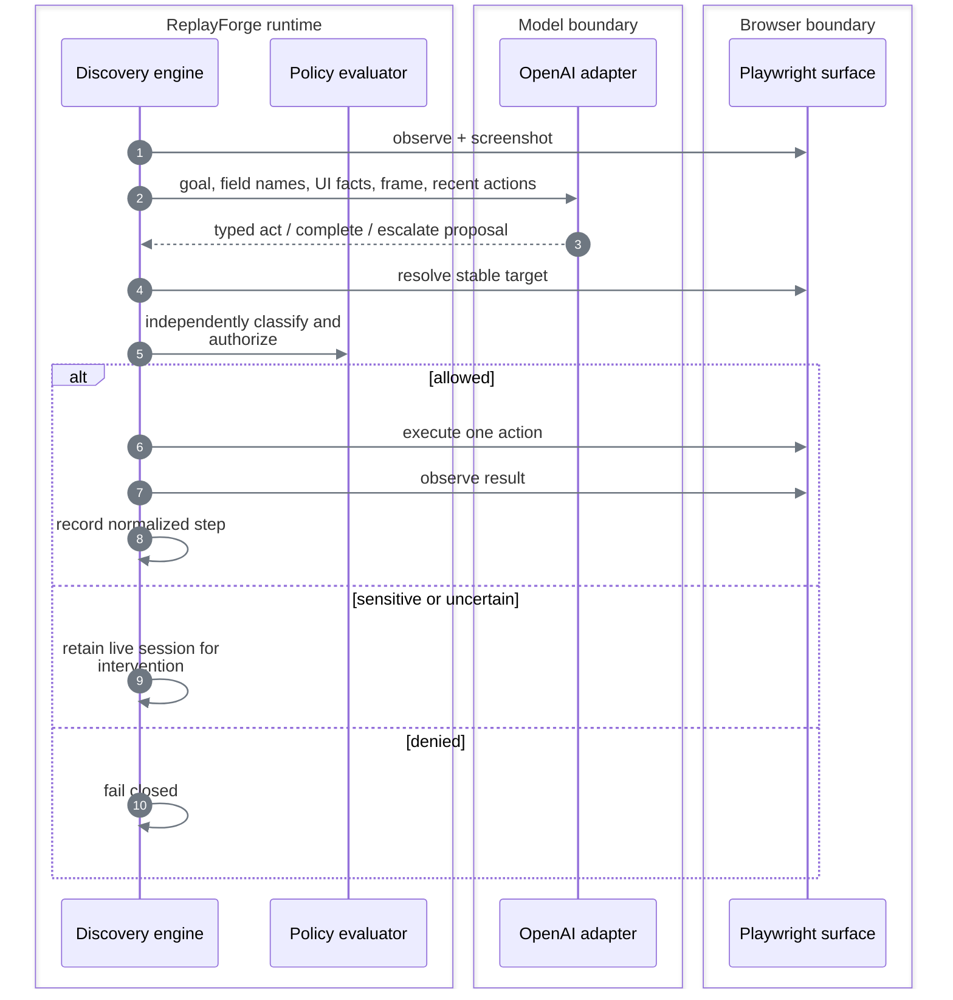

# Model-guided discovery

## Contract

Discovery accepts a goal, registered application family, tenant, symbolic entry point, invocation inputs, and step/time limits. It returns success with a published artifact, a typed failure, or an intervention request.

It is available only when all three conditions hold:

```text
OpenAI key configured
        ∩
local Langfuse credentials authenticate
        ∩
demo target responds
        = discovery ready
```

Replay needs none of these model dependencies.

## Observe → decide → act



### What the model receives

- Goal text.
- Input **field names**, not the supplied customer values in the text instruction.
- Required and already captured output fields.
- Current normalized route and viewport.
- Local OCR tokens with confidence and bounding boxes.
- Headings, labels, frame titles, actionable controls, and extractable field labels when present.
- Active-element summary and state fingerprint.
- A current PNG screenshot.
- At most 20 recent normalized actions.
- Allowed action types and maximum risk.

### What the model may return

The response is parsed into a strict discriminated union:

```text
act      → one typed action, locator bundle, rationale, expected effect, risk, confidence
complete → advisory claim that the goal is complete
escalate → reason code and bounded rationale
```

Raw chain-of-thought is not requested or persisted. Provider errors are reduced to bounded categories; their raw messages are not exposed in run results.

## Bounds

| Bound | Implementation |
|---|---|
| Steps | Request range `1..50`; default `20` |
| Wall time | Request range `10..600s`; default `120s` |
| Repeated state | Intervene after the configured repeated fingerprint limit |
| Repeated action | Intervene after the configured equivalent-proposal limit |
| Confidence | Intervene below `0.6` |
| Model calls | Maximum `12` per run |
| Provider timeout | `30s` per call |
| Output tokens | Maximum `600` per call |
| Screenshot | Maximum `1.5 MiB` |

The model policy is loaded from `config/model-policy.yaml`. API requests and environment variables cannot select a different model or enlarge these budgets.

## Completion is not trusted

```text
model says complete
       │
       ▼
compiler validates exact trace shape
       │
       ▼
runtime evaluates deterministic checkpoint
       │
       ▼
all five outputs validate
       │
       ▼
registry publishes next immutable patch
```

The compiler is intentionally specific to the savings-balance flow. It requires eight actions in the expected order, durable targets, read-only risk, and exactly the five declared extractions. A discovery-only icon region is converted to a content-addressed edge template before recording; any coordinate-only target that survives capture is rejected.

## Perception decision

| Option | Decision | Why |
|---|---|---|
| Full DOM sent to the model | Rejected | Large, noisy, can contain data, and overfits markup |
| Screenshot only with free-form clicks | Rejected | General, but produces opaque and brittle recordings |
| Accessibility/DOM facts only | Rejected as primary | Unavailable on canvas and remote rendered surfaces |
| Screenshot + local OCR + typed visual targets | **Chosen primary** | Pixel-grounded while remaining structured and replayable |
| Compact semantic facts | Chosen fallback | Useful when the target exposes trustworthy roles and labels |

On the canvas route, normalized DOM control lists are empty. The model receives the screenshot and OCR tokens, then proposes OCR targets or one transient icon region. `capture_locator` compiles that region into a hashed template before the successful step enters the trace. Replay later uses only OCR/template candidates and never calls the model.

## Provider decision

| Option | Decision | Why |
|---|---|---|
| Provider SDK types throughout the engine | Rejected | Would couple domain behavior and tests to one vendor |
| Multiple providers | Rejected | Breadth without improving the evaluated core |
| Provider-neutral port + one OpenAI adapter | **Chosen** | Real discovery evidence with replaceable domain boundaries |
| Remote observability service | Rejected | Would send operational telemetry outside the local environment |
| Local Langfuse | **Chosen** | Authenticated call metrics remain local; provider credentials never enter it |
