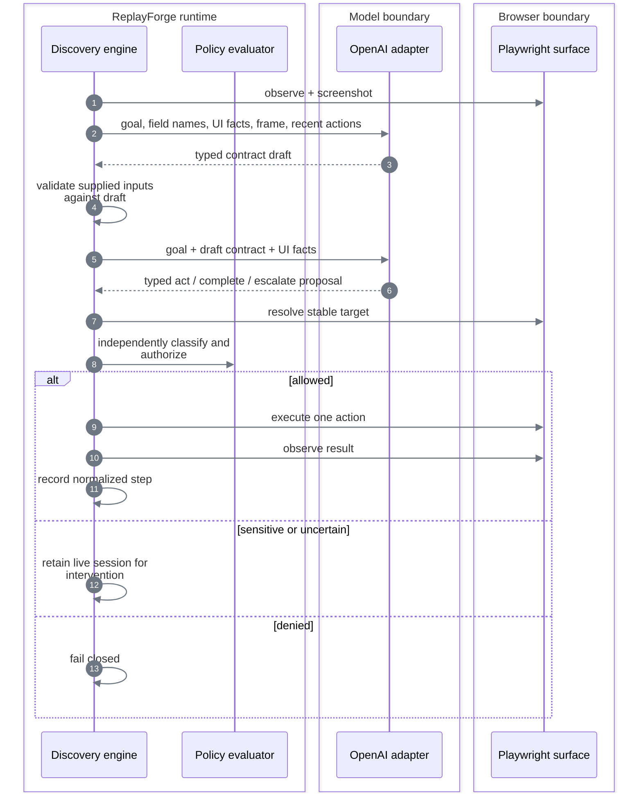

# Model-guided discovery

[Documentation index](README.md)

## Contract

Discovery accepts a goal, registered application family, tenant, symbolic entry point, invocation inputs, and step/time limits. A contract-planning pass first produces a typed `CapabilityDraftSpec`; the action loop then returns a validated draft, a typed failure, or an intervention request. The legacy one-shot endpoint publishes read-only drafts for compatibility; discovery suites keep drafts unpublished until finalization.

It is available only when all three conditions hold:

```text
OpenAI key configured
        ∩
local Langfuse credentials authenticate
        ∩
registered target responds
        = discovery ready
```

Replay still needs its registered target, but neither OpenAI nor Langfuse.

## Observe → decide → act



### What the model receives

- Goal text.
- Input **field names**, not the supplied customer values in the text instruction.
- Required and already captured output fields.
- Current normalized route and viewport.
- Local OCR tokens with confidence and bounding boxes.
- Headings, labels, frame titles, actionable controls, and extractable field labels when present.
- Active-element summary and state fingerprint.
- A current PNG screenshot.
- At most 20 recent normalized actions.
- Allowed action types and maximum risk.

### What the model may return

The response is parsed into a strict discriminated union:

```text
act      → one typed action, locator bundle, rationale, expected effect, risk, confidence
complete → advisory claim that the goal is complete
escalate → reason code and bounded rationale
```

Raw chain-of-thought is not requested or persisted. Provider errors are reduced to bounded categories; their raw messages are not exposed in run results.

Before the action loop, supplied values must satisfy the planned input contract; a mismatch returns
`discovery_input_invalid`. Every bound typing/selection action carries its input classification into
policy, including forbidden parent-object classifications. Missing bindings are rejected before
dispatch. Literal values matching supplied data—even nested values—cannot become recorded actions.
This uses the same value-contract and classification helpers as replay: a successful discovery must
not depend on inputs that its published capability would reject.

Assertions and waits may reference only outputs already captured and inputs actually available.
An unbound operand is a rejected proposal, not evidence of a failed UI state: the model can extract
the missing field and replan. Nested conditions receive the same check. Once both values are
bound, a failed comparison remains terminal; the engine never substitutes a model claim for it.

Keyboard proposals use the same closed key-name vocabulary as artifacts. Each action is one
chord (modifiers, then a supported navigation/function key or select-all shortcut), not a list of
successive keystrokes or arbitrary text. Domain validation rejects malformed chords before
dispatch; text entry must use a typed value binding. This replaces unrestricted key strings that
could reach the browser as unsupported commands.

## Bounds

The request and engine share domain-defined step and wall-time bounds. Repeated observations,
equivalent proposals, and low confidence trigger intervention. The
[model policy](../config/model-policy.yaml) caps calls, tokens, time, frame bytes, and cost;
requests cannot change the model or enlarge provider budgets. Contract planning consumes one call,
and the first exhausted request or provider budget stops discovery. Exact values and override
rules are in [Constraints and policy](constraints-and-policy.md#execution-bounds).

Repeated-action checks compare the action and locator, excluding confidence and explanatory
prose. Rewording the same failed click therefore cannot buy more retries. After an ambiguous
target, the model receives its rejected proposal in transient conversation history, explicitly
marked **not executed**, so it can choose a different locator or escalate. Raw surface diagnostics
are excluded; durable events retain only the bounded rejection code. This replaces generic retry
advice that could repeatedly suggest the same ambiguous relation on dense screens.

## Completion is not trusted

```text
model says complete
       │
       ▼
generic compiler validates draft against the recorded trace
       │
       ▼
runtime evaluates deterministic checkpoint
       │
       ▼
all planned outputs validate
       │
       ▼
suite finalization applies the risk publication gate
```

`TraceArtifactCompiler` is task-independent. It validates symbolic inputs, exactly-once output bindings, stable targets, observed routes, risk ceilings, and verified checkpoints without knowing a page name, output name, or action count. New traces emit schema `1.4`, whose non-empty route policy is matched to the registered application. Rendered-only registrations enforce geometry-free targets; legacy schemas `1.0`–`1.3` remain loadable unchanged. Scenario traces are held by a discovery suite and can contribute observed business outcomes or application failures before publication.

## Discovery suites

```text
primary goal
    │
    ▼
typed draft ──► successful trace ──► optional observed scenarios
                                      │
                                      ▼
                         deterministic validation
                         ├── read-only or reversible: publish
                         └── sensitive or irreversible: block
```

The suite endpoints are `/api/v1/discovery-suites`, `/scenarios`, `/validations`, and `/finalize`. Compatibility variants are only added after a deterministic replay proof. The model may describe an observed branch; it cannot publish an unseen branch from speculation.

Suite states are `collecting → validated → published`, with `failed` terminal. Read-only and
explicitly reversible work may publish after deterministic validation. Sensitive and irreversible
drafts fail closed; there is no reviewer or approval stage after discovery. A failed tenant replay
is retained as sanitized drift metadata and never changes `supported_variants`.

## Perception decision

| Option | Decision | Reason |
|---|---|---|
| Full DOM sent to the model | Rejected | Large, noisy, can contain data, and overfits markup |
| Screenshot only with free-form clicks | Rejected | General, but produces opaque and brittle recordings |
| Accessibility/DOM facts only | Rejected as primary | Unavailable on canvas and remote rendered surfaces |
| Screenshot + local OCR + typed visual targets | **Chosen primary** | Pixel-grounded while remaining structured and replayable |
| Compact semantic facts | Chosen fallback | Useful when the target exposes trustworthy roles and labels |

On the canvas route, application controls and values do not exist as DOM nodes. The model receives
the screenshot and OCR tokens, then proposes semantic candidates. Named repeated actions use a
unique OCR anchor plus target text; label/control and label/value relationships use a frame-local
layout graph. A transient icon region can create a content-addressed signature only when synthetic
asset capture is explicitly enabled; [runtime defaults prohibit new pixel retention](safety-and-handoff.md#data-exposure-boundaries).
Published schema `1.4` targets retain semantic identity, not coordinates or relative regions.
Replay re-resolves every action from a fresh frame and never calls the model.

The richer workstation's [capture specification](../config/servicing-discovery.yaml) describes a
loan-payoff discovery and model-free Summit validation. It is an executable capture recipe, not
a discovered capability or proof of success. Synthetic screenshot/member/loan data transmission
was explicitly authorized on 2026-09-14. Early genuine attempts exposed several boundaries:

| Attempt | Observed result | Follow-up |
|---|---|---|
| `run_433b2bd68bb84769a7a1d4df4e79f628` | Final equality check failed after extraction returned neighboring labels | Corrected field/value association; tested both tenants |
| `run_c5de13d213d24a65af06f71a0bbcf979` | Repeated ambiguous proposals exhausted the provider budget | Added rejected-locator context and intent-based repeat detection |
| `run_e3bc149bcb234864a0b6598056ca006d` | Primary discovery succeeded; Summit replay failed before opening the member | Reproduced a missed input rectangle being associated with a distant table cell |
| `run_d46aeb169b7e41edadfc83597f111afd` | Model escalated after ambiguous navigation | Made `below` column-aligned, symmetric with the row-aligned `right_of` relation |
| `run_fa3c4ff44a114da483b3b49e60463d86` | Quote issued, but the model asserted equality before any extraction | Added explicit unbound-condition rejection; independently checked production typing and date extraction |
| `run_4489ea9042714e39b9c39847a1ed8705` | Keyboard dispatch failed after entering the member query | Constrained key names and validated single-chord structure before dispatch |

None of these attempts yielded a published portable capability. Their local runtime records
are not relabeled as successful exported bundles.

## Provider decision

| Option | Decision | Reason |
|---|---|---|
| Provider SDK types throughout the engine | Rejected | Would couple domain behavior and tests to one vendor |
| Multiple providers | Rejected | Breadth without improving the evaluated core |
| Provider-neutral port + one OpenAI adapter | **Chosen** | Real discovery evidence with replaceable domain boundaries |
| Remote observability service | Rejected | Would send operational telemetry outside the local environment |
| Local Langfuse | **Chosen** | Authenticated call metrics remain local; provider credentials never enter it |

The selected model and reasoning profile are pinned in the [model policy](../config/model-policy.yaml),
not chosen by each request. This keeps discovery cost and behavior attributable to a versioned
configuration. The committed runs establish that the selected profile completed these workflows;
the repository does not contain a comparative model benchmark. A different model or reasoning
profile needs fresh validation before making a stronger quality or cost claim.
