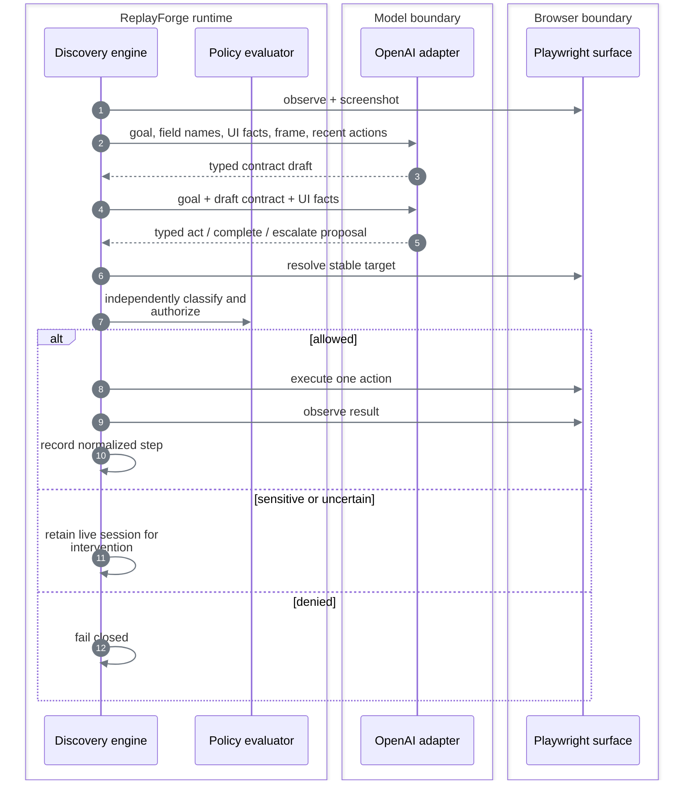

# Model-guided discovery

## Contract

Discovery accepts a goal, registered application family, tenant, symbolic entry point, invocation inputs, and step/time limits. A contract-planning pass first produces a typed `CapabilityDraftSpec`; the action loop then returns a validated draft, a typed failure, or an intervention request. The legacy one-shot endpoint publishes read-only drafts for compatibility; discovery suites keep drafts unpublished until finalization.

It is available only when all three conditions hold:

```text
OpenAI key configured
        ∩
local Langfuse credentials authenticate
        ∩
demo target responds
        = discovery ready
```

Replay needs none of these model dependencies.

## Observe → decide → act



### What the model receives

- Goal text.
- Input **field names**, not the supplied customer values in the text instruction.
- Required and already captured output fields.
- Current normalized route and viewport.
- Local OCR tokens with confidence and bounding boxes.
- Headings, labels, frame titles, actionable controls, and extractable field labels when present.
- Active-element summary and state fingerprint.
- A current PNG screenshot.
- At most 20 recent normalized actions.
- Allowed action types and maximum risk.

### What the model may return

The response is parsed into a strict discriminated union:

```text
act      → one typed action, locator bundle, rationale, expected effect, risk, confidence
complete → advisory claim that the goal is complete
escalate → reason code and bounded rationale
```

Raw chain-of-thought is not requested or persisted. Provider errors are reduced to bounded categories; their raw messages are not exposed in run results.

## Bounds

| Bound | Implementation |
|---|---|
| Steps | Request range `1..50`; default `20` |
| Wall time | Request range `10..600s`; default `120s` |
| Repeated state | Intervene after the configured repeated fingerprint limit |
| Repeated action | Intervene after the configured equivalent-proposal limit |
| Confidence | Intervene below `0.6` |
| Model calls | Maximum `20` per run |
| Provider timeout | `30s` per call |
| Output tokens | Maximum `1,200` per call |
| Screenshot | Maximum `1.5 MiB` |

The model policy is loaded from `config/model-policy.yaml`. API requests and environment variables cannot select a different model or enlarge these budgets.
The request and engine share one domain definition for step and wall-time bounds. These bounds are
layered: contract planning consumes one model call, and discovery stops at whichever request or
provider budget is exhausted first. See [Constraints and policy](constraints-and-policy.md).

## Completion is not trusted

```text
model says complete
       │
       ▼
generic compiler validates draft against the recorded trace
       │
       ▼
runtime evaluates deterministic checkpoint
       │
       ▼
all planned outputs validate
       │
       ▼
suite finalization applies the risk publication gate
```

`TraceArtifactCompiler` is task-independent. It validates symbolic inputs, exactly-once output bindings, stable targets, observed routes, risk ceilings, and verified checkpoints without knowing a page name, output name, or action count. New traces emit schema `1.4`, whose non-empty route policy is matched to the registered application. Rendered-only registrations enforce geometry-free targets; legacy schemas `1.0`–`1.3` remain loadable unchanged. Scenario traces are held by a discovery suite and can contribute observed business outcomes or application failures before publication.

## Discovery suites

```text
primary goal
    │
    ▼
typed draft ──► successful trace ──► optional observed scenarios
                                      │
                                      ▼
                         deterministic validation
                         ├── read-only or reversible: publish
                         └── sensitive or irreversible: block
```

The suite endpoints are `/api/v1/discovery-suites`, `/scenarios`, `/validations`, and `/finalize`. Compatibility variants are only added after a deterministic replay proof. The model may describe an observed branch; it cannot publish an unseen branch from speculation.

Suite states are `collecting → validated → published`, with `failed` terminal. Read-only and
explicitly reversible work may publish after deterministic validation. Sensitive and irreversible
drafts fail closed; there is no reviewer or approval stage after discovery. A failed tenant replay
is retained as sanitized drift metadata and never changes `supported_variants`.

## Perception decision

| Option | Decision | Why |
|---|---|---|
| Full DOM sent to the model | Rejected | Large, noisy, can contain data, and overfits markup |
| Screenshot only with free-form clicks | Rejected | General, but produces opaque and brittle recordings |
| Accessibility/DOM facts only | Rejected as primary | Unavailable on canvas and remote rendered surfaces |
| Screenshot + local OCR + typed visual targets | **Chosen primary** | Pixel-grounded while remaining structured and replayable |
| Compact semantic facts | Chosen fallback | Useful when the target exposes trustworthy roles and labels |

On the canvas route, application controls and values do not exist as DOM nodes. The model receives
the screenshot and OCR tokens, then proposes semantic candidates. Named repeated actions use a
unique OCR anchor plus target text; label/control and label/value relationships use a frame-local
layout graph. A transient icon region is permitted only to create a content-addressed signature.
Published schema `1.4` targets retain semantic identity, not coordinates or relative regions.
Replay re-resolves every action from a fresh frame and never calls the model.

## Provider decision

| Option | Decision | Why |
|---|---|---|
| Provider SDK types throughout the engine | Rejected | Would couple domain behavior and tests to one vendor |
| Multiple providers | Rejected | Breadth without improving the evaluated core |
| Provider-neutral port + one OpenAI adapter | **Chosen** | Real discovery evidence with replaceable domain boundaries |
| Remote observability service | Rejected | Would send operational telemetry outside the local environment |
| Local Langfuse | **Chosen** | Authenticated call metrics remain local; provider credentials never enter it |
