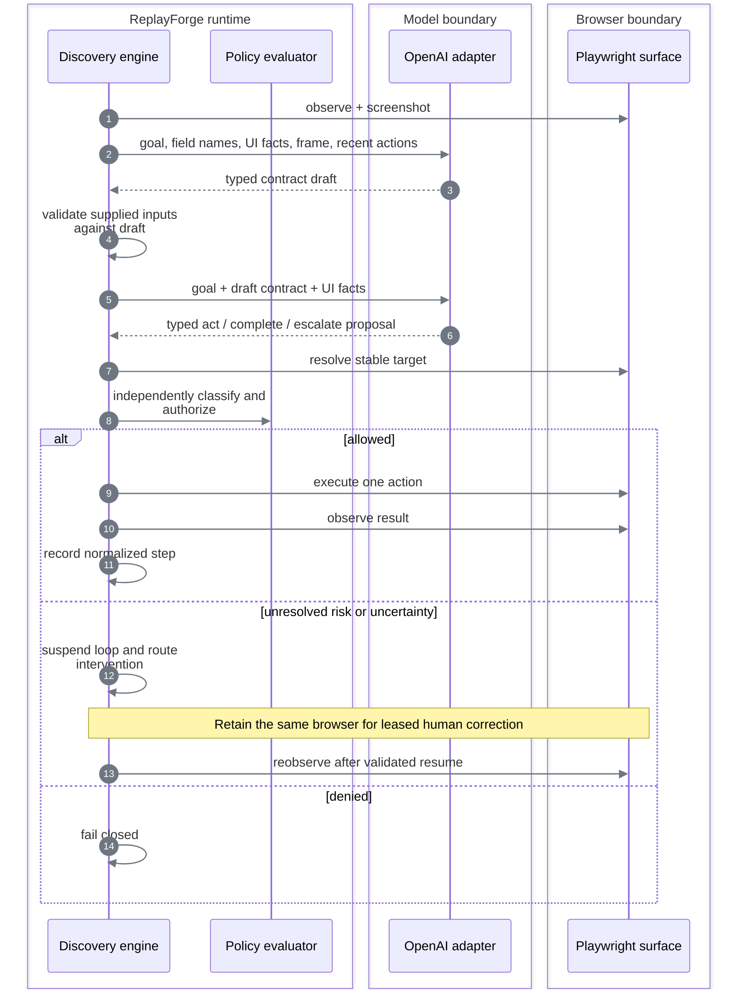

# Model-guided discovery

[Documentation index](README.md)

## Contract

Discovery accepts a goal, registered application family, tenant, symbolic entry point, invocation
inputs, and step/time limits. A contract-planning pass first produces a typed `CapabilityDraftSpec`;
the action loop returns a validated draft or a typed failure, pausing for human control when blocked.
Direct discovery returns an unpublished draft; only suites publish, after deterministic validation
and finalization. This prevents human-assisted traces from bypassing the replay gate. The
three-flow capture and [visual discovery launcher](live-viewing.md) use suites.

On a blocker, the engine suspends its loop with the same browser, verified recordings, model
instance, and remaining step/call budgets. The caller waits outside the browser owner thread,
leaving that worker free for leased operator input. Resume requires an accepted manual action,
a changed frame fingerprint, and an allowlisted location. Extracted outputs are invalidated and
must be read again. Human waiting does not consume the automation wall budget.

Manual operations are recorded as human audit events, not fabricated automation steps. A corrected
discovery can continue, but an essential unrecorded manual operation may make its fresh replay
fail; that draft remains unpublished. Termination and shutdown release the waiting caller and
close the retained browser. Budget exhaustion and forbidden actions still fail closed.

It is available only when all three conditions hold:

```text
OpenAI key configured
        ∩
local Langfuse credentials authenticate
        ∩
registered target responds
        = discovery ready
```

Replay still needs its registered target, but neither OpenAI nor Langfuse.

## Observe → decide → act



### What the model receives

- Goal text.
- Input **field names**, not the supplied customer values in the text instruction.
- Required and already captured output fields.
- Current normalized route and viewport.
- Local OCR tokens with confidence, bounding boxes, and exact-match symbolic input bindings.
- Headings, labels, frame titles, actionable controls, and extractable field labels when present.
- Active-element summary and state fingerprint.
- A current PNG screenshot.
- At most 20 recent normalized actions.
- OCR text from the screen before the last completed action, explicitly historical and transient.
- Allowed action types and maximum risk.

Symbolic annotations associate an already-visible OCR phrase with an input path without adding
unseen invocation values to the request. They are targeting hints, not identity or uniqueness
proof. Multiple occurrences remain ambiguous; embedded identifiers in composite labels are not
exact matches. Discovery can choose another observed record-selection affordance, but cannot
substitute a fixed row, literal customer identifier, or unverified default selection.

### What the model may return

The response is parsed into a strict discriminated union:

```text
act      → one typed action, locator bundle, rationale, expected effect, risk, confidence
complete → advisory claim that the goal is complete
escalate → reason code and bounded rationale
```

Raw chain-of-thought is not requested or persisted. Provider errors are reduced to bounded categories; their raw messages are not exposed in run results.

Before the action loop, supplied values must satisfy the planned input contract; a mismatch returns
`discovery_input_invalid`. Every bound typing/selection action carries its input classification into
policy, including forbidden parent-object classifications. Missing bindings are rejected before
dispatch. Literal values matching supplied data—even nested values—cannot become recorded actions.
This uses the same value-contract and classification helpers as replay: a successful discovery must
not depend on inputs that its published capability would reject.

Assertions and waits may reference only outputs already captured and inputs actually available.
An unbound operand is a rejected proposal, not evidence of a failed UI state: the model can extract
the missing field and replan. Nested conditions receive the same check. Once both values are
bound, a failed comparison remains terminal; the engine never substitutes a model claim for it.
Successful actions are explicitly marked completed in transient model history; successful
assertions are marked verified and retained. Extraction, assertion, and satisfied waits need not
change pixels, so they do not trigger the unchanged-screen guard. Repeated executable actions
and the step/call/time budgets still bound them.

Keyboard proposals use the same closed key-name vocabulary as artifacts. Each action is one
chord (modifiers, then a supported navigation/function key or select-all shortcut), not a list of
successive keystrokes or arbitrary text. Domain validation rejects malformed chords before
dispatch; text entry must use a typed value binding. This replaces unrestricted key strings that
could reach the browser as unsupported commands.

Extraction targets must identify a field, not its current value. After reading a candidate,
the engine rejects locators that contain the captured value and asks for a structural accessor;
the rejected extraction does not bind an output or enter the replay trace. Publication also
checks artifact content against captured personal, customer-identifier, and financial strings.
This closes the observed failure where a locator containing a payoff amount passed same-input
tenant validation but could not generalize to a different member. These are bounded literal
guards (strings of at least four characters), not semantic PII detection. Stable field labels and
operational status assertions remain supported; different-input replay is still necessary proof.

The publication guard walks the typed artifact, rather than treating serialized JSON as one
unstructured string. For captured values, contract property names and typed input/output
references use whole-symbol comparison: a status such as `Posted` is not the field identifier
`posted_date`. Literal copies of either complete symbol still fail. Descriptions, selectors,
examples, enum/constant values, and condition operands retain substring checks; metadata is not
exempt. Invocation values remain substring-checked even inside identifiers. Secret and
personal-data-shaped patterns still scan the entire artifact, including provenance. This fixes
schema-name collisions without changing output classifications or adding application-specific
exceptions; it does not detect arbitrary encodings of personal data.

Before that check, matching private values in input/output **schema descriptions** cause the
whole description to become `[REDACTED]`. These annotations do not drive execution. This is
redaction, not a metadata exemption: the resulting artifact is checked again and its content hash
is recomputed. Selectors, target descriptions used by policy, examples, constraints, and observed
conditions are never rewritten. Configured secrets are rejected before any description redaction.

Extraction proposals are instructed to describe the observed field label exactly, rather than
paraphrase the task or repeat its value. This avoids private data leaking into step metadata
without rewriting policy-relevant descriptions after execution or exempting common words from
the publication check. A prompt violation still fails closed.

A failed suite exposes a typed `privacy_rejection` with the source category and schema-only
location. Dictionary keys become `*`; rejected values and free-text failure messages stay out of
suite snapshots. Capture errors include the suite ID so the failed run remains identifiable.

A labeled extraction may record the observed `right_of` or `below` relation. With no direction,
competing horizontal and stacked layouts remain ambiguous. An explicit relation selects the
observed layout, but still requires one matching value group. This avoids guessing that the next
table-row label is a stacked value, without storing offsets, screen dimensions, or field-specific
rules. A genuinely model-driven transaction run exposed this ambiguity; the regression tests use
unrelated part identifiers at three scales, and the unchanged failed-run screenshot verifies the fix.

Named relative targets are resolved across all matching anchors and must identify exactly one
target. A repeated identity in a search field and a result row need not be ambiguous when only
the row has a related action. Multiple distinct related actions still fail closed; no nearest,
first-row, or pixel-offset fallback is used. Transient region locators, when used for opted-in
signature capture, still require one anchor; they cannot enter a published schema 1.4 artifact.
When repeated related text includes one visibly bounded control and plain status text, current-frame
segmentation may select that unique control. Multiple matching controls remain ambiguous; an
enclosing row alone does not establish which label is actionable.

Discovery and replay share one pure extraction-transform implementation. `trim` removes only
surrounding whitespace; only `decimal` removes dollar signs and grouping commas. `lowercase` uses
Unicode lowercase, not case-folding. Separate implementations were rejected after an exact-output
browser test exposed replay silently changing a value that discovery had preserved.

## Bounds

### Input-dependent targets

`input_text` binds an invocation string to an exact rendered identity, optionally anchoring a
named control in the same row or column. Both discovery and replay use the same transient resolver;
the recorded target retains only the symbolic input path. There is no selector interpolation,
coordinate offset, or bank-specific record lookup. Missing, undeclared, non-string, or forbidden
bindings stop before grounding. Known invocation literals in proposed targets are rejected before
execution, with feedback to use a symbolic binding. Structural UI labels still belong in discovered
artifacts; they are observed interface identity, not a hardcoded runtime procedure.

Unknown invocation data defaults to personal/redacted regardless of field name. A suffix such as
`_id` does not establish a privacy classification or justify retaining a weaker representation.

### Execution limits

The request and engine share domain-defined step and wall-time bounds. Repeated observations,
equivalent proposals, and low confidence pause a managed discovery for same-session human correction.
Without an intervention router, a blocked engine returns failure. Exhausted budgets stop rather
than reset through handoff. The [model policy](../config/model-policy.yaml) caps calls, output
tokens, time, frame bytes, and output-token cost;
requests cannot change the model or enlarge provider budgets. Contract planning consumes one call,
and the first exhausted request or provider budget stops discovery. Exact values and override
rules are in [Constraints and policy](constraints-and-policy.md#execution-bounds).

Repeated-action checks compare the action and locator, excluding confidence and explanatory
prose. Rewording the same failed click therefore cannot buy more retries. After an ambiguous
target, the model receives its rejected proposal in transient conversation history, explicitly
marked **not executed**, so it can choose a different locator or escalate. Raw surface diagnostics
are excluded; durable events retain only the bounded rejection code. This replaces generic retry
advice that could repeatedly suggest the same ambiguous relation on dense screens.

## Completion is not trusted

```text
model says complete
       │
       ▼
generic compiler validates draft against the recorded trace
       │
       ▼
runtime evaluates deterministic checkpoint
       │
       ▼
all planned outputs validate
       │
       ▼
suite finalization applies the risk publication gate
```

`TraceArtifactCompiler` is task-independent. It validates symbolic inputs, declared outputs, stable targets, observed routes, risk ceilings, and verified checkpoints without knowing a page name, output name, or action count. An output can be recaptured after a state change; the latest extraction supplies the returned value, while both observations and their checks remain in the trace. This supports identity checks before and after a mutation. `output_equals` compares an extracted state exactly; `identity_matches` compares an output with an invocation input. Neither model prose nor a visible label substitutes for these executed checks.

New traces emit schema `1.4`, whose non-empty route policy is matched to the registered application. Rendered-only registrations enforce geometry-free targets. Scenario traces are held by a discovery suite and can contribute observed business outcomes, application failures, or bounded recoveries before publication.

## Discovery suites

```text
primary goal
    │
    ▼
typed draft ──► successful trace ──► optional observed scenarios
                                      │
                                      ▼
                         deterministic validation
                         ├── read-only or reversible: publish
                         └── sensitive or irreversible: block
```

The suite endpoints are `/api/v1/discovery-suites`, `/scenarios`, `/validations`, and `/finalize`. Compatibility variants are only added after a deterministic replay proof. The model may describe an observed branch; it cannot publish an unseen branch from speculation.

`POST /api/v1/discovery-suites/from-published` extends an exact immutable capability version.
It first requires fresh successful replay with the supplied tenant and inputs. The suite reports
`primary_source: published_capability` and retains the original discovery run and evidence
references; it does not claim another model-driven primary run occurred. New scenarios still
require genuine discovery and the same complete replay/publication gates.

Scenario inputs remain private suite state and are replayed during tenant validation and final
publication. A negative scenario must return its exact declared disposition and code; a recovery
must both complete the task and emit its own `recovery_completed` event. Happy-path success alone
cannot validate either claim. Shared-prefix matching includes action, target scope/candidates/state,
and risk—not merely the fact that both recordings clicked something.

Scenario discovery reuses the primary input contract and exposes its recorded steps to the model.
`recorded_action` selects a prior action by ID; the normal live grounding and policy checks still
execute it. `branch` marks a positively observed exceptional state and becomes a verified assertion
in the trace. The compiler binds that marker to the matching executed prefix; it never infers a
branch from the last piece of text on a page. Normal task discovery cannot use these scenario-only
proposals.
Reused actions retain existing identity postconditions, including their composite semantics, and
the model's additional scenario assertion. Neither can silently replace the other.

Negative scenarios stop at the marker without fabricating happy-path outputs. Optional extraction
is available for identity checks. Recovery scenarios mark the blocker first, execute a bounded
correction, and assert a distinct restored state. They rejoin at the next primary step, cannot skip
the remaining program, and must pass a fresh complete replay that actually uses the recovery.
The [exception coverage matrix](exception-coverage.md) separates configured cases, automated
regression checks, and genuine discovery/replay evidence.

| Choice | Alternative | Reason |
|---|---|---|
| Explicit, executed branch assertion | Infer a detector from the final screen | Preserve the exact branch boundary and reject speculation |
| Model-selected reuse of discovered actions | Hand-written per-task scenario recipes | Keep application navigation in learned artifacts, with fresh grounding on every action |
| Optional scenario outputs | Invent a balance, receipt, or status value to finish discovery | A legitimate negative result need not contain successful-task outputs |
| Check recovery triggers after the action | Wait for a later target failure | The exceptional state matters even when the primary action lacks a postcondition |

Suite states are `collecting → validated → published`, with `failed` terminal. Read-only and
explicitly reversible work may publish after deterministic validation. Sensitive and irreversible
drafts fail closed; there is no reviewer or approval stage after discovery. A failed tenant replay
is retained as sanitized drift metadata and never changes `supported_variants`.

## Perception decision

| Option | Decision | Reason |
|---|---|---|
| Full DOM sent to the model | Rejected | Large, noisy, can contain data, and overfits markup |
| Screenshot only with free-form clicks | Rejected | General, but produces opaque and brittle recordings |
| Accessibility/DOM facts only | Rejected as primary | Unavailable on canvas and remote rendered surfaces |
| Screenshot + local OCR + typed visual targets | **Chosen primary** | Pixel-grounded while remaining structured and replayable |
| Compact semantic facts | Chosen fallback | Useful when the target exposes trustworthy roles and labels |

On the canvas route, application controls and values do not exist as DOM nodes. The model receives
the screenshot and OCR tokens, then proposes semantic candidates. Named repeated actions use a
unique OCR anchor plus target text; label/control and label/value relationships use a frame-local
layout graph. A transient icon region can create a content-addressed signature only when synthetic
asset capture is explicitly enabled; [runtime defaults prohibit new pixel retention](safety-and-handoff.md#data-exposure-boundaries).
Published schema `1.4` targets retain semantic identity, not coordinates or relative regions.
Replay re-resolves every action from a fresh frame and never calls the model.

The [goal-only specification](../config/servicing-discovery.yaml) requests three different outcomes
on the same workstation. The [evidence inventory](verification.md#scenario-matrix) identifies
the actual model runs; a specification or scripted browser test is not discovery evidence.

Real failures drove generic fixes: field/value association rejects neighboring labels; relation
matching rejects ambiguous actions; symbolic input targets prevent copied record IDs; unbound
conditions reject assertions before extraction; supplied form values cannot be replaced by defaults;
and publication rejects private literals, including captured outputs. None is a bank-specific recipe.

The transaction run `run_098f82d1d9a249a5a05860fbbd862dcf` on `699442c` completed after fixing
contradictory output-constraint defaults and repeated-anchor resolution. Its published artifact
passed both tenant validations. Earlier failed attempts remain private audit records, not deliverable
success bundles.

A card-lock confirmation exposed missing observation context: the current screen no longer
showed the inverse operation previously visible on the preceding screen. Discovery now sends
the OCR text from the screen before the last completed action, alongside the current screenshot.
This single-screen historical context is transient and is not persisted in events or artifacts.
It may explain an observed affordance but cannot establish a current target or override policy.
This was chosen over a task-specific risk exception, unbounded screenshot history, or blind retries.

## Provider decision

Output requirements omit absent `const`, `enum`, and `format` constraints. Sending the internal
defaults `const: null` and `enum: []` incorrectly suggests a null-only value and no permitted
values for a required string. Only actual constraints are sent; the model and replay validator
therefore receive the same contract semantics. Structured output formatting alone does not
guarantee semantic correctness ([OpenAI guidance](https://developers.openai.com/api/docs/guides/structured-outputs)).

| Option | Decision | Reason |
|---|---|---|
| Provider SDK types throughout the engine | Rejected | Would couple domain behavior and tests to one vendor |
| Multiple providers | Rejected | Breadth without improving the evaluated core |
| Provider-neutral port + one OpenAI adapter | **Chosen** | Real discovery evidence with replaceable domain boundaries |
| Remote observability service | Rejected | Would send operational telemetry outside the local environment |
| Local Langfuse | **Chosen** | Authenticated call metrics remain local; provider credentials never enter it |

Requiring local metrics readiness makes model-call accounting part of discovery admission, rather
than silently dropping it when observability is unavailable. The accepted cost is another local
stack and a discovery dependency; replay remains independent of both provider and metrics services.

The selected model and reasoning profile are pinned in the [model policy](../config/model-policy.yaml),
not chosen by each request. This keeps discovery cost and behavior attributable to a versioned
configuration. The committed runs demonstrate successful discovery with this profile. Model choice
is evaluated through task completion, contract validity, and replay results; changing the profile
requires fresh validation. This establishes workload-specific evidence rather than a model ranking.
