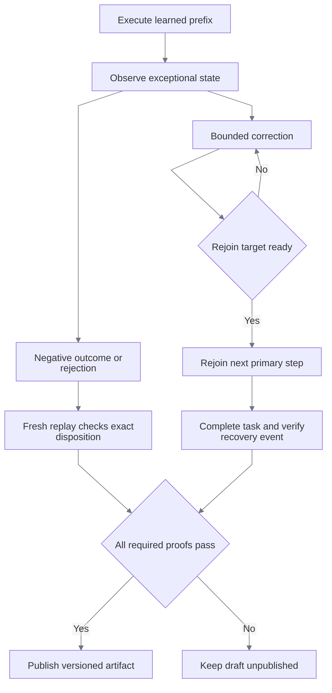

# Negative outcomes and recovery

[Documentation index](README.md) · [Discovery contract](discovery.md)

A successful task does not prove its exception paths. Each learned branch must be observed in
the real application and then exercised by a fresh, model-free replay before publication.
The [capture specification](../config/servicing-discovery.yaml) supplies goals and synthetic
inputs—not navigation steps, coordinates, detectors, or expected output values.

## Four dispositions, four contracts

| Disposition | Meaning | Required proof | Forbidden shortcut |
|---|---|---|---|
| Business outcome | The request is understood, but its legitimate result is negative | Positive visible detector; exact outcome code on fresh replay | Treat an absent target as proof that the record does not exist |
| Application failure | The application rejects the request or denies servicing | Positive rejection detector; exact failure code on fresh replay | Correct caller inputs or bypass permissions to obtain success |
| Recovery | A known, bounded UI interruption can be corrected safely | Observed blocker, executed correction, distinct restored state, complete replay and matching `recovery_completed` event | Count happy-path success as evidence that recovery executed |
| Uncertain execution | Identity, effect, policy, or grounding cannot be established | Typed failure or same-session intervention with evidence | Guess a record, retry an uncertain mutation, or invent outputs |



## Three-task coverage matrix

Payoff's five cases now have [genuine discovery and two-tenant replay proof](verification.md#scenario-matrix)
and are published in version `1.0.2`. The transaction and card exception cases remain unproven.
The same verification matrix distinguishes original discoveries from model-free replay evidence.

| Task | Scenario | Required disposition | Invariants |
|---|---|---|---|
| Transaction investigation | Member does not exist | `business_outcome:member_not_found` | No substitute member or fabricated transaction |
| Transaction investigation | Reference exists in another account, not the requested one | `business_outcome:transaction_not_found` | Select the supplied account; retain reference filter; the default account must not yield a false success |
| Loan payoff | Member does not exist | `business_outcome:member_not_found` | No quote or fabricated receipt |
| Loan payoff | Date outside quote window | `business_outcome:quote_date_unavailable` | Do not move the requested date into the allowed window |
| Loan payoff | Invalid calendar date | `failure:invalid_payoff_date` | Preserve supplied date; no quote issuance |
| Loan payoff | Restricted member | `failure:member_restricted` | No role change or restriction bypass |
| Loan payoff | Non-restrictive review notice | Recovery: `acknowledge_member_notice` | Confirm member, acknowledge only the notice, retain date; replay issues and verifies quote |
| Temporary card lock | Member does not exist | `business_outcome:member_not_found` | No alternative member or card |
| Temporary card lock | Selected card already locked | `business_outcome:card_already_locked` | Verify card identity; no unlock, duplicate lock, or invented receipt |
| Temporary card lock | Selected card expired | `business_outcome:card_expired` | Verify card identity; no substitution or state change |
| Temporary card lock | Rejected maintenance reason | `failure:invalid_maintenance_reason` | Do not rewrite caller reason or apply lock |
| Temporary card lock | Restricted member | `failure:member_restricted` | No privilege change or card mutation |
| Temporary card lock | Non-restrictive review notice | Recovery: `acknowledge_member_notice` | Retain card and reason; recovery does not itself apply the lock |

## Cross-cutting failure analysis

| Boundary | Failure modes | Required behavior and test evidence |
|---|---|---|
| Input contract | Missing field, wrong type, unknown binding, invalid shape | Reject before dispatch; [discovery tests](../backend/tests/unit/discovery/test_engine.py) and [replay tests](../backend/tests/unit/replay/test_engine.py) |
| Identity | Wrong member/account/card; stale output; mismatched final identity | Preserve learned identity assertions, including nested conditions; re-extract after mutation; [scenario tests](../backend/tests/unit/discovery/test_scenarios.py) and [artifact checks](../backend/tests/integration/test_demo_artifact.py) |
| Visual grounding | Duplicate labels, repeated identities, reflow, stale frame, absent control | Resolve uniquely from current pixels or fail; never use row ordinal; [vision tests](../backend/tests/unit/surfaces/test_vision.py) |
| Application rules | Role denial, member restriction, frozen account, invalid date, ineligible card | Keep rules distinct; [real UI tests](../backend/tests/integration/test_servicing_interactions.py) verify these states, but do not constitute model-discovered branch evidence |
| Recovery | Trigger absent, failed correction, exhausted budget, risk increase, later human resume | Preserve original failure or stop with typed recovery failure; carry use counts across resume; [replay recovery tests](../backend/tests/unit/replay/test_engine.py) |
| Publication | False detector, mismatched prefix, skipped primary steps, happy-only validation | Reject merge/publication; [suite tests](../backend/tests/unit/runs/test_discovery_suite.py) |
| Effect uncertainty | Timeout or lost observation around a mutation | Do not infer that the action did not occur; bounded handoff/failure rules remain authoritative; [safety contract](safety-and-handoff.md) |
| Privacy | Input/output literals leaking into traces, screenshots, or reports | Parameterized artifacts and bounded sanitized evidence; [privacy contract](discovery.md#what-the-model-may-return) |

Invalid input can be rejected by the typed contract *before* the application is reached. That is
valid input protection, but not proof of an application-observed rejection branch. Likewise, a
missing card locator does not prove an exhaustive “card not found” result. No eligible loan and
permission-denied discovery need reproducible application states before genuine evidence can
be claimed; they are not fabricated by changing replay results.

## Decisions that keep this general

| Choice | Alternative considered | Reason |
|---|---|---|
| Model-selected actions from the observed primary trace | Handwritten bank-specific exception scripts | Navigation stays in discovered artifacts; each action is grounded and authorized again |
| Phase-specific scenario proposal schema | Expose every action type before divergence | Only recorded actions, a branch marker, or escalation can extend a mergeable prefix; recovery permits newly discovered corrections |
| Explicit unexecuted recovery boundary | Ask vaguely to restore the workflow | The model sees the next primary action but cannot invoke reference actions during correction; fields not yet entered are not restoration work |
| Verify rejoin readiness during discovery | Accept an acknowledgement message as restoration | The exact next target/preconditions must resolve; otherwise the model gets bounded corrective feedback. Informational warning text may legitimately remain after acknowledgement |
| Restoration asserted in the corrective trace | Reuse the checkpoint's generic route or original blocker | A marker without correction cannot be recovery; unrelated checkpoint boilerplate cannot supply missing restored-state evidence |
| Explicit positive branch marker | Infer a branch from the last visible text | Preserve the actual divergence point and reject speculation |
| Optional negative-trace outputs | Require normal success outputs on every path | A rejected request has no legitimate success receipt to extract |
| Exact replay disposition and recovery-event gate | Accept any successful validation run | Prevent unexecuted or misclassified branches from passing publication |
| End terminal traces at the verified model-selected marker | Ask the model for another action after a terminal result | Prevent duplicate branch proposals or mutation after rejection; compilation, privacy, checkpoint, and fresh-replay gates still apply |
| Retain composite identity guards and new assertions | Replace all postconditions for scenario convenience | Exception discovery must not weaken record selection checks |
| Current-frame bounded-control disambiguation | Fixed offsets or first matching label | Distinguish an action from repeated status text while retaining ambiguity when multiple controls match |
| Bounded OCR inference pool | Raise grounding deadlines or reduce screenshot fidelity | Default two intra-operation threads, one inter-operation thread; serialized inference retains current recognition and timing bounds |

## Reproduce

With the local workstation, runtime, model credentials, and Langfuse ready:

```bash
PLAYWRIGHT_BROWSERS_PATH=/tmp/replayforge-playwright-browsers \
  .venv/bin/python scripts/capture_demo_workflows.py \
  --spec config/servicing-discovery.yaml \
  --workflow transaction_investigation --timeout-seconds 600
```

Run `servicing_loan_payoff_quote` and `temporary_card_lock` separately to keep browser/model
resource use bounded. Capture stops on an unsuccessful discovery or validation. Each successful
scenario artifact and its finalized run-manifest reference are saved immediately with owner-only
permissions, even if a later case fails. The reference is separate because the artifact's
provenance manifest can precede the terminal result.
The primary artifact is saved only after publication. Private capture files are not submission
evidence: export and verify sanitized bundles using the
[evidence workflow](verification.md), including actual run IDs and the recording commit.

To extend a committed example without rediscovering its successful path, add
`--primary-version 1.0.1`. The exact version must first pass fresh replay. Its original discovery
provenance remains intact; only the new scenario runs are new discovery evidence.
For staged evidence work, `--collect-only` saves the verified scenario traces without publication
and reports `collected`, never `published`. Then run the model-free restoration/validation tool.
Normal capture still validates and publishes automatically; no human approval gate is added.
To collect remaining cases without repeating preserved discoveries, `--scenario CODE` may be
repeated with `--collect-only --primary-version VERSION`. Partial selection cannot publish;
the restoration tool still requires the complete configured scenario set.

The model-free replay capture tool accepts `expected_status: business_outcome` with an exact
`expected_code`. A recovery case uses `expected_status: success` and `expected_recovery`;
the named recovery must appear in an actual `recovery_completed` journal event. Contradictory
expectations are rejected before browser execution; mismatched results are not exported.

Recovery renews its automation lease between corrective actions and passes the newest lease
version back to the primary loop. Matching multiple outcomes, failures, or recoveries within one
category is `branch_ambiguous`, not permission to choose the first declaration. Existing failure
precedence over outcomes remains unchanged.
Replay verifies same-step identity guards before returning a negative disposition or starting
recovery. A matching status label cannot excuse a mismatched selected record. Composite identity
guards retain their original boolean semantics.
Suite proof also checks isolation: primary and terminal cases must not execute a recovery;
a recovery case must complete exactly its named correction once. Success with an unrelated,
repeated, or spuriously triggered recovery does not pass publication.
The restoration validator honors the order of its `--scenario` arguments so a previously failing
case can be checked first. It still requires every configured scenario and tenant before publication.

Discovery also renews between model inference, grounding, execution, and condition checks.
Each renewal checks the same owner and exact lease version. A single stage that outlasts the
lease still fails closed with `control_lease_expired`; ownership changes produce
`control_lease_conflict`. There is no background renewal that could keep a hung run alive.

The resource choice was measured on one identical 76-token frame: one OCR inference thread took
7.0–7.6 seconds; two took 5.2–5.3 seconds with identical recognized text and boxes. This is a local
measurement, not a cross-hardware guarantee. `ocr.inference_threads` in the shared vision policy
is bounded to 1–4; the default is 2. Screenshot resolution, confidence thresholds, and the
10-second grounding deadline were not relaxed.

After a runtime restart, `scripts/validate_scenario_evidence.py` can restore a suite from an exact
published primary and verified local scenario bundles. It checks original run identity, successful
model-driven completion, and the explicit branch event's assertion boundary. No branch is inferred
from filenames or invented navigation. No model is configured; every tenant/scenario validation
and finalization gate runs again. Local evidence is integrity-checked, not externally attested.
