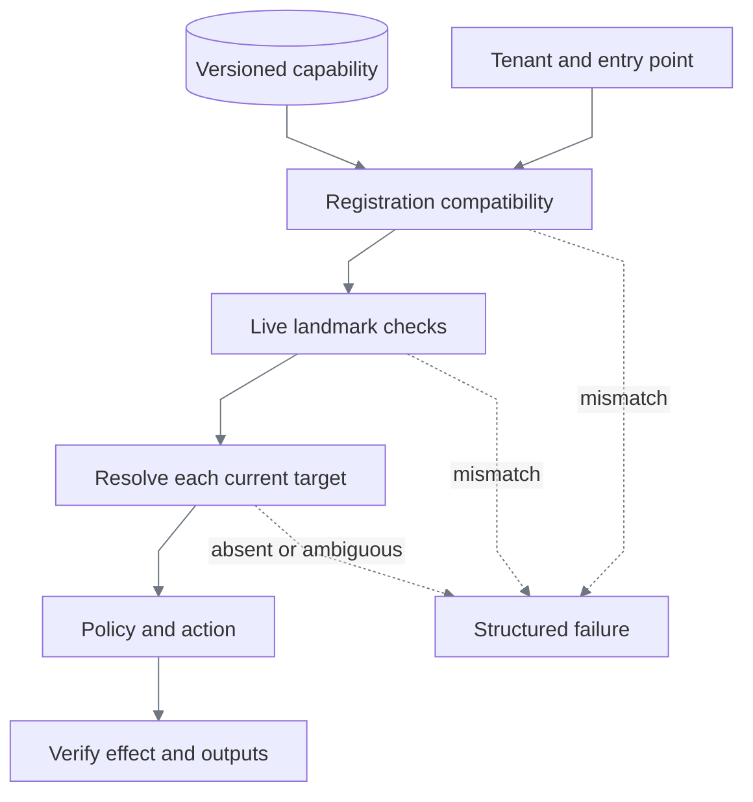

# Heterogeneity and compatibility

Reuse follows a vendor application's task contract. A tenant name selects a registered instance;
it does not select a different program. Discovery-suite validation executes the same draft on each
requested tenant and records support only after success.

## What is enforced

| Boundary | Check | Why |
|---|---|---|
| Before launch | Tenant supported by artifact; application, tenant, and navigation entry points registered | Unknown instances cannot inherit execution authority |
| Before launch | Surface kind and adapter contract match | A browser capability cannot silently run under different adapter semantics |
| Schema 1.4 before launch | Base variant and rendered-surface mode match registration | Discovery's perception assumptions remain explicit |
| Entry surface | Registered required landmarks present; registered forbidden landmarks absent | Detect an incompatible version, maintenance screen, or wrong entry state before input |
| Every step | Unique current target, policy, declared effect | Detect runtime faults and local incompatibility where they occur |
| Completion | Business checkpoint and typed outputs | A compatible-looking screen alone cannot prove success |

Older schema 1.0–1.3 artifacts predate registered base-variant/rendered-mode semantics. Their
immutable bytes and hashes are preserved; they receive surface-contract and registered readiness checks,
but registration does not reinterpret their historical base labels. This is an explicit compatibility
rule, not a silent artifact migration.

The artifact's descriptive fingerprint can include tenant branding: Harbor's discovered heading
is not Summit's heading. It is not silently promoted to a universal readiness condition. Application
registration explicitly declares the shared landmarks to enforce; the workbench uses `Member Search`
and forbids `System maintenance`. Artifact preconditions and per-step conditions remain executable.

The provenance `target_fingerprint` identifies the discovered observation. It is not an application
version or a runtime equality gate: customer values, tenant branding, and viewport changes alter
frames legitimately. Landmark checks detect declared incompatibility; they cannot identify every
vendor release or prove that unseen screens are unchanged.

## Version changes and specialization

The current registry holds one origin per application family, multiple tenant identifiers, symbolic
entry points, and application-wide route aliases/policy. Harbor and Summit share one contract and
need no overlays. Independent tenant origins and an overlay repository are future design.

For a vendor upgrade, run deterministic validation against the new instance before adding support.
If only presentation changes, current-frame grounding may reuse the identical artifact. If the
business sequence or output meaning changes, discover and publish a new immutable capability
version. Never patch the old version or automatically widen its policy.

A future specialization record should bind `(base artifact hash, tenant, vendor version)` to
explicit entry-point, locator, or bounded timing substitutions. Resolve it into a validated immutable
artifact and record the resulting hash in evidence. Output meaning, step order, risk, and allowlists
remain governed by the base contract; semantic changes require a new capability. Fail validation
if an override's base hash has changed. Fleet rollout and vendor-version detection are unimplemented.

| Alternative | Decision and reason |
|---|---|
| One copy per tenant | Avoid: obscures shared behavior and creates independent maintenance drift |
| Unrestricted patches | Avoid: can change business meaning or expand authority without discovery |
| Shared artifact plus measured tenant validation | Implemented: smallest model that proves actual reuse |
| Compare screenshot hashes at startup | Avoid: rejects harmless changes in layout, values, or branding |
| Contract and semantic landmark checks | Implemented: stable checks with explicit failure reasons |
| Build fleet infrastructure now | Defer: the PDF asks for credible design; this slice needs executable reuse proof |

## Surface extension

`SurfaceSession` owns observation, target resolution, action dispatch, condition evaluation,
extraction, sanitized evidence, and closure. The replay interpreter owns order, policy, recovery,
and results. No browser handle crosses that boundary.

Legacy web uses the existing browser transport with rendered targets or explicitly scoped semantic
locators. Native desktop needs an OS adapter for window identity, capture, input, focus, and session
ownership, plus a desktop policy model. PNG-based OCR and signature grounding are reusable; web
origins, routes, frame scopes, and keyboard behavior require deliberate mapping. The registry rejects
desktop contracts today. Adding a label to configuration does not implement desktop support.
