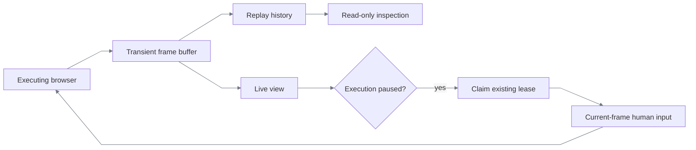

# Live execution viewing

[Documentation index](README.md)

Open **http://127.0.0.1:3000**. Choose **Replay saved task** or **Discover new task**, enter
parameters or apply an explicit synthetic preset, then select **Run and watch**. The browser
can remain headless; its actual screenshots appear in the console on your machine.

| Mode | Execution | Viewing | Human control |
|---|---|---|---|
| Replay | A pinned published capability; no model calls | Live plus Back / Next / Live inspection | Claim a paused session, act on its current frame, resume |
| Discovery | Model exploration, deterministic tenant validation, automatic publication | Latest actual screen and phase-labelled timeline | Correct a blocked discovery in the same session, then resume; no publication approval |

Replay fields come from the capability input contract. Discovery accepts a goal and named JSON
inputs. Presets are explicit configuration in `REPLAYFORGE_VIEWER_PRESETS_FILE`, not navigation
recipes or recovered customer inputs. New applications use the same launch and viewing code.
Validation actually executes the discovered task again in fresh sessions; select only tenants
where those operations are authorized. Opening the page itself never starts a model call.
Validation replays are unattended: an intervention boundary fails validation without
creating an operator session or publishing the draft.

Human controls appear only for a live intervention, not for every failed run. Ordinary replay
locator/time-out failures currently terminate after their permitted handling; the viewer can show
their last retained frame, but cannot reopen the closed browser. See the
[routing limit](requirements.md#remaining-concerns).

## Watching is not controlling



Back and Next select an earlier available screenshot. They do **not** navigate the application,
undo a transaction, replay an action, or pause automation. The historical screen remains selected
as execution progresses. Return **Live** to inspect or operate the current paused session.
History frames have no control credentials or input sequence; only the existing intervention
endpoint supplies a current, owner-bound input frame.

The viewer updates at screenshot/observation boundaries, not as continuous video. Its timestamp
shows how old the screen is while OCR, an application operation, or a model call is in progress.
The timeline shows sanitized execution events, not hidden model reasoning. A failed connection
does not restart a run. Refresh reconnects using only a per-tab execution ID and viewer token.

## Execution and run identity

An `exe_` identity groups one user launch. Replay contains one `run_`; discovery may contain a
primary discovery run and several model-free validation runs. Frames and events carry their
actual run ID and phase. Publication is automatic only after successful validation; a validation
failure is displayed as failure, not a fabricated published capability.
Additional tenants validate once each; finalization owns the primary-tenant replay immediately
before publication. The console labels that phase `final-validation:<tenant>`.

```text
POST launch → execution ID + viewer credential → background execution
                                                ├─ owning browser thread → PNG buffer
                                                └─ redacted journal → timeline
GET status / frame ← read-only console polling ←───────────────┘
```

HTTP handlers never access Playwright. The runtime factory captures a context-local observer
on the launch thread, then passes explicit callbacks into the session owner and journal.
Viewer failures cannot change a business result or prevent durable evidence recording.
The original synchronous APIs remain available and use the same engines.

## Privacy and lifecycle

| Boundary | Limit / behavior |
|---|---|
| Active managed executions | 1, including paused discovery or replay; excess launches return `429` |
| Retained execution records | At most 4; oldest completed records may be evicted |
| Replay screenshots | At most 60 and 32 MiB per execution; oldest frames expire first |
| Discovery screenshots | Latest frame only, including during deterministic validation |
| Individual screenshot | PNG, at most 5 MiB |
| Timeline | Latest 2,000 sanitized events, monotonic cursor |
| Completed view | Expires after 5 minutes; a background sweep removes expired data |
| Runtime restart | All viewing state is lost; no persistent screenshot archive |

These are **managed-viewer** limits, not admission limits for the existing synchronous API.
Paused replay or discovery remains available until resumed or terminated; it occupies the active slot.
Direct discovery HTTP requests also wait during handoff; use the background viewer endpoint for
interactive discovery, so a client request timeout does not hide the live intervention.

Screens and final outputs can contain sensitive values. Access requires the opaque viewer token
in a request header, never a URL; responses are `no-store`. The browser stores only reconnect
credentials in session storage, not inputs, screenshots, or outputs. Viewer PNGs remain in memory
and do not enter journals, Langfuse, capabilities, or the evidence store. Normal separately-redacted
evidence is unchanged. Discovery's existing authorized provider boundary is also unchanged.

This is a loopback/local operator tool, **not production authentication**. The launcher and existing
operator identities remain trusted local interfaces. Do not publicly expose the console or API.

## Decisions

| Chosen | Alternative | Reason |
|---|---|---|
| Existing execution engines | A second visual-demo runner | One implementation of policies, discovery, replay and correctness |
| Owner-thread frame callbacks | Capture from HTTP or another browser thread | Respect Playwright ownership and avoid blocking behind a whole run |
| Poll bounded buffers | WebSocket/video streaming stack | Suitable for step-wise observation; no streaming infrastructure or per-viewer frame queues |
| Read-only replay history | Browser rewind or generic undo | Inspect previous states without repeating side effects |
| Transient screenshots | Persist raw screen history | Provide local inspection without a new durable PII archive |
| Explicit synthetic presets | Hardcoded form fields or original discovery inputs | Keep runtime/application boundaries general and input reuse deliberate |
| Handoff only on discovery blockage | Approval after every discovery | Satisfy live recovery without adding a publication reviewer; fresh replay still gates publication |

See [verification](verification.md) for the distinction between injected unit/policy tests,
real browser execution, and genuine provider-backed discovery evidence.
