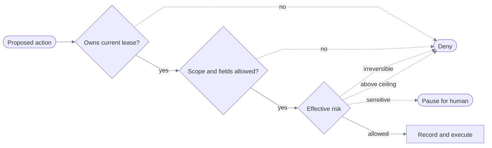
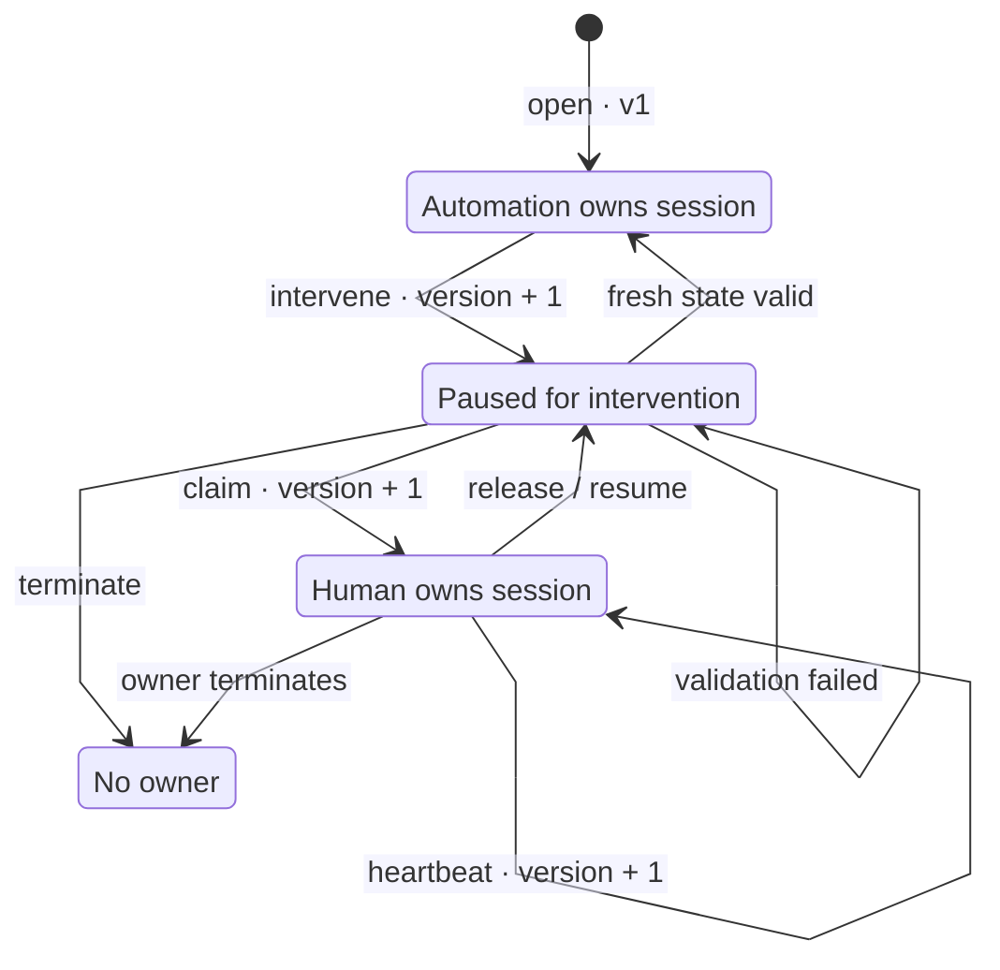
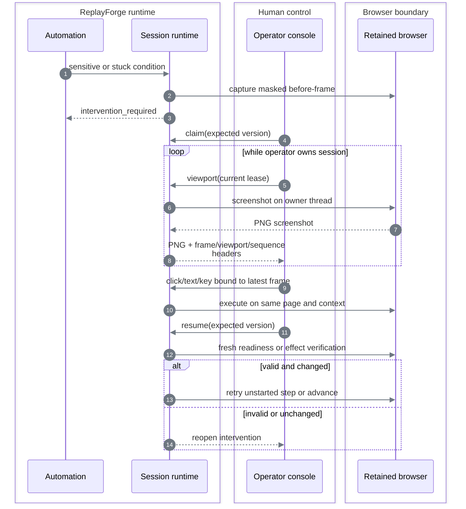

# Safety, evidence, and human handoff

[Documentation index](README.md)

## One action, three gates



### Policy composition

Replay intersects five immutable layers:

```text
platform ∩ application ∩ tenant ∩ capability ∩ invocation
```

Allowed origins, route patterns, and action types become the set intersection. Forbidden field classes become the union. The maximum risk becomes the most restrictive ceiling. Discovery currently intersects platform and application layers.

The current tenant and invocation layers inherit the application/capability ceilings; there is no
separate per-tenant policy editor or caller-supplied policy override. Registered forbidden classes
reach replay, and input classification includes protected parent objects. Capability-declared
forbidden input labels are enforced before typing.

Discovery applies the same bound-input classification rules after validating its planned input
contract. This closes the policy boundary before the first typing/selection action, not only when
the resulting artifact is replayed.

Risk is the maximum of:

- Risk declared by the step or proposal.
- Risk registered by the resolved target.
- Risk inferred from action type and target language.

The model and artifact therefore cannot lower an independently detected risk.

| Risk | Runtime response |
|---|---|
| Read-only or reversible within policy | Allow |
| Sensitive replay step within policy | Pause the live session for human intervention |
| Above policy ceiling | Deny |
| Irreversible | Always deny in this submission |

## Control ownership

Every browser session has one versioned lease. Its TTL and renewal bound are documented in
[Constraints and policy](constraints-and-policy.md#execution-bounds).



Every mutation supplies the expected intervention state, lease version, and owner. The paired
repository changes workflow and control ownership in one compare-and-swap operation. A stale
operator tab, duplicate request, expired lease, or automation action after pause is rejected.

An active human lease cannot be stolen. If its heartbeat expires, the claim transition may atomically assign the session to a new operator and increment the version. A passive `automation_paused` lease remains claimable after its timestamp so queue delay does not strand the retained browser.

## Same-session handoff

The default operator path needs no ID copied from a terminal. The console polls the active intervention
inbox and shows safe routing context before control is claimed: capability and version, application
and tenant, interrupted step, normalized route, trigger, and explanation. Invocation inputs and
extracted values are absent. The intervention control viewport is restricted to the current lease
holder; separately, a viewer-token holder can observe but cannot control the execution. Operator
labels are not authentication.



Accepted manual input is deliberately narrow: left click, text insertion, and ten navigation/editing keys. Text content is never placed in audit events; only its character count is recorded. Pointer evidence records coordinates, source frame, viewport, and sequence. Before persistence, every screenshot is fully masked in memory: neither DOM selectors nor OCR can establish that all remaining pixels are public.

Discovery can pause on low confidence, repeated state/action, model escalation, or an unresolved
safety boundary. Its original loop resumes only after accepted human input changes the allowed
live state. Used step/model budgets remain spent; human wait time is excluded. Outputs must be
re-extracted, and publication still requires fresh model-free validation. Human actions remain
audit evidence, never invented recorded automation. Replay validates the continuation boundary
described below. Earlier replay screenshots remain read-only;
return Live before claiming or sending input. Validation replays themselves never request a human.

After permitted automatic retries and declared recovery are exhausted, ordinary absent/ambiguous
targets, action failures/timeouts, and unverified dispatched effects can open intervention. The
engine checks policy again before retaining the session; a recoverable error alone grants no authority.
Invalid inputs, denied policy, wrong identity, declared terminal failures, broken sessions, and
errors inside recovery stay terminal. Unattended validation never opens intervention.

| Pause boundary | Operator task | Resume gate | Execution resumes at |
|---|---|---|---|
| Action not dispatched | Restore the interface; do not perform the interrupted task step | Changed allowed state, fresh preconditions and unique target | Same step, with spent retry/recovery budgets preserved |
| Action may have dispatched | Inspect and complete/correct its effect | Fresh declared postconditions or permitted outcome; identity guards still apply | Next step; never blindly repeat the action |
| Sensitive policy boundary | Perform the permitted human task | Same effect-verification gate | Next step |

Human control invalidates cached outputs. Resume re-extracts condition operands through recorded,
policy-allowed targets; missing or forbidden reads reject resume. Other outputs must be extracted
again later. A possibly dispatched action without a declared effect checkpoint cannot safely resume:
the operator may inspect or terminate it. A terminal failure has no retained browser to claim.

## Stale-input protection

A human input command must match all of:

```text
intervention ID
  + human owner ID
  + exact lease version
  + latest frame sequence
  + next client sequence
  + exact viewport dimensions
```

After one accepted input, the frame is invalidated. The next action requires a fresh screenshot.

The console separately guards asynchronous responses: an old lookup cannot replace a newly selected
intervention, and an older poll cannot lower the displayed lease version. Switching context clears
the previous frame and unsent manual text; late mutation responses cannot update the new context.
Ignoring stale responses was chosen over trusting arrival order. Server-side lease/frame validation
remains authoritative; the UI guard prevents misleading context, not a substitute authorization layer.

## Evidence path

### Data exposure boundaries

Redacted evidence does not mean that live discovery sees redacted pixels. These are deliberately
different paths, with different recipients and lifetimes.

| Data path | Recipient | Payload and retention boundary |
|---|---|---|
| Discovery perception | OpenAI adapter → remote provider | Unmasked screenshot and UI/OCR facts; visible customer values can be present even though input values are omitted from structured input fields |
| Model-call metrics | Local Langfuse | Model identity, token/cost usage, latency, and bounded outcomes; no prompt, response, or screenshot payload |
| Live manual control | Current human lease holder | Unmasked viewport; transient and non-cacheable, not a retained evidence image |
| Execution viewing | Holder of the per-execution viewer token | Actual frames and results; bounded in-memory retention, no screenshot files, no control authority |
| Successful invocation | API caller | Typed task outputs; evidence redaction does not redact the caller's result |
| Durable evidence | Confined local files | Restricted events/results; fully masked viewport images preserve dimensions, not visual content |
| Published capability | Local registry | Symbolic bindings and semantic targets; not the original customer inputs or model transcript |
| New image signatures | Capability asset store | Runtime capture disabled by default; explicit synthetic-only opt-in requires loopback target origins. Existing curated assets remain readable |

Provider calls set `store=false`; this is not Zero Data Retention and does not independently
disable provider abuse-monitoring retention. It is not a claim that no data crosses the provider
boundary or a substitute for deployment data policy; see the official
[OpenAI data controls](https://developers.openai.com/api/docs/guides/your-data).
The implemented demo uses synthetic
data. Operator labels and API callers are trusted locally; institution-level authentication and
authorization are not implemented.

Payload separation is implemented in the [provider adapter](../backend/src/replayforge/providers/openai.py),
[metrics adapter](../backend/src/replayforge/observability/model_calls.py), and
[evidence redactor](../backend/src/replayforge/evidence/redaction.py).

### Persistence pipeline

```text
domain event / terminal result
        → structured redaction
        → forbidden-secret scan
        → SHA-256 + atomic local write
        → metadata sidecar
        → new manifest snapshot

browser failure/handoff frame
        → replace every pixel in memory, retaining frame dimensions
        → PNG signature and size validation
        → atomic local write + manifest
```

The redactor drops credential-, token-, password-, cookie-, authorization-, and secret-shaped keys; drops personal fields; tokenizes customer identifiers; and replaces financial values. It also rejects known provider, cloud, GitHub, bearer, and private-key patterns that survive redaction.

Journal details use a positive retention schema: bounded operational codes, enums, counters,
and opaque session identifiers survive; unknown fields, free-text messages, and wrong-shaped
values do not. Operator labels are pseudonymized because a local label may contain a name or
email address. Add new diagnostic fields in
[the event privacy schema](../backend/src/replayforge/runs/privacy.py), not by passing arbitrary
UI observations to the journal. This is a retention boundary, not a general-purpose PII detector.

Customer and operator pseudonyms use HMAC-SHA-256 with an ephemeral random 256-bit key and
the run ID as context; 128 digest bits are retained. The public run ID alone cannot reproduce
them. Values correlate only within the same redactor lifetime and run, not across restarts or
independent exports. An unkeyed hash was rejected because short member IDs can be enumerated.
Pseudonymization is not anonymization, and neither it nor secret-pattern scanning certifies
arbitrary artifact descriptions or image crops as free of personal information.

Terminal evidence omits free-text failure messages, expected/observed payloads, and unclassified
outputs. Declared output classifications still apply recursively; the API caller's live result is
unchanged. Discovery terminal records contain an artifact identity and hash, not a duplicate of
the complete artifact. Before publication, a deterministic artifact guard rejects configured
secrets, email/SSN-shaped strings, and invocation or classified captured-output strings of four or
more characters copied into metadata, examples, or executable fields. Captured-output checks cover
personal, customer-identifier, and financial classifications. Runtime-generated provenance is
excluded from value-substring matching to avoid accidental matches inside random run IDs.
Extraction also rejects a locator containing the value it just read, before binding that output;
stable field-label accessors remain supported. This prevents a successful same-input validation
from legitimizing a financial-value literal as a reusable target.

These guards deliberately fail closed on known matches. They do not identify every name,
short input, encoded value, or personal image; synthetic-only discovery is the supported demo
boundary. Do not point this deployment at real customer records on the strength of these checks.

The operator viewport is live and therefore unmasked for the authorized lease holder. Failure and handoff screenshots are masked in memory before persistence.

Full masking intentionally loses visual post-mortem detail; use the authorized live viewport to
inspect the screen. New failure and blocked-replay events retain value-free diagnostics instead:
execution phase, action kind, dispatch uncertainty, condition kind, available match counts, and
retry/recovery state. Labels, predicates' literal values, and adapter prose are excluded.

Finalization packages the latest diagnostic as `diagnostic.json` inside one `trace.zip` (64 KiB
JSON limit); all earlier snapshots remain ordered events. This is **not a Playwright trace**.
The snapshot passes the positive retention schema and configured-secret scan before packaging.
Archive failure records `diagnostic_trace: unavailable` without changing the task's disposition.
Historical evidence is never rewritten.
New template/signature capture also defaults off: edge detection can preserve readable text,
faces, or identifying marks. For explicitly synthetic targets only,
`REPLAYFORGE_ALLOW_SYNTHETIC_ASSET_CAPTURE=true` enables capture; both the demo origin and every
registered application origin must be loopback. This flag is an operator assertion, not a PII
detector. Curated content-addressed assets remain available for deterministic replay with capture
disabled. Do not enable the flag for real customer records.

## Decisions

| Decision | Alternatives | Choice | Reason |
|---|---|---|---|
| Policy | Single boolean guard, adapter-specific checks, layered policy | Layer intersection | Every authority can only narrow permission; decisions stay auditable |
| Risky replay action | Allow with logging, deny all, human intervention | Sensitive → human; irreversible → deny | Demonstrates safe progress without pretending irreversible recovery is solved |
| Evidence redaction | Redact at display, redact after storage, redact before write | Before write | Known sensitive fields and unknown diagnostics are excluded at the retention boundary |
| Screenshot retention | Fixture selectors, OCR masks, full-frame suppression | Full frame | No general proof that unmasked pixels are public; visual diagnostics are sacrificed explicitly |
| Failure diagnostics | Raw browser trace, masked image alone, value-free snapshot | Scanned snapshot + ordered events | Explains where and why execution stopped without retaining UI values; one final ZIP preserves the exporter contract |
| Blocked replay continuation | Restart, repeat blindly, dispatch-aware continuation | Restore/retry before dispatch; verify/advance otherwise | Preserves the same session without duplicating uncertain mutations or resetting automatic budgets |
| Image signatures | Treat edges as anonymous, permit all crops, restricted capture | Off by default | Edge maps can preserve sensitive content; synthetic opt-in keeps the demo option explicit |
| Session takeover | Open new browser, expose existing browser | Existing context | Preserves cookies, route, form state, and the assignment's required seam |
| Operator routing | Require an ID from logs, active inbox | Discovery/replay inbox + optional direct ID | Makes a paused session discoverable without adding a general run-management UI |
| Ownership | UI convention, mutex only, versioned lease | Versioned lease + CAS | Makes stale and concurrent commands explicit conflicts |
| Identity | Pretend login, external identity provider, local label | Local operator label | Keeps the trust boundary honest; real authentication belongs with deployment authorization |
| Transport | WebSocket/CDP stream, headed browser, HTTP polling | HTTP polling | Minimal real control path; sequence checks compensate for stale frames |
| UI verification | Mock-only, real handoff only, both | Real handoff + controlled response ordering | Real browser control proves integration; delayed-response tests reproduce races deterministically |
| Persistence | Database transactions, process memory | Memory for control metadata | Fits the local slice; restart loses interventions and is documented |

## Known limits

- Restarting FastAPI loses active leases, interventions, journals, continuations, and browser sessions. Published capabilities reload from their immutable YAML files.
- There is no authentication or institution authorization layer; operator IDs are caller-supplied labels.
- HTTP is loopback-oriented and not production transport security.
- There is no continuous video, drag, right-click, clipboard, file upload, or multi-operator co-browsing.
- Evidence retention classes are metadata only; automated expiry is not implemented.
