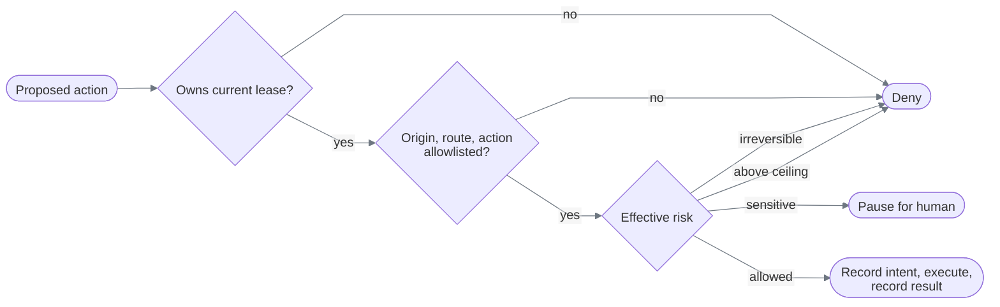
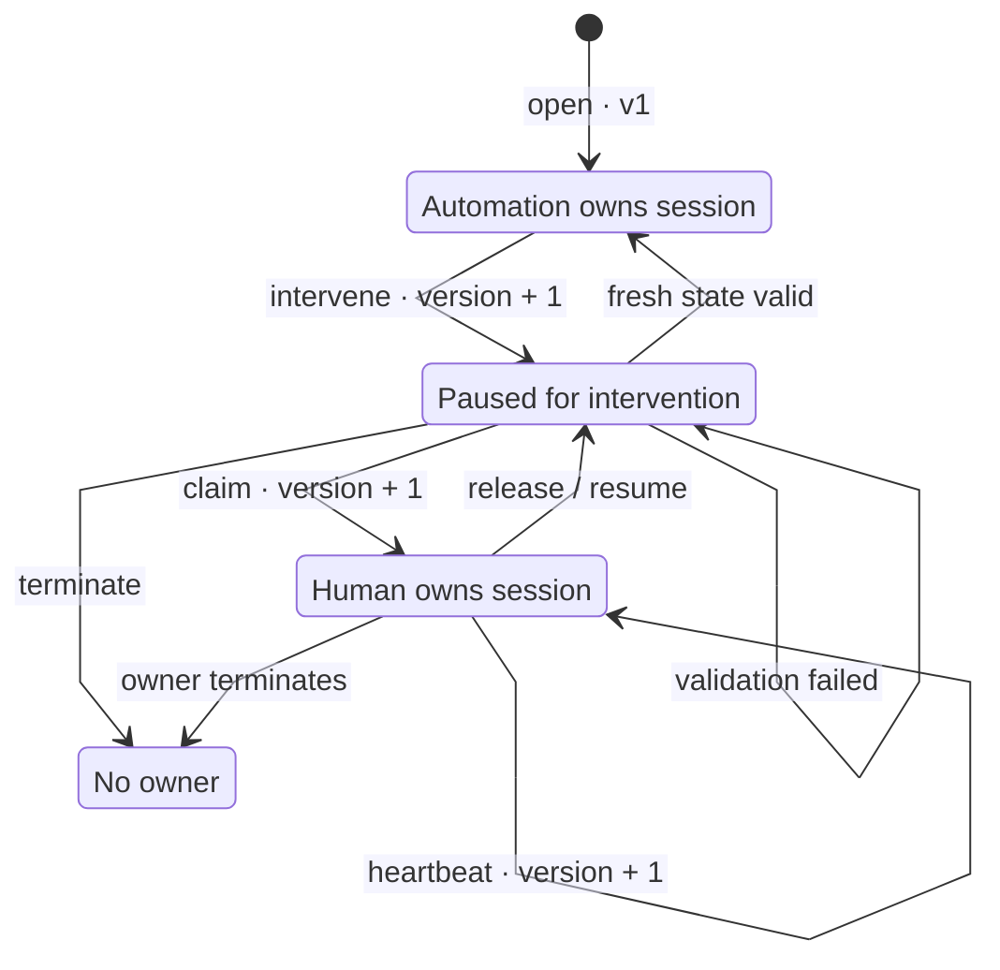
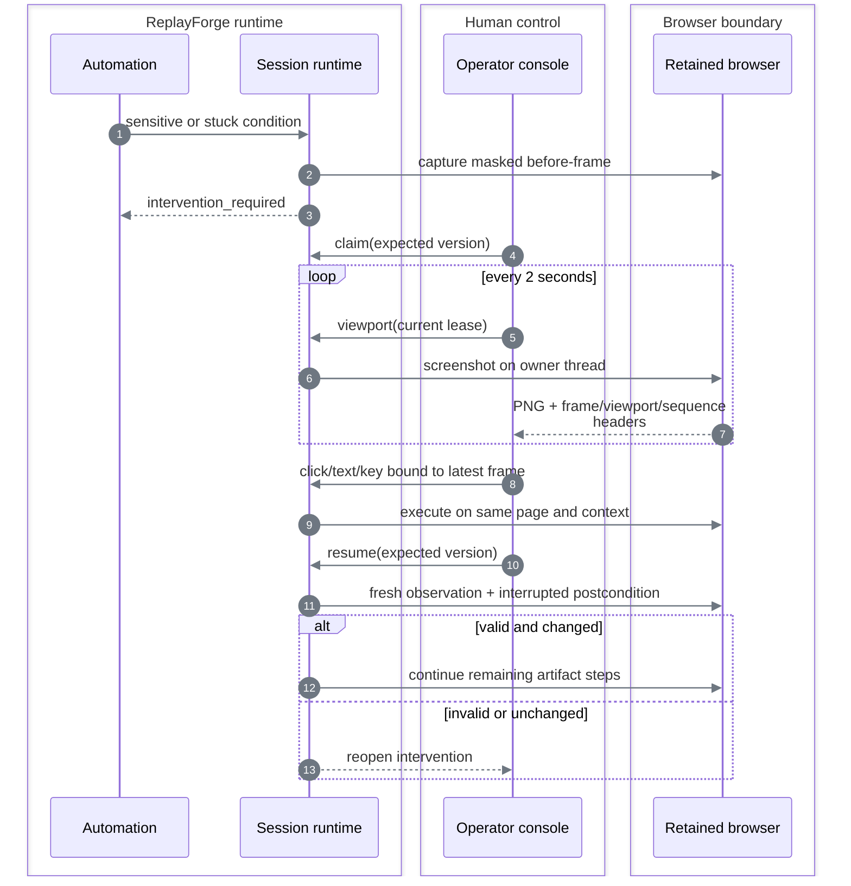

# Safety, evidence, and human handoff

## One action, three gates



### Policy composition

Replay intersects five immutable layers:

```text
platform ∩ application ∩ tenant ∩ capability ∩ invocation
```

Allowed origins, route patterns, and action types become the set intersection. Forbidden field classes become the union. The maximum risk becomes the most restrictive ceiling. Discovery currently intersects platform and application layers.

Risk is the maximum of:

- Risk declared by the step or proposal.
- Risk registered by the resolved target.
- Risk inferred from action type and target language.

The model and artifact therefore cannot lower an independently detected risk.

| Risk | Runtime response |
|---|---|
| Read-only or reversible within policy | Allow |
| Sensitive replay step within policy | Pause the live session for human intervention |
| Above policy ceiling | Deny |
| Irreversible | Always deny in this submission |

## Control ownership

Every browser session has one versioned lease with a 30-second TTL.



Every mutation supplies the expected intervention state, lease version, and owner. The paired
repository changes workflow and control ownership in one compare-and-swap operation. A stale
operator tab, duplicate request, expired lease, or automation action after pause is rejected.

An active human lease cannot be stolen. If its heartbeat expires, the claim transition may atomically assign the session to a new operator and increment the version. A passive `automation_paused` lease remains claimable after its timestamp so queue delay does not strand the retained browser.

## Same-session handoff

The operator does not copy an opaque ID from a terminal. The console polls the active replay inbox and shows safe routing context before control is claimed: capability and version, application and tenant, interrupted step, normalized route, trigger, and explanation. Invocation inputs and extracted values are absent. The unmasked live viewport remains restricted to the current lease holder.



Accepted manual input is deliberately narrow: left click, text insertion, and ten navigation/editing keys. Text content is never placed in audit events; only its character count is recorded. Pointer evidence records coordinates, source frame, viewport, and sequence. Before persistence, DOM-backed frames mask controls and customer values; the canvas-only surface masks the entire canvas because its sensitive pixels have no element boundary.

Discovery can pause and expose the same session, but deterministic continuation after manual work is currently implemented only for replay. Discovery resume reopens safely because no continuation is available.

## Stale-input protection

A human input command must match all of:

```text
intervention ID
  + human owner ID
  + exact lease version
  + latest frame sequence
  + next client sequence
  + exact viewport dimensions
```

After one accepted input, the frame is invalidated. The next action requires a fresh screenshot.

## Evidence path

```text
domain event / terminal result
        → structured redaction
        → forbidden-secret scan
        → atomic local write
        → SHA-256 + metadata sidecar
        → new manifest snapshot

browser failure/handoff frame
        → mask inputs, details, account table
        → PNG signature and size validation
        → atomic local write + manifest
```

The redactor drops credential-, token-, password-, cookie-, authorization-, and secret-shaped keys; drops personal fields; tokenizes customer identifiers; and replaces financial values. It also rejects known provider, cloud, GitHub, bearer, and private-key patterns that survive redaction.

The operator viewport is live and therefore unmasked for the authorized lease holder. Persisted failure and handoff screenshots are masked before capture.

## Decisions

| Stage | Alternatives | Chosen | Why |
|---|---|---|---|
| Policy | Single boolean guard, adapter-specific checks, layered policy | Layer intersection | Every authority can only narrow permission; decisions stay auditable |
| Risky replay action | Allow with logging, deny all, human intervention | Sensitive → human; irreversible → deny | Demonstrates safe progress without pretending irreversible recovery is solved |
| Evidence redaction | Redact at display, redact after storage, redact before write | Before write | Sensitive bytes never enter durable evidence |
| Session takeover | Open new browser, expose existing browser | Existing context | Preserves cookies, route, form state, and the assignment's required seam |
| Operator routing | Require an ID from logs, active inbox | Replay inbox + optional direct ID | Makes a paused session discoverable without adding a general run-management UI |
| Ownership | UI convention, mutex only, versioned lease | Versioned lease + CAS | Makes stale and concurrent commands explicit conflicts |
| Identity | Pretend login, external identity provider, local label | Local operator label | Keeps the trust boundary honest; real authentication belongs with deployment authorization |
| Transport | WebSocket/CDP stream, headed browser, HTTP polling | HTTP polling | Minimal real control path; sequence checks compensate for stale frames |
| UI verification | Mocked network calls, real browser path | Real browser path | Proves the console drives the retained runtime rather than only rendering mocked states |
| Persistence | Database transactions, process memory | Memory for control metadata | Fits the local slice; restart loses interventions and is documented |

## Known limits

- Restarting FastAPI loses active leases, interventions, journals, continuations, and browser sessions. Published capabilities reload from their immutable YAML files.
- There is no authentication or institution authorization layer; operator IDs are caller-supplied labels.
- HTTP is loopback-oriented and not production transport security.
- There is no continuous video, drag, right-click, clipboard, file upload, or multi-operator co-browsing.
- Evidence retention classes are metadata only; automated expiry is not implemented.
