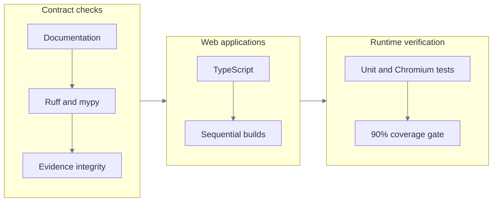

# Verification and evidence

[Documentation index](README.md)

## One command

```bash
bash scripts/verify.sh
```



The 90% branch-aware coverage gate covers deterministic domain code. Thin HTTP, provider, launch-registry,
suite-orchestration, composition, and Playwright adapters are excluded from that percentage and
covered by contract tests, real Chromium integration, and genuine discovery evidence. Unit and
integration tests run in one coverage process so browser-executed domain paths count.

For documentation-only changes, run the lightweight gate and its regression tests:

```bash
uv run python scripts/check_docs.py
uv run python -m unittest discover -s scripts -p 'test_check_docs.py'
```

These check local links and heading anchors, index coverage, the required report sections, fenced
blocks, and shared Mermaid styling. They do not fetch external links or prove rendered layout.

The documentation consistency pass also rendered all 21 diagrams with Mermaid `11.12.0` in
Chromium, using both default and dark themes. No text extended beyond its SVG viewport; key
architecture, replay, and handoff diagrams were visually inspected. Renderer versions and host
themes can differ, so this is a recorded layout check, not a cross-viewer guarantee.

## What is proved where

| Property | Test mechanism | Committed evidence |
|---|---|---|
| Genuine model-guided discovery | Provider, engine, compiler tests; recorded runs | Three task-specific discovery bundles plus the original fixture |
| Replay cannot import a model provider | Structural dependency test | `evidence/replay-success` |
| Typed success and five outputs | Engine + composed integration | `evidence/replay-success` |
| Legitimate negative answer | Outcome precedence tests | `evidence/replay-member-not-found` |
| Finite recovery | Retry/recovery tests + Chromium | `evidence/replay-recovery` |
| Known hard failure | Failure classification + masked screenshot checks | `evidence/replay-hard-failure` |
| Same live browser handoff | Lease/runtime tests + captured frames | `evidence/human-handoff` |
| Shared artifact across tenants | Chromium integration | `evidence/tenant-reuse` |
| Canvas-only model-free replay | Chromium on Harbor and Summit | Automated `3.0.0`, `3.1.0`, and `3.2.0` integration tests |
| Visual fail-closed behavior | OCR cardinality, same-scale peak detection, contextual template, asset integrity tests | Unit suite + `test_visual_portability.py` |
| Visual portability | One artifact across two tenants, six CSS viewports, DPR `1–2` | Portability matrix plus six discovered-task/tenant combinations |
| Artifact immutability and integrity | Registry/serialization tests | Artifact hash in every applicable bundle |
| Redaction before retention | Redactor/journal/store tests | Manifest directives and sanitized payloads |

The expanded [demo-bank workstation](demo-bank.md) has separate domain/controller tests and
screenshot-driven Chromium tests. These exercise the target application's business behavior, not
a new discovered capability. Historical discovery and replay bundles remain tied to the earlier
fixture routes; richer-screen discovery and runtime compatibility validation are still pending.

## Audit regression coverage

| Correctness boundary | Regression proof |
|---|---|
| Condition actions execute their declared semantics | `test_condition_actions_cannot_succeed_without_their_condition` |
| Ambiguity cannot prove absence | `test_absence_requires_proof_not_a_resolution_error` |
| Nested input references and finite financial decimals | `test_nested_input_resolution_and_missing_optional_values`; value-contract cases |
| Returned mappings cannot mutate registry state | `test_nested_mutation_cannot_change_published_content`; registration snapshot test |
| Duplicate YAML cannot overwrite reviewed fields | `test_yaml_cannot_silently_overwrite_reviewed_fields` |
| Nested secrets cannot hide under public objects | Discovery-contract and evidence-classification tests |
| Policy runs before forbidden input | `test_input_policy_is_enforced_before_typing` |
| Application contract changes stop before launch | `test_incompatible_registration_stops_before_surface_open` |
| Shared readiness differs from tenant branding | Registered readiness tests plus actual Harbor/Summit Chromium replay |
| Production compilation is task-independent | Dependency test rejects production imports from `tests`; old compiler is a fixture |
| Discovery enforces its planned input contract and input classifications | `test_planned_input_contract_is_checked_before_any_action`; `test_discovery_input_classification_applies_before_typing` |
| Validation errors cannot echo arbitrary property names | `test_request_validation_never_echoes_unknown_property_names` |
| All reviewed policy YAML has unambiguous keys | Model/vision duplicate-budget rejection tests |
| Late UI responses cannot change the selected task | `test_delayed_lookup_cannot_replace_new_operator_selection` |

The genuine discovery bundles are historical executions tied to their recorded commits. They were
verified, not regenerated or relabeled during the audit. Browser integration tests exercise today's
runtime against those unchanged artifact contracts; synthetic test providers remain test fixtures.

### Audit checkpoint: `a71b7b0`

| Gate | Result |
|---|---|
| Unit suite | 608 passed, including discovery-input policy, registration, compiler-safety, and evidence-tampering regressions |
| Integration suite | 48 passed, including real Chromium replay, portability, operator control, and response-ordering regression |
| Configured domain coverage | 90.48%, with the existing branch-aware 90% threshold and exclusions unchanged |
| Static checks | Ruff format/lint and strict mypy passed; both frontend typechecks and sequential production builds passed |
| Historical evidence | All ten bundles verified; no genuine discovery was regenerated |

The full 655-case Python run passed with coverage. After rebuilding the console, both operator
browser cases passed, including one added response-ordering case: 656 distinct passing cases in
total. That new case first reproduced the stale-selection bug against the previous console build.
It mocks response timing; the separate handoff case drives the real retained browser session.
Starlette emits one upstream AnyIO deprecation warning; no test is skipped to suppress it.

### Initial demo workstation checkpoint

| Gate | Result |
|---|---|
| Target domain and controller | 20 passing Node tests: money, ownership, permissions, atomic operations, review lifecycle, and case history |
| Expanded target in Chromium | Six passing cases across focused runs: card lock/unlock, transfers, permission/payoff flow, case resolution, and two tenant/viewport combinations |
| Preserved automation | The existing discovered temporary-card-lock capability replayed successfully on Harbor's unchanged workbench |
| Application and capability contracts | 157 passing Python unit tests |
| Static checks and build | Strict mypy, Ruff, demo TypeScript, and demo production build passed |
| Documentation | 14 documents checked; seven checker tests passed; 21 diagrams rendered in light and dark themes |
| Historical evidence | All ten bundles verified unchanged; no new discovery execution claimed |

This is the scoped demo-expansion checkpoint, not a rerun of the full backend coverage matrix
recorded above. Browser tests inspect screenshots and send real input; they do not read the target's
React state. OCR limitations and the remaining fresh-discovery requirement are documented in the
[demo-bank guide](demo-bank.md#verification-and-evidence-status).

### Demo workflow audit: `90ab61c`

The follow-up audit reproduced and corrected stale member context, discarded canceled forms,
premature success wording, incomplete text editing, truncated controls/review values, inactive
partially visible controls, a non-interactive scrollbar, and inherited request-key collisions.
See the [defect and correction table](demo-bank.md#defects-corrected-in-the-workflow-audit).

| Gate | Result |
|---|---|
| Domain, controller, and text editor | 32 passing tests, including the complete seeded tenant/member/role matrix and 100 consecutive funds-conserving transfers |
| Instrumented Chromium interaction tests | 32 passing cases across Harbor and Summit; includes resize during a filled form at 800×600, 1024×768, and 1440×900 |
| Independent screenshot/OCR tests | All six existing workstation cases passed against the audited build, without drawing instrumentation |
| Preserved discovered workflows | Six successful model-free replays: transaction investigation, loan payoff, and temporary card lock on both Harbor and Summit |
| Static checks and build | Strict mypy, Ruff, TypeScript, and the demo production build passed |
| Retained evidence | All ten historical bundles verified unchanged |

The fast browser suite observes actual canvas drawing calls and their viewport/clip visibility,
then uses real input events. It does not read React state or the private hit map. The independent
screenshot/OCR suite remains separate; neither suite substitutes for genuine model discovery.
The audit covers the supported desktop Chromium target, not every possible browser or input method.

### Privacy hardening checkpoint

Verified on 2026-09-14 after the servicing workflow audit:

| Check | Result | Boundary |
|---|---|---|
| Backend unit suite | 623 passed | Includes journal/terminal redaction, artifact leak rejection, keyed pseudonyms, and image capture policy |
| Targeted Chromium privacy/failure tests | 5 passed | Includes closed-shadow-root synthetic personal text, fully masked screenshots, and retained failure evidence |
| Additional Chromium regression tests | 6 passed | Scripted discovery, replay, business outcome, recovery, live control, and same-session resume; no model calls |
| Static checks | Ruff and strict mypy passed | No claim of a newly rerun full browser matrix |
| Historical evidence | Ten bundles verified unchanged | New policies do not retroactively rewrite old evidence |
| Rich-workstation model discovery at this checkpoint | Not run | The initial egress request was denied; explicit authorization was subsequently granted on 2026-09-14, and the genuine attempts below supersede this status |

Reproduce the new browser checks with `test_playwright_surface.py` and the selection
`real_iframe_search_and_account_extraction or visual_evidence_masks or evidence_masks_unclassified or registered_artifact_classifies_permission_denial or real_output_failure_retains`.
The proposed capture in `config/servicing-discovery.yaml` is not an artifact or an evidence bundle.

## Evidence bundle anatomy

For a concrete review, open the [card-lock discovery manifest](../evidence/discovery-temporary-card-lock/manifest.json)
and follow this chain:

| Inspect | Establishes | Does not establish |
|---|---|---|
| `manifest.json` | Recorded commit, command, run ID, exact file set, and hashes | Signer authenticity or coverage of later code changes |
| `events.jsonl` | Ordered, sanitized execution and policy records | A full model transcript or unredacted UI state |
| `artifact.yaml` | Published task contract for a discovery bundle | Success on every future UI or tenant |
| `result.json` | The recorded run's sanitized terminal result | A stronger checkpoint than the artifact actually declares |
| Bundle verifier + current tests | Byte integrity plus current behavior against saved contracts | A new genuine discovery run |

A discovery-suite result can contain the pre-publication draft. The bundle's `artifact` record and
`artifact.yaml` identify the published contract; finalization and tenant validation can change its
hash from the draft recorded in `result.json`. Those are different lifecycle objects, not two
interchangeable copies of one artifact.

```text
evidence/<scenario>/
├── manifest.json       command, commit, source manifest, hashes, redaction
├── events.jsonl        ordered sanitized lifecycle events
├── result.json         exactly one typed terminal result
├── artifact.yaml       discovery scenario only
└── screenshots/        selected masked frames where required
```

The runtime writes append-only evidence objects and successive manifest snapshots under ignored
`evidence/runtime/`. Each completed run points to its final snapshot. Export tooling verifies that
snapshot, copies only its declared content, and atomically publishes a reviewer bundle without
overwriting an existing destination.

`verify_evidence_bundles.py` checks:

- Manifest schema.
- An exact file set: no undeclared files or symlinks.
- Every declared file's size and SHA-256.
- JSON size limits and secret-like text scanning.
- Event order and run identity.
- Exactly one terminal result.
- Artifact hash when present.
- Attachment ownership, size, media type, and PNG/ZIP signatures.
- Source-manifest hash and declared redaction metadata.

SHA-256 detects a changed or omitted file relative to its manifest; it does not authenticate the
author. A party able to replace both payloads and manifest can construct a different consistent
bundle. Here, the Git commit containing the bundle supplies the reviewer-visible provenance anchor.
Retention classes are recorded for policy and later lifecycle enforcement; this local slice does
not delete evidence automatically.

## Scenario matrix

| Directory | Version | Tenant | Terminal state | Specific proof |
|---|---:|---|---|---|
| [discovery-success](../evidence/discovery-success/manifest.json) | compiled | Harbor | success | A real OpenAI/Luna loop produced an eight-step artifact |
| [discovery-transaction-investigation](../evidence/discovery-transaction-investigation/manifest.json) | `1.0.0` | Harbor + Summit validation | success | A real OpenAI/Luna loop produced a 15-step, six-output artifact |
| [discovery-loan-payoff](../evidence/discovery-loan-payoff/manifest.json) | `1.0.0` | Harbor + Summit validation | success | A real OpenAI/Luna loop produced an 11-step, five-output artifact |
| [discovery-temporary-card-lock](../evidence/discovery-temporary-card-lock/manifest.json) | `1.0.0` | Harbor + Summit validation | success | A real OpenAI/Luna loop produced a reversible 12-step, four-output artifact |
| [replay-success](../evidence/replay-success/manifest.json) | `1.0.0` | Harbor | success | Model-free outputs and final checkpoint |
| [replay-member-not-found](../evidence/replay-member-not-found/manifest.json) | `1.0.0` | Harbor | business outcome | “No member” is not reported as a crash |
| [replay-recovery](../evidence/replay-recovery/manifest.json) | `1.0.1` | Harbor | success | Known notice dismissed once, then resumed |
| [replay-hard-failure](../evidence/replay-hard-failure/manifest.json) | `1.0.2` | Harbor | failure | Permission denial plus masked failure frame |
| [human-handoff](../evidence/human-handoff/manifest.json) | `2.0.0` | Harbor | success | Pause, claim, input, fresh-state validation, continuation |
| [tenant-reuse](../evidence/tenant-reuse/manifest.json) | `1.0.0` | Summit | success | Same artifact version and hash on a second tenant |

### Visual workbench matrix

`backend/tests/integration/test_visual_portability.py` runs immutable artifacts against the
canvas-only workbench. The original portability matrix contains six viewport/DPR cells, two
recoveries, and five declared/fail-closed outcomes. Six more cells replay the transaction, payoff,
and card-lock artifacts on both Harbor and Summit. Artifact-shape tests reject DOM targets,
coordinates, and relative regions. Every case runs without a model call.

| Fixture | Expected terminal behavior |
|---|---|
| `normal` | Five typed outputs and verified checkpoint |
| `delayed` | Existing condition polling handles the bounded delay |
| `notice` | One recovery, then the remaining steps resume |
| `missing` | `business_outcome/member_not_found` |
| `restricted` | `failure/permission_denied` |
| `duplicate_search` | `failure/target_ambiguous` before dispatch |
| `changed_icon` | `failure/target_absent` |
| `duplicate_field` | `failure/target_ambiguous` at `account.extract_available_balance` |

No Playwright trace archive is committed. This is an explicit optional evidence cut. Historical
screenshots retain limited visual context; new screenshot evidence is fully masked, so current
failure diagnosis uses operational event codes and the authorized live viewport.

## Testing decisions

| Option | Decision | Reason |
|---|---|---|
| Mock-only browser tests | Rejected | Would not prove iframe, locator, navigation, or screenshot behavior |
| Live-model tests on every CI run | Rejected | Non-deterministic, credentialed, and paid |
| Unit fakes + real Chromium + committed live evidence | **Chosen** | Deterministic gates plus auditable proof of four genuine model runs, including three distinct tasks |
| Trust exported evidence files | Rejected | Closed-set validation and hashes expose changes relative to the committed manifest |
| Store raw screenshots | Rejected | Evidence is masked before persistence |
| Add S3-compatible storage | Rejected for this slice | Local durable files satisfy single-node execution and repository review; remote distribution adds no requirement coverage here |

## Secret audit

`.env`, `.secrets/`, local Langfuse data, runtime evidence, dependencies, build output, and the
assignment PDF are ignored. The audit checks tracked content and reachable Git history for
configured credential values and high-confidence credential patterns without printing secret
values. No matches were found. Pattern scans are a release check, not a proof that arbitrary
sensitive text can always be recognized.
