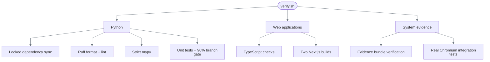

# Verification and evidence

## One command

```bash
bash scripts/verify.sh
```



The 90% branch gate covers deterministic domain code. Thin HTTP, provider, launch-registry,
suite-orchestration, composition, and Playwright adapters are excluded from that percentage and
covered by contract tests, real Chromium integration, and genuine discovery evidence. Unit and
integration tests run in one coverage process so browser-executed domain paths count.

## What is proved where

| Property | Test mechanism | Committed evidence |
|---|---|---|
| Genuine model-guided discovery | Provider, engine, compiler tests; recorded runs | Three task-specific discovery bundles plus the original fixture |
| Replay cannot import a model provider | Structural dependency test | `evidence/replay-success` |
| Typed success and five outputs | Engine + composed integration | `evidence/replay-success` |
| Legitimate negative answer | Outcome precedence tests | `evidence/replay-member-not-found` |
| Finite recovery | Retry/recovery tests + Chromium | `evidence/replay-recovery` |
| Known hard failure | Failure classification + masked screenshot checks | `evidence/replay-hard-failure` |
| Same live browser handoff | Lease/runtime tests + captured frames | `evidence/human-handoff` |
| Shared artifact across tenants | Chromium integration | `evidence/tenant-reuse` |
| Canvas-only model-free replay | Chromium on Harbor and Summit | Automated `3.0.0`, `3.1.0`, and `3.2.0` integration tests |
| Visual fail-closed behavior | OCR cardinality, same-scale peak detection, contextual template, asset integrity tests | Unit suite + `test_visual_portability.py` |
| Visual portability | One artifact across two tenants, six CSS viewports, DPR `1–2` | 15-case matrix, all passing |
| Artifact immutability and integrity | Registry/serialization tests | Artifact hash in every applicable bundle |
| Redaction before retention | Redactor/journal/store tests | Manifest directives and sanitized payloads |

## Evidence bundle anatomy

```text
evidence/<scenario>/
├── manifest.json       command, commit, source manifest, hashes, redaction
├── events.jsonl        ordered sanitized lifecycle events
├── result.json         exactly one typed terminal result
├── artifact.yaml       discovery scenario only
└── screenshots/        selected masked frames where required
```

The runtime writes append-only evidence objects and successive manifest snapshots under ignored
`evidence/runtime/`. Each completed run points to its final snapshot. Export tooling verifies that
snapshot, copies only its declared content, and atomically publishes a reviewer bundle without
overwriting an existing destination.

`verify_evidence_bundles.py` checks:

- Manifest schema.
- An exact file set: no undeclared files or symlinks.
- Every declared file's size and SHA-256.
- JSON size limits and secret-like text scanning.
- Event order and run identity.
- Exactly one terminal result.
- Artifact hash when present.
- Attachment ownership, size, media type, and PNG/ZIP signatures.
- Source-manifest hash and declared redaction metadata.

SHA-256 detects a changed or omitted file relative to its manifest; it does not authenticate the
author. A party able to replace both payloads and manifest can construct a different consistent
bundle. Here, the Git commit containing the bundle supplies the reviewer-visible provenance anchor.
Retention classes are recorded for policy and later lifecycle enforcement; this local slice does
not delete evidence automatically.

## Scenario matrix

| Directory | Version | Tenant | Terminal state | Specific proof |
|---|---:|---|---|---|
| `discovery-success` | compiled | Harbor | success | A real OpenAI/Luna loop produced an eight-step artifact |
| `discovery-transaction-investigation` | `1.0.0` | Harbor + Summit validation | success | A real OpenAI/Luna loop produced a 15-step, six-output artifact |
| `discovery-loan-payoff` | `1.0.0` | Harbor + Summit validation | success | A real OpenAI/Luna loop produced an 11-step, five-output artifact |
| `discovery-temporary-card-lock` | `1.0.0` | Harbor + Summit validation | success | A real OpenAI/Luna loop produced a reversible 12-step, four-output artifact |
| `replay-success` | `1.0.0` | Harbor | success | Model-free outputs and final checkpoint |
| `replay-member-not-found` | `1.0.0` | Harbor | business outcome | “No member” is not reported as a crash |
| `replay-recovery` | `1.0.1` | Harbor | success | Known notice dismissed once, then resumed |
| `replay-hard-failure` | `1.0.2` | Harbor | failure | Permission denial plus masked failure frame |
| `human-handoff` | `2.0.0` | Harbor | success | Pause, claim, input, fresh-state validation, continuation |
| `tenant-reuse` | `1.0.0` | Summit | success | Same artifact version and hash on a second tenant |

### Visual workbench matrix

`backend/tests/integration/test_visual_portability.py` runs immutable artifacts against the
canvas-only workbench. The original portability matrix contains six viewport/DPR cells, two
recoveries, and five declared/fail-closed outcomes. Six more cells replay the transaction, payoff,
and card-lock artifacts on both Harbor and Summit. Artifact-shape tests reject DOM targets,
coordinates, and relative regions. Every case runs without a model call.

| Fixture | Expected terminal behavior |
|---|---|
| `normal` | Five typed outputs and verified checkpoint |
| `delayed` | Existing condition polling handles the bounded delay |
| `notice` | One recovery, then the remaining steps resume |
| `missing` | `business_outcome/member_not_found` |
| `restricted` | `failure/permission_denied` |
| `duplicate_search` | `failure/target_ambiguous` before dispatch |
| `changed_icon` | `failure/target_absent` |
| `duplicate_field` | `failure/target_ambiguous` at `account.extract_available_balance` |

No Playwright trace archive is committed. This is an explicit optional evidence cut; screenshots are the richer failure/handoff signal.

## Testing decisions

| Option | Decision | Why |
|---|---|---|
| Mock-only browser tests | Rejected | Would not prove iframe, locator, navigation, or screenshot behavior |
| Live-model tests on every CI run | Rejected | Non-deterministic, credentialed, and paid |
| Unit fakes + real Chromium + committed live evidence | **Chosen** | Deterministic gates plus auditable proof of four genuine model runs, including three distinct tasks |
| Trust exported evidence files | Rejected | Closed-set validation and hashes expose changes relative to the committed manifest |
| Store raw screenshots | Rejected | Evidence is masked before persistence |
| Add S3-compatible storage | Rejected for this slice | Local durable files satisfy single-node execution and repository review; remote distribution adds no requirement coverage here |

## Secret audit

`.env`, `.secrets/`, local Langfuse data, runtime evidence, dependencies, build output, and the assignment PDF are ignored. Before the current public push, all tracked files and all reachable historical blobs were scanned for provider keys, cloud keys, repository tokens, bearer tokens, JWTs, and private keys. Actual local credential values were also compared against history without exposing them; no match was found.
