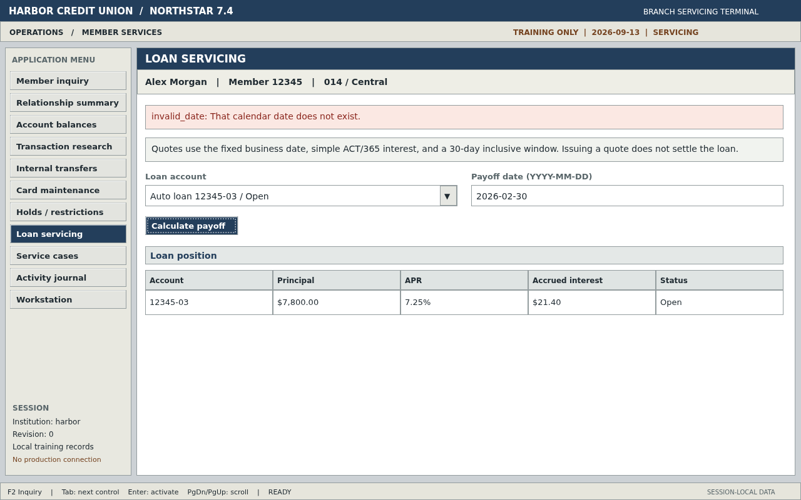

# Evidence

## Current replay matrix

All **32 cases passed** against the unchanged published capabilities on revision `6c5a304`:
10 successful completions (including four learned recoveries), 14 declared business outcomes,
and 8 expected application failures. No model calls were made. Each failure retains a verified,
unmasked PNG; successful and business-outcome runs retain structured evidence, not a screen history.

| Capability | Version | Harbor | Summit | Invocation specification |
|---|---|---|---|---|
| Transaction investigation | `1.0.3` | 3/3 | 3/3 | [6 cases](../config/replay-transaction-validation.yaml) |
| Loan payoff quote | `1.0.2` | 6/6 | 6/6 | [12 cases](../config/replay-payoff-validation.yaml) |
| Temporary card lock | `1.0.2` | 7/7 | 7/7 | [14 cases](../config/replay-card-validation.yaml) |

Cases check the exact declared status/code; recovery cases additionally require a recorded
`recovery_completed` event and successful completion. The engine enforces the artifact's typed
outputs and checkpoints. No artifact edits, learned-step substitutions, or republishing were needed.

### Open the recordings

| Task / case | Harbor | Summit |
|---|---|---|
| transaction / primary | [manifest](replay-raw-transaction-harbor-primary/manifest.json) | [manifest](replay-raw-transaction-summit-primary/manifest.json) |
| transaction / member-not-found | [manifest](replay-raw-transaction-harbor-member-not-found/manifest.json) | [manifest](replay-raw-transaction-summit-member-not-found/manifest.json) |
| transaction / transaction-not-found | [manifest](replay-raw-transaction-harbor-transaction-not-found/manifest.json) | [manifest](replay-raw-transaction-summit-transaction-not-found/manifest.json) |
| payoff / primary | [manifest](replay-raw-payoff-harbor-primary/manifest.json) | [manifest](replay-raw-payoff-summit-primary/manifest.json) |
| payoff / member-not-found | [manifest](replay-raw-payoff-harbor-member-not-found/manifest.json) | [manifest](replay-raw-payoff-summit-member-not-found/manifest.json) |
| payoff / quote-date-unavailable | [manifest](replay-raw-payoff-harbor-quote-date-unavailable/manifest.json) | [manifest](replay-raw-payoff-summit-quote-date-unavailable/manifest.json) |
| payoff / invalid-payoff-date | [manifest](replay-raw-payoff-harbor-invalid-payoff-date/manifest.json) | [manifest](replay-raw-payoff-summit-invalid-payoff-date/manifest.json) |
| payoff / member-restricted | [manifest](replay-raw-payoff-harbor-member-restricted/manifest.json) | [manifest](replay-raw-payoff-summit-member-restricted/manifest.json) |
| payoff / acknowledge-member-notice | [manifest](replay-raw-payoff-harbor-acknowledge-member-notice/manifest.json) | [manifest](replay-raw-payoff-summit-acknowledge-member-notice/manifest.json) |
| card / primary | [manifest](replay-raw-card-harbor-primary/manifest.json) | [manifest](replay-raw-card-summit-primary/manifest.json) |
| card / member-not-found | [manifest](replay-raw-card-harbor-member-not-found/manifest.json) | [manifest](replay-raw-card-summit-member-not-found/manifest.json) |
| card / card-already-locked | [manifest](replay-raw-card-harbor-card-already-locked/manifest.json) | [manifest](replay-raw-card-summit-card-already-locked/manifest.json) |
| card / card-expired | [manifest](replay-raw-card-harbor-card-expired/manifest.json) | [manifest](replay-raw-card-summit-card-expired/manifest.json) |
| card / invalid-maintenance-reason | [manifest](replay-raw-card-harbor-invalid-maintenance-reason/manifest.json) | [manifest](replay-raw-card-summit-invalid-maintenance-reason/manifest.json) |
| card / member-restricted | [manifest](replay-raw-card-harbor-member-restricted/manifest.json) | [manifest](replay-raw-card-summit-member-restricted/manifest.json) |
| card / acknowledge-member-notice | [manifest](replay-raw-card-harbor-acknowledge-member-notice/manifest.json) | [manifest](replay-raw-card-summit-acknowledge-member-notice/manifest.json) |

### Visible failure evidence



The screenshot shows the actual rejected date after replay reached loan servicing. Also inspect
[card-reason validation](replay-raw-card-harbor-invalid-maintenance-reason/screenshots/001.png),
[payoff restriction](replay-raw-payoff-harbor-member-restricted/screenshots/001.png), and
[card restriction](replay-raw-card-harbor-member-restricted/screenshots/001.png).
The equivalent Summit captures are linked through that tenant's manifests above.

To reproduce, start the demo and run each specification sequentially with a fresh output root:

```bash
PLAYWRIGHT_BROWSERS_PATH=/tmp/replayforge-playwright-browsers \
uv run python scripts/capture_replay_evidence.py \
  --spec config/replay-transaction-validation.yaml \
  --commit-sha "$(git rev-parse HEAD)" --output-root .local/new-replay-matrix
```

Repeat with the payoff and card specifications. Existing output names are rejected before execution.

The [perception-budget decision](../docs/operations.md#grounding-deadlines) explains why the
configurable limit is now 20 seconds. Confidence, uniqueness, policy, retry counts, and checkpoints
are unchanged. All 32 recordings use that committed configuration.


## Earlier readiness failure

[Open the actual replay screenshot](replay-payoff-readiness-raw/screenshots/001.png).

The [historical manifest](replay-payoff-readiness-raw/manifest.json) binds this unmasked PNG to
the actual payoff `1.0.1` replay on revision `f172a0f`. It stopped with
`visual_grounding_budget_exceeded` during initial rendered readiness, before any task action.
The image shows the synthetic member directory at that stop; it is not a completed lookup or
a missing-member result. No model calls, changed artifacts, or altered timing limits were used.

The 32-case rerun below passes with the measured 20-second perception budget; this older recording
preserves the original 10-second timeout rather than rewriting its outcome.
The recorded command requested the existing missing-record case. Its expected-code check rejected
this earlier readiness failure, so the completed runtime manifest was exported separately under
its actual outcome. The screenshot is the original captured file, not a reconstruction.

## Screenshots and storage

New replay and discovery failures store the actual viewport **without masking**, as do before/after
handoff captures. Files live under the configured evidence directory (default:
`evidence/runtime/<run-id>/*-<evidence-id>.png`). Open the PNG directly; its sidecar metadata and run
manifest carry its SHA-256 hash, retention class, and `unredacted:raw-screenshot` marker.
Writes are atomic and files are owner-readable/writable only. Runtime evidence is Git-ignored.

This preserves visible failure context on synthetic applications. It is not image redaction:
anything on screen may be retained. Use synthetic data only and inspect every exported PNG before
sharing. Structured logs/results still use their existing redaction rules. Export copies retained
PNG bytes unchanged into `screenshots/001.png`, etc., and preserves their privacy declarations.

Capture is best-effort: a destroyed browser or an error before a page exists cannot yield a current
screenshot. Rendered-readiness failures capture before closing the page. Terminal events report
`evidence_frame` as `captured`, `unavailable`, or `not_applicable`. Successful discovery does not
save a screen history. Old masked images cannot be unmasked; the 53 historical bundles remain
immutable records of their original runs. The new replay matrix and earlier raw readiness capture
are separate recordings.

Primary model recordings cover three tasks on the single servicing workstation:

| Bundle | Business task |
|---|---|
| [discovery-transaction-parameterized](discovery-transaction-parameterized/manifest.json) | Search the supplied member, select the supplied account, filter the supplied reference, and verify transaction/account identities |
| [discovery-servicing-loan-payoff](discovery-servicing-loan-payoff/manifest.json) | Issue a non-binding dated payoff quote |
| [discovery-servicing-card-lock](discovery-servicing-card-lock/manifest.json) | Temporarily lock the selected card and verify the result |

Each suite automatically validates Harbor and Summit before publication. The manifest binds the
actual recording run, source revision, command, exact run artifact, redaction metadata, and hashes.
The primary result can name its draft version; suite finalization assigns the published version
and validated tenant set.
The [original transaction recording](discovery-servicing-transaction/manifest.json) remains
immutable provenance; the current parameterized flow supersedes it on the same UI.

Two separately captured model-free replays use the published payoff artifact without provider
credentials or artifact modifications:

| Bundle | Verified result |
|---|---|
| [replay-servicing-payoff](replay-servicing-payoff/manifest.json) | Success with exact amount, requested date, and confirmation checks before sanitized export |
| [replay-servicing-missing-record](replay-servicing-missing-record/manifest.json) | `target_absent` failure with a fully masked screenshot; no invented not-found business outcome |

These recordings used source revision `a462cdf`. Their synthetic invocation data and expected
results live in [the replay specification](../config/replay-evidence.yaml), not in the runtime.

### Read a failed run

The [failed replay's events](replay-servicing-missing-record/events.jsonl) show permitted search
input and search submission, then `replay_failed` at the recorded Open action. Its
[result](replay-servicing-missing-record/result.json) reports `target_absent`; the matching
[artifact](replay-servicing-missing-record/artifact.yaml) identifies the expected target. The
manifest binds the fully masked failure PNG and every structured record.

This proves that replay stopped when it could not establish the target. It does **not** prove
that no member exists: that requires a positively observed business-outcome detector, as in the
newer scenario bundles. `recoverable: true` classifies the error; it does not promise another
attempt, an open human session, or successful recovery. The masked PNG cannot reconstruct the
failed page, and retained logs omit raw expected/observed values. This historical recording predates
dispatch-aware handoff and diagnostic ZIPs. Current unattended validation retains that terminal
behavior; attended execution can now pause instead. Historical bundles remain unchanged.

### Final handoff and diagnostic proof

The [obstruction handoff](replay-injected-obstruction-handoff/events.jsonl) uses the unchanged
published payoff `1.0.2` artifact. A test inserts an opaque screen obstruction; an operator input
dismisses it, then the same session re-resolves and executes the original step exactly once.
This is a **real-browser, test-injected replay**, not a new model discovery or a learned recovery.
Its [manifest](replay-injected-obstruction-handoff/manifest.json) records code revision `4739d33`.

The [diagnostic ZIP](replay-injected-obstruction-handoff/trace.zip) contains one `diagnostic.json`:
the first typing step expected one target, resolution failed before dispatch, and its retry rule
did not permit this error. No action was dispatched. The event timeline then records human input,
verified readiness, automation resume, and final success. The two retained frames remain masked.
Available counts are retained; unavailable counts and raw target text are not invented.

The [unattended failure](replay-unattended-target-diagnostic/events.jsonl) runs payoff `1.0.1`
against a missing synthetic member, with intervention disabled. It stops at the unresolved third
step and closes the browser. Its [trace](replay-unattended-target-diagnostic/trace.zip) and
[manifest](replay-unattended-target-diagnostic/manifest.json) prove current failure diagnostics
without changing the old artifact into a business-outcome-aware program. Both new bundles use
the normal evidence exporter; neither rewrites earlier recordings.

### Expanded scenario proof

Payoff also has five genuine scenario-discovery bundles and twelve model-free validation bundles
covering normal completion, two negative outcomes, two application failures, and notice recovery
on both tenants. See the [complete linked matrix](../docs/verification.md#scenario-matrix).
Discovery used `6699114`; the complete replay matrix used `7512f5e`. Those validation bundles
contain the unpublished merged candidate; successful finalization published version `1.0.2`.
Their exact artifact hashes distinguish that candidate from the original immutable source version.

Card lock has six genuine scenario discoveries and fourteen model-free validation bundles.
Its three business outcomes, two application failures, and notice recovery all pass on Harbor and
Summit. Recovery includes scrolling to the exact learned rejoin target, followed by a complete
lock with fresh identity/status checks. The replay matrix used `9c9d051` and published `1.0.2`;
each discovery manifest records its own actual recording revision.

Transaction investigation has a [fresh parameterized primary recording](discovery-transaction-parameterized/manifest.json)
and two genuine negative-case discoveries, all recorded on `d7c0dda`. Six model-free matrix replays
on `879a18a` verify normal completion, missing member, and a reference absent from the requested
account on both tenants. Successful finalization published `1.0.3`; the replay bundles preserve
the exact merged candidate used before publication. The primary was launched through the viewer
API; its capture command is a reproduction recipe, not a claim that the CLI launched that run.

```bash
uv run python scripts/verify_evidence_bundles.py evidence --require-submission
```

Bundles contain `artifact.yaml`, `events.jsonl`, `result.json`, and `manifest.json`.
These historical discovery bundles contain structured evidence, not raw page histories.
New failure/handoff capture follows the storage policy above. Private runtime records are ignored.

Fully masked PNGs demonstrate the retention boundary, not the visual state that caused a failure.
Use the ordered events, exact artifact, terminal result, and newer diagnostic ZIPs to inspect a
run. The unmasked synthetic app preview in the root README is separate from these recordings.

### Artifact interpretation

The card-lock artifact's description calls the
operation sensitive, while the executable risk and policy classify it as reversible. The
structured fields govern execution. Immutable recordings preserve what was executed; a description
correction belongs in a new validated publication. Compare structured risk and policy fields when
reviewing authority, and step conditions plus the final checkpoint when reviewing completion.

To reproduce both replays after starting the demo bank, choose a new ignored output directory
and supply the actual source commit. Existing destinations are rejected before execution:

```bash
PLAYWRIGHT_BROWSERS_PATH=/tmp/replayforge-playwright-browsers \
uv run python scripts/capture_replay_evidence.py --spec config/replay-evidence.yaml \
  --commit-sha "$(git rev-parse HEAD)" --output-root .local/replay-reproduction
```

To restore and revalidate the five saved payoff scenarios without any model calls:

```bash
PLAYWRIGHT_BROWSERS_PATH=/tmp/replayforge-playwright-browsers \
uv run python scripts/validate_scenario_evidence.py \
  --spec config/servicing-discovery.yaml --workflow servicing_loan_payoff_quote \
  --primary-version 1.0.1 \
  --scenario member_not_found=evidence/discovery-payoff-member-not-found \
  --scenario quote_date_unavailable=evidence/discovery-payoff-quote-date-unavailable \
  --scenario invalid_payoff_date=evidence/discovery-payoff-invalid-payoff-date \
  --scenario member_restricted=evidence/discovery-payoff-member-restricted \
  --scenario acknowledge_member_notice=evidence/discovery-payoff-acknowledge-member-notice
```

This performs real UI replays and publishes the next unused version only if every required case
passes; existing versions are never overwritten. Optional `--output-root`, `--evidence-prefix`,
and `--commit-sha` export those actual replay proofs to a new directory.

For the transaction matrix, use its parameterized primary and the two observed branches:

```bash
PLAYWRIGHT_BROWSERS_PATH=/tmp/replayforge-playwright-browsers \
uv run python scripts/validate_scenario_evidence.py \
  --spec config/servicing-discovery.yaml --workflow transaction_investigation \
  --primary-version 1.0.2 \
  --scenario transaction_not_found=evidence/discovery-transaction-not-found \
  --scenario member_not_found=evidence/discovery-transaction-member-not-found
```

Old-UI runs were removed, not relabeled as workstation runs. Browser regressions for policy-driven
handoff use explicit temporary fixtures and real live control, not fabricated discovery evidence.
See [verification](../docs/verification.md) for the precise proof boundaries.

## Historical bundle index

Each link opens the immutable manifest; sibling files contain its artifact, ordered events,
terminal result, and any declared attachments. `discovery-*` records model-driven execution;
`replay-*` records model-free execution. Scenario replays retain the candidate actually tested.

| Bundle | Recorded result |
|---|---|
| [replay-payoff-readiness-raw](replay-payoff-readiness-raw/manifest.json) | `failure · visual_grounding_budget_exceeded` — unmasked screenshot |
| [discovery-card-acknowledge-member-notice](discovery-card-acknowledge-member-notice/manifest.json) | `success` |
| [discovery-card-card-already-locked](discovery-card-card-already-locked/manifest.json) | `success` |
| [discovery-card-card-expired](discovery-card-card-expired/manifest.json) | `success` |
| [discovery-card-invalid-maintenance-reason](discovery-card-invalid-maintenance-reason/manifest.json) | `success` |
| [discovery-card-member-not-found](discovery-card-member-not-found/manifest.json) | `success` |
| [discovery-card-member-restricted](discovery-card-member-restricted/manifest.json) | `success` |
| [discovery-payoff-acknowledge-member-notice](discovery-payoff-acknowledge-member-notice/manifest.json) | `success` |
| [discovery-payoff-invalid-payoff-date](discovery-payoff-invalid-payoff-date/manifest.json) | `success` |
| [discovery-payoff-member-not-found](discovery-payoff-member-not-found/manifest.json) | `success` |
| [discovery-payoff-member-restricted](discovery-payoff-member-restricted/manifest.json) | `success` |
| [discovery-payoff-quote-date-unavailable](discovery-payoff-quote-date-unavailable/manifest.json) | `success` |
| [discovery-servicing-card-lock](discovery-servicing-card-lock/manifest.json) | `success` |
| [discovery-servicing-loan-payoff](discovery-servicing-loan-payoff/manifest.json) | `success` |
| [discovery-servicing-transaction](discovery-servicing-transaction/manifest.json) | `success` |
| [discovery-transaction-member-not-found](discovery-transaction-member-not-found/manifest.json) | `success` |
| [discovery-transaction-not-found](discovery-transaction-not-found/manifest.json) | `success` |
| [discovery-transaction-parameterized](discovery-transaction-parameterized/manifest.json) | `success` |
| [replay-card-harbor-acknowledge-member-notice](replay-card-harbor-acknowledge-member-notice/manifest.json) | `success` |
| [replay-card-harbor-card-already-locked](replay-card-harbor-card-already-locked/manifest.json) | `business_outcome · card_already_locked` |
| [replay-card-harbor-card-expired](replay-card-harbor-card-expired/manifest.json) | `business_outcome · card_expired` |
| [replay-card-harbor-invalid-maintenance-reason](replay-card-harbor-invalid-maintenance-reason/manifest.json) | `failure · invalid_maintenance_reason` |
| [replay-card-harbor-member-not-found](replay-card-harbor-member-not-found/manifest.json) | `business_outcome · member_not_found` |
| [replay-card-harbor-member-restricted](replay-card-harbor-member-restricted/manifest.json) | `failure · member_restricted` |
| [replay-card-harbor-primary](replay-card-harbor-primary/manifest.json) | `success` |
| [replay-card-summit-acknowledge-member-notice](replay-card-summit-acknowledge-member-notice/manifest.json) | `success` |
| [replay-card-summit-card-already-locked](replay-card-summit-card-already-locked/manifest.json) | `business_outcome · card_already_locked` |
| [replay-card-summit-card-expired](replay-card-summit-card-expired/manifest.json) | `business_outcome · card_expired` |
| [replay-card-summit-invalid-maintenance-reason](replay-card-summit-invalid-maintenance-reason/manifest.json) | `failure · invalid_maintenance_reason` |
| [replay-card-summit-member-not-found](replay-card-summit-member-not-found/manifest.json) | `business_outcome · member_not_found` |
| [replay-card-summit-member-restricted](replay-card-summit-member-restricted/manifest.json) | `failure · member_restricted` |
| [replay-card-summit-primary](replay-card-summit-primary/manifest.json) | `success` |
| [replay-injected-obstruction-handoff](replay-injected-obstruction-handoff/manifest.json) | `success` |
| [replay-payoff-harbor-acknowledge-member-notice](replay-payoff-harbor-acknowledge-member-notice/manifest.json) | `success` |
| [replay-payoff-harbor-invalid-payoff-date](replay-payoff-harbor-invalid-payoff-date/manifest.json) | `failure · invalid_payoff_date` |
| [replay-payoff-harbor-member-not-found](replay-payoff-harbor-member-not-found/manifest.json) | `business_outcome · member_not_found` |
| [replay-payoff-harbor-member-restricted](replay-payoff-harbor-member-restricted/manifest.json) | `failure · member_restricted` |
| [replay-payoff-harbor-primary](replay-payoff-harbor-primary/manifest.json) | `success` |
| [replay-payoff-harbor-quote-date-unavailable](replay-payoff-harbor-quote-date-unavailable/manifest.json) | `business_outcome · quote_date_unavailable` |
| [replay-payoff-summit-acknowledge-member-notice](replay-payoff-summit-acknowledge-member-notice/manifest.json) | `success` |
| [replay-payoff-summit-invalid-payoff-date](replay-payoff-summit-invalid-payoff-date/manifest.json) | `failure · invalid_payoff_date` |
| [replay-payoff-summit-member-not-found](replay-payoff-summit-member-not-found/manifest.json) | `business_outcome · member_not_found` |
| [replay-payoff-summit-member-restricted](replay-payoff-summit-member-restricted/manifest.json) | `failure · member_restricted` |
| [replay-payoff-summit-primary](replay-payoff-summit-primary/manifest.json) | `success` |
| [replay-payoff-summit-quote-date-unavailable](replay-payoff-summit-quote-date-unavailable/manifest.json) | `business_outcome · quote_date_unavailable` |
| [replay-servicing-missing-record](replay-servicing-missing-record/manifest.json) | `failure · target_absent` |
| [replay-servicing-payoff](replay-servicing-payoff/manifest.json) | `success` |
| [replay-transaction-harbor-member-not-found](replay-transaction-harbor-member-not-found/manifest.json) | `business_outcome · member_not_found` |
| [replay-transaction-harbor-primary](replay-transaction-harbor-primary/manifest.json) | `success` |
| [replay-transaction-harbor-transaction-not-found](replay-transaction-harbor-transaction-not-found/manifest.json) | `business_outcome · transaction_not_found` |
| [replay-transaction-summit-member-not-found](replay-transaction-summit-member-not-found/manifest.json) | `business_outcome · member_not_found` |
| [replay-transaction-summit-primary](replay-transaction-summit-primary/manifest.json) | `success` |
| [replay-transaction-summit-transaction-not-found](replay-transaction-summit-transaction-not-found/manifest.json) | `business_outcome · transaction_not_found` |
| [replay-unattended-target-diagnostic](replay-unattended-target-diagnostic/manifest.json) | `failure · target_absent` |
