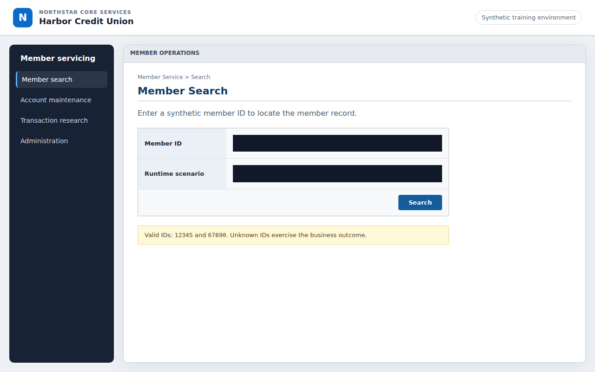
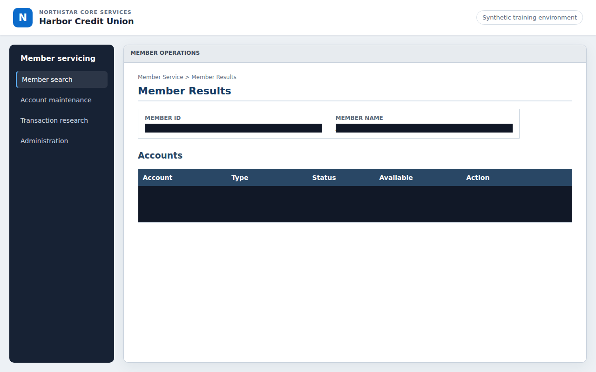
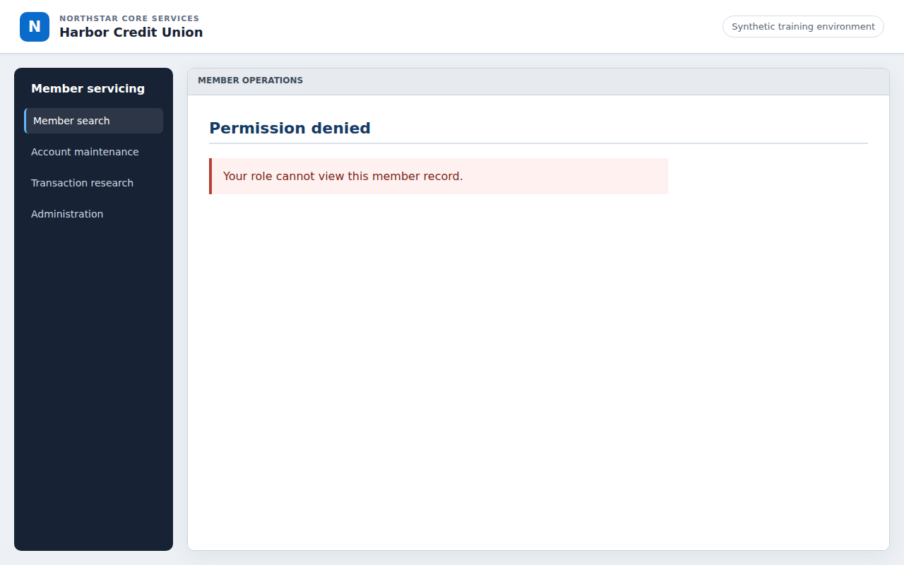

# Evidence

These immutable reviewer bundles were exported from runtime evidence produced through the public API against real Chromium. Each `manifest.json` binds the scenario to its command, commit, artifact where applicable, source manifest, redaction directives, and SHA-256 file hashes.

```text
runtime action
  → redaction / screenshot masking
  → ignored evidence/runtime store
  → source-manifest verification
  → immutable reviewer bundle below
  → independent hash verification
```

| Bundle | Terminal result | What it proves |
|---|---|---|
| [`discovery-success`](discovery-success/) | `success` | Genuine OpenAI-guided discovery compiled a typed eight-step artifact |
| [`discovery-transaction-investigation`](discovery-transaction-investigation/) | `success` | Genuine OpenAI discovery compiled the 15-step transaction capability |
| [`discovery-loan-payoff`](discovery-loan-payoff/) | `success` | Genuine OpenAI discovery compiled the 11-step payoff capability |
| [`discovery-temporary-card-lock`](discovery-temporary-card-lock/) | `success` | Genuine OpenAI discovery compiled and validated the reversible 12-step card-lock capability |
| [`replay-success`](replay-success/) | `success` | Version `1.0.0` replayed without model decisions and verified five outputs |
| [`replay-member-not-found`](replay-member-not-found/) | `business_outcome` | A legitimate “no member” state is not reported as a crash |
| [`replay-recovery`](replay-recovery/) | `success` | Version `1.0.1` used one declared interstitial recovery |
| [`replay-hard-failure`](replay-hard-failure/) | `failure` | Version `1.0.2` classified permission denial and captured a masked frame |
| [`human-handoff`](human-handoff/) | `success` | Version `2.0.0` paused, transferred the live session, validated fresh state, and resumed |
| [`tenant-reuse`](tenant-reuse/) | `success` | The same `1.0.0` artifact and hash replayed on Summit |

## Verify

From the repository root:

```bash
UV_CACHE_DIR=/tmp/replayforge-uv-cache uv run python scripts/verify_evidence_bundles.py evidence
```

The verifier checks manifest schemas, hashes, event ordering, run identity, exactly one terminal result, artifact integrity, source-manifest linkage, and attachment media signatures.

## Bundle shape

```text
<scenario>/
├── manifest.json
├── events.jsonl
├── result.json
├── artifact.yaml       discovery only
└── screenshots/*.png  failure/handoff when required
```

Playwright trace archives are not included. Masked screenshots are the selected richer failure and handoff signal. Unit fixtures are never represented as genuine run evidence. See [Verification](../docs/verification.md) for the proof matrix and [Safety and handoff](../docs/safety-and-handoff.md) for the redaction path.

## Rich evidence examples

| Before handoff: values masked | After human action: values masked |
|---|---|
|  |  |


